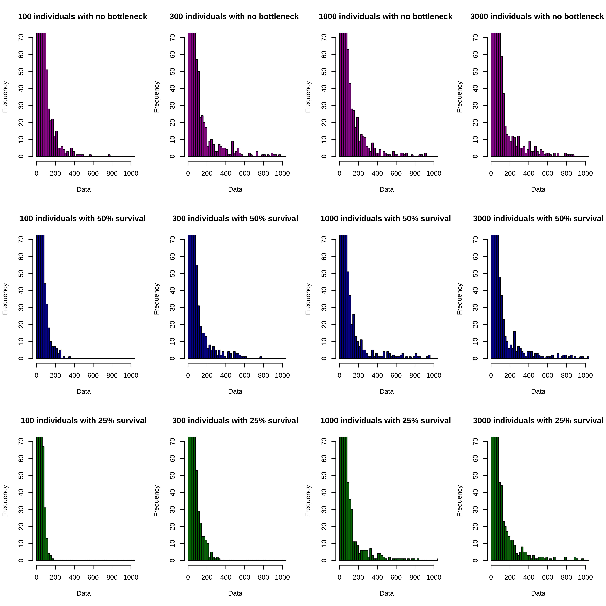
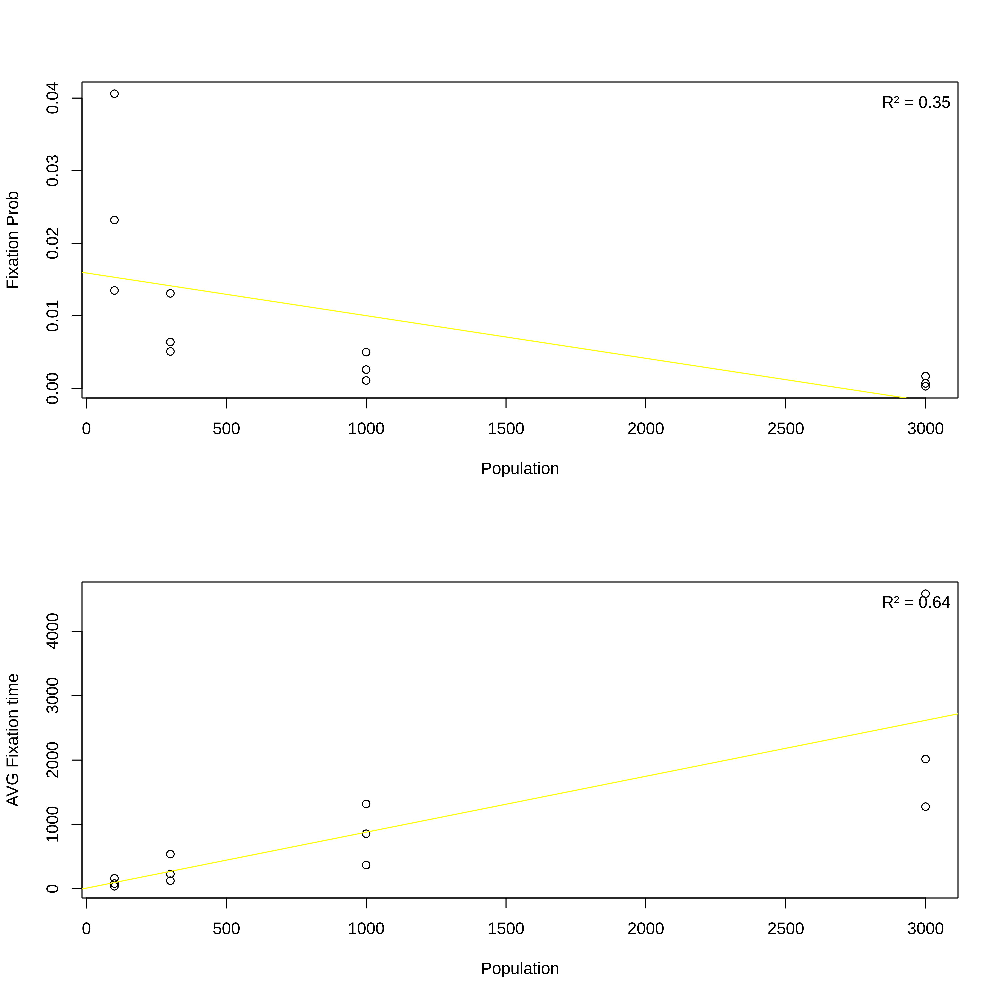

## Abstract

**Biological clocks** are molecular mechanisms present in living organisms that allow scientists to estimate the passage of time. In this task, we will use a computer model to simulate the evolution over time of a neutral mutation appearing in the genome of a living being in a population N, analyzing its fixation capacity and the average time it takes for fixation to occur. It is precisely through these mechanisms that it is possible to analyze the passage of time since the appearance of a mutation, as has recently happened in the *Juan Maeso case*.

For this work, we have used part of a code provided in class by Professor Alejandro Couce, which has been heavily modified to take into account only one mutated gene with no mutation rate over time. We will take into account various parameters such as population size or the occurrence of "bottleneck" phenomena. The code used in class can be found in the attached jupyter notebook, and both it and the text of this article are available under the [CC-by-SA 4.0 license](https://creativecommons.org/licenses/by-sa/4.0/).

## Introduction

Biological clocks are mechanisms present in living beings that allow us to follow and measure the passage of time. In the case of molecular mechanisms, we can speak of the existence of a time clock dependent on evolutionary drift, where random DNA substitutions caused, for example, by enzyme failures, which are usually neutral, accumulate in protein sequences in a constant manner, allowing us to predict approximately the time elapsed since their appearance, provided that the selective or mutational processes do not vary over time.

Although at first the biological clock hypothesis may seem contradictory with the stasis of the fossil record, which shows that species originate abruptly (the Cambrian explosion being a paradigmatic example of a large number of speciation events in a short time), when it is taken into account that most polymorphisms in the DNA chain are random, everything starts to make sense. Biological clocks are thus simply a consequence of drift processes that generate variation so that, when a bottleneck phenomenon occurs, some individuals can survive. Evolution is not, therefore, a constant process, but takes advantage of moments of scarcity to build on pre-existing genetic diversity.

In this article, we will analyze the evolution of these neutral mutations from their appearance to their disappearance or population fixation, using R, Jupyter Notebooks and Google Colab.


## Materials and Methods

To replicate the process of mutation generation, we will start from a ```population``` of individuals, in which, in a completely random manner, we force the appearance of a mutation in one and only one of its individuals on *day 1*. This mutation is represented in the code by a ``` 1 ``` when present and by a ``` 0 ``` when absent.  Over a series of timesteps (```days```), we will simulate reproduction by randomly dividing the population into a number ```rate``` of groups (with ```rate``` = $\frac{1}{survival rate}$ to the bottleneck event we are attending) and repeating these groups N times until the original ```population``` size is reached.

If the gene disappears, the function we have used for this process (see: ```iterate_daily```) aborts (returning the population prevalence over time until then), which not only simplifies the process, but also brings exponential improvements in processing time. On the other hand, if the function reaches as many iterations as ```days``` we had originally defined, the function also returns a list with the population prevalence over time.

In the introduction, we explained that one of our main objectives was to study the effect of population size and the different possible bottleneck events in the population. Therefore, to facilitate this, we will perform the following variants of our experiment (read by grouping rows two-by-two):

| Individuals | Bottleneck | Individuals | Bottleneck | Individuals | Bottleneck |
|:-----------:|:----------:|:-----------:|:----------:|:-----------:|:----------:|
|     100     |     No     |     100     |     0.5    |     100     |    0.25    |
|     300     |     No     |     300     |     0.5    |     300     |    0.25    |
|     1000    |     No     |     1000    |     0.5    |     1000    |    0.25    |
|     3000    |     No     |     3000    |     0.5    |     3000    |    0.25    |


For all twelve repetitions of the experiment, we will perform 10000 time iterations (``days``) and 10000 replicates, a more than sufficient number to overcome the low probability of transmission of a mutation in a single gene in such large populations.

**Note**: Though as efficient as possible, the code still takes *ages* to run in my computer. To make it more reproducible, [I have uploaded the code to Google Colab](https://colab.research.google.com/drive/1y56hJ6ouvpCmx2kyhupRam4RkPgLEfM4), where you can more easily interact with it.


After running the ```iterate_daily``` function for all simulations and possible variations, we visualize the distribution of either fixation or mutation times by using histograms, generated by counting the length of the population prevalence over time vectors using ```generate_histdata```. To make them comparable, we forced the limits of all x axes to be between 0 and 10000, and, to make data more easily interpretable, we cut the graphs at y = 70 and grouped the data to form 500 bars.

To search for fixation, we developed two functions:

* ```calculate_fixation``` checks if a given repetition of the experiment reached the maximum number of days (a requisite without which it is impossible to speak of mutation fixation, since the gene would have become prematurely extinct). If the list is of the desired length, it calls ```fixed_since``` to figure out when the mutation became fixed, and then calculates ```fixation_probability``` (the proportion of repetitions which present fixation over the total repetitions in a given variant of our experiment) and ```avg_fixation_time```, the average time it took for the gene to fixate in the repetitions where it dead. It returns both.
* ```fixed_since``` figures out when a gene became fixed. Two possible approaches can be taken here. The more simple one assumes that a gene becomes fixed when all the individuals on the population have it; this, although simplistic and easy to program, feels unreal to me: In the real world, genes are not fixed in a binary fashion, but can appear in varying proportions. Take the example of blood groups: the most common in Catalonia, 0+, is not dominant, but has two recessive alleles, so its incidence should be better: this is a clear case of fixation by genetic drift. Therefore, to take these factors into account, I have developed the second method, which consists of, for each element of the time series, comparing it with the next 2 (or the next one if we are at the end of the list) and the last element of the list; if the relative variance is less than 5% (which is already quite small) I will estimate that the gene has started or reached the fixation process; otherwise, I will keep looking. Thus, if I reach the end of the list without having found fixation, I will assume that, since the fixation process is still active (and we cannot know if it will be fixed or not) we decide to exclude it, returning 0 as value and not adding a new fixed gene to the counter.

Once we have calculated the necessary parameters, we place them in a table for display, and perform both a pearson correlation test and a linear fit to find out the relationship of the data to each other, producing a plot for the average fixation time and another for the probability of fixation.

## Results

The distribution of the proportion of individuals with the mutation, which can be seen in the histograms in **Figure 1**, shows the following groups:



* The **early extinctions**, with lengths between 1 and 200, represent those genes that, though sheer probability, fail to take over the whole population, ending their presence early on. It is because of this group that we have trimmed the height of the histograms to $y = 70$ (since there are so many concentrated in this group that it would otherwise be very difficult to make inferences about the data), and why we must perform so many repetitions: it takes many, many simulations to overcome the imposing force of chance, which tends to make such small changes (in just one individual) disappear.

* The **fading trend**: loosely defined, this group would include all the bars between 200 and 999, and represent genes that, although managing to survive for some time, lack long-term impact, disappearing without becoming fixed (either in the total population or in a part of it) after several generations.

* The **survivers**: the members of this group, represented by the histogram bar above $x = 1000$, are those who have been able to survive the 1000 days after which they have been observed, becoming permanently fixed (if all individuals acquire the gene, in which case we could call the individuals with this gene **colonizers**) or semi-permanently fixed (if only a certain proportion is fixed, as is the case for *group 0* in the blood groups.

As we can see in the histogram, most of the repeats belong to the **early extinctions** group, with the number progressively decreasing as we move from the first group to the second and third. However, a reflection is pertinent: we can clearly see how, for variants with only 100 individuals, whether there is a bottleneck or not, no fixed genes will appear; however, as we increase the population, the distribution gradually shifts to the right, leaving room for the appearance of *survivers*. It is surprising to see that the group that seems to obtain the highest number of fixations is the one that presents a bottleneck with 50% survival, something we did not expect when we started the experiment. Initially, it would make sense that those groups with the lowest bottleneck would have the easiest time seeing a gene fix, since it would only have to compete with the others through its survival fitness (the number of times it is selected by ``offspring`` in the ``iterate_daily`` function), and not also with bottleneck selection. However, it seems that this precisely provides a suitable environment, a balance between the difficulty to be selected among the ~25% of the genes that reproduce and the possibility to multiply by 2 (instead of only by 1 as happens without bottleneck).

With respect to the fixation parameters, we obtain the following table:

|Population|Bottleneck|Fixation Probability|AVG Fixation Time    |
|----------|----------|--------------------|---------------------|
|100       |1         | 0.0123             |157.869918699187     |
|1000      |1         | 0.0011             |996.454545454545     |
|300       |1         | 0.0049             |440.204081632653     |
|3000      |1         | 0,0004             |5418.5               |
|100       |0.5       | 0.0222             |76.0855855855856     |
|1000      |0.5       | 0.0024             |698.25               |
|300       |0.5       | 0.0066             |238.181818181818     |
|3000      |0.5       | 0,0007             |2501.71428571429     |
|100       |0.25      | 0.0375             |44496                |
|1000      |0.25      | 0.0034             |426.794117647059     |
|300       |0.25      | 0.0141             |118.234042553191     |
|3000      |0.25      | 0.0013             |1229.69230769231     |
|Pearson (Population)||-0.5883012          |0.8024554            |
|Pearson (Bottleneck)||-0.3393287          |0.4053819            |

As we can see, as far as the connection between population structure and fixation probability is concerned, the results are rather inconclusive: due to the negative sign, it could be said that they are inversely correlated, but the low pearson-coefficient of only 0.58 gives very little robustness to this hypothesis. However, as far as the relationship between average fixation time and population values is concerned, we obtain much more promising results: a pearson-coefficient of 0.802, which, although not *super high*, still represents a degree of moderate linear dependency; thus we can conclude that average fixation time is moderately related to population characteristics.

Another way to investigate the results, as we have explained in the "Materials and Methods" section, is to use a linear fit to see what the fit between the two populations is; such an analysis is available in **Figure 2**.



Here, we can see that the degrees of $R^2$ (= pearson correlation$^2$), as was previously discussed, are bad for Fixation Probability, and neither really good nor really bad for Average Fixation Time. Part of this has to do with the population distribution: as one can see in the graphs, and as was specified by our code, the population coalesces around brackets of 100, 300, 1000 and 3000, which makes it more difficult for the data to fit a linear model.

This analysis could also be applied to the bottleneck level, but, as can be seen in the table, the correlation seems to be pretty weak, so I left it out for this time.

## Conclussions

According to the graphs shown above, we can conclude that, while population size is really important for the fixation of traits, especially for the time it takes for them to fixate once it is known that they are going to do so, we can say that the presence of bottlenecks is not nearly as relevant. This result is certainly surprising: one would expect that the larger the bottleneck, the more difficult it would be for the gene to bind, but this does not seem to be the case. Perhaps this is precisely because we have defined the gene as neutral, and therefore not subject to the selective pressure that these events usually represent.

Regarding possible extensions and improvements to the code, some of these would be:

* Modify the code so that it breaks once 100% of the members of the population contain the gene: this is a small change that could improve computing time *significantly*.
* Realize the graphs of the trajectories seen in class: the data are present, available under lists such as ```sim_100_none```, so it would be a matter of plotting it; however, precisely because this type of graphs have already been explored in class, I preferred to try new representations (through, for example, histograms).
* More repetitions could be added to the code, until reaching the 100,000 suggested by the statement: however, in colab this would increase the computing time, probably due both to point 1 of this list and to the fact that I have performed 12 variants per simulation; moreover, as with 10,000 replications I have already managed to find interesting complexity, I have considered it better to leave this as it is.
* Another possible improvement, although changing the objective of the code, would be to make the presence of the mutation in the genome modify the reproductive fitness, since bottleneck phenomena are usually not neutral. However, since the goal of this program was to simulate a cellular clock, it is better to keep the mutations neutral.
* As was discussed in the "Results" section, we could randomize population values, in order to make the results more representative.

Regarding the improvement of the computational approah itself, we could say that one of its major shortcomings is probably in the way it simulates reproduction. By taking random individuals by lot and multiplying the sample several times, not only do we avoid facts such as recombination (an individual does not always have to pass the mutation) or diploidy (a copy or two may pass...). The code, as it stands, is simplistic, and, although useful for the simulation of the events we want to show, it could be extended to take into account these factors, as well as, for example, the effect of space: currently, it is assumed that all individuals reproduce with all at the same rate, something we know that in reality does not happen. Dominance/recessivity relationships, on the other hand, are less relevant, since we consider this mutation as neutral.

## References

Fossil Record Stasis - blavatsky.net. https://www.blavatsky.net/index.php/39-sciences/biology/evolution/24-fossil-record-stasis. Accedido 14 de diciembre de 2021.

Pascual-García, Alberto, et al. «The Molecular Clock in the Evolution of Protein Structures». Systematic Biology, vol. 68, n.º 6, noviembre de 2019, pp. 987-1002. PubMed, https://doi.org/10.1093/sysbio/syz022.

«Descubre cuáles son los grupos sanguíneos más frecuentes». Blog Banc de Sang i Teixits, 22 de septiembre de 2021, https://www.bancsang.net/blog/es/descubre-cuales-son-los-grupos-sanguineos-mas-frecuentes/.

And lots upon lots of Stack Overflow :D

---

This document was generated using pandoc.
