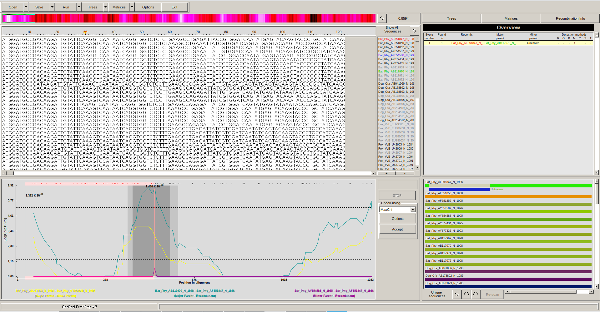
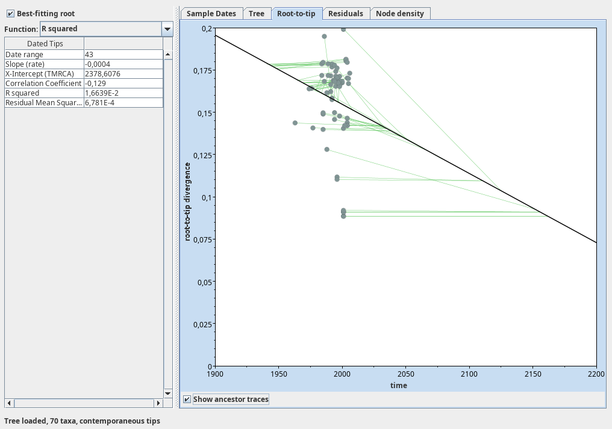
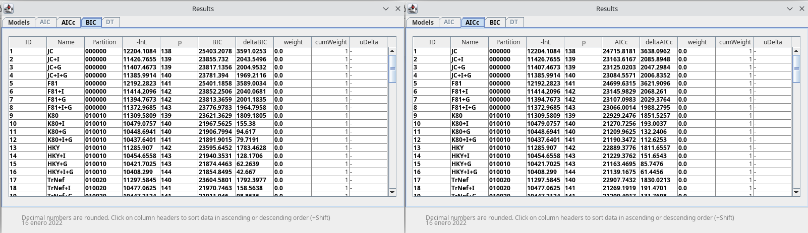
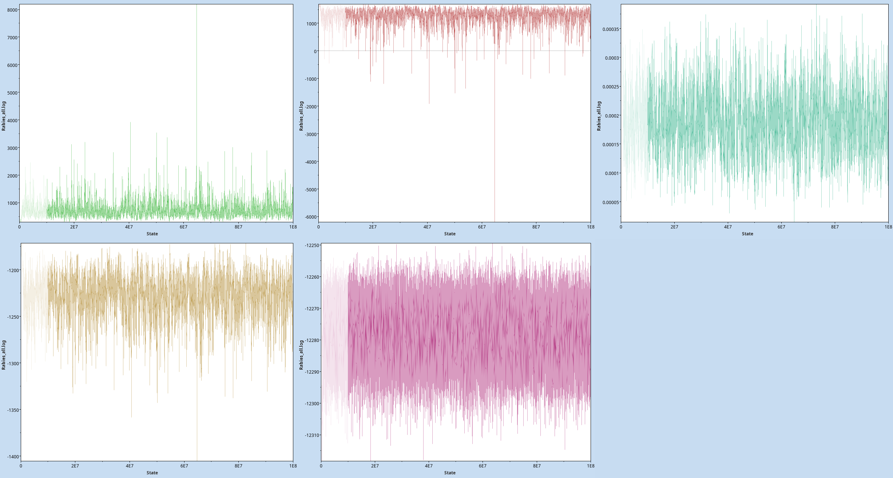
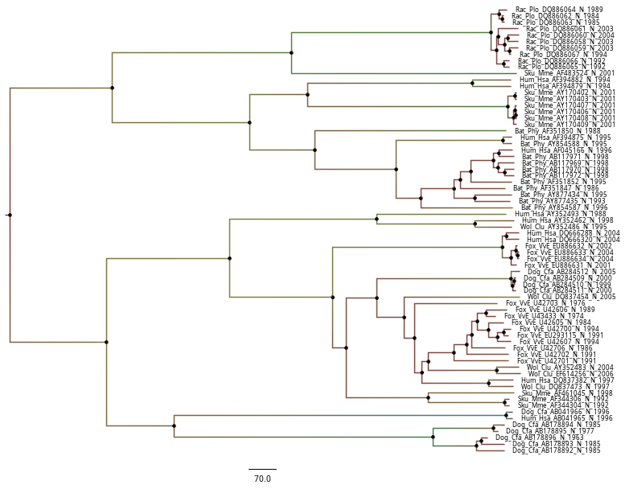

## Abstract

The Rabies Virus is one of the most terrible viruses in existence today: not only has it been tormenting mankind for years, but to this day it continues to kill more than 59000 people a year, making it one of the most neglected zoonotic diseases in existence, and one that, because of its terrible consequences, continues to be relevant to this day. In this article, we attempt to elucidate, using solely computational methods, when it emmerged. Although the results are generally unremarkable and inadequate, we hope that this article will inspire others to improve our results, and serve as a guide on how to perform this kind of analysis.

**Keywords: rabies, zoonotic diseases, evolutionary biology, molecular clock**

## Introduction

The rabies virus, a single-stranded, negative RNA virus of the *Lyssavirus* family,[^nishizono_rhabdoviruses_2012] is one of the most terrible viruses currently in existence: not only has it been tormenting mankind for years, but to this day it continues to kill an estimated 59,000 people a year,[^noauthor_rabies_nodate] representing one of the most neglected zoonotic diseases in existence, and one that, because of its terrible consequences, remains relevant to this day. Its symptoms include excitability, hydrophobia and death by cardio-respiratory arrest in the case of *furious rabies*, which represents 80% of cases; and radiant paralysis extending from the site of the bite to death in the case of *paralytic rabies*, which accounts for 20% of infections.[^noauthor_rabies_nodate-1]

The fact that this disease is still killing people today is particularly upsetting given that safe vaccines to prevent infection have been available since 1885,[^noauthor_why_nodate] and is mainly due to two factors: on the one hand, the difficulty of access to vaccines in poor countries, such as India, one of the countries with the highest number of infections at present (35% of the global burden)[^noauthor_rabies_nodate-1] and, on the other, to the fact that, being a disease of zoonotic transmission, it would not suffice to vaccinate all humans, but animals, such as dogs, in close contact with humans, would also have to be immunised, since their bites represent 99% of cases to date. [^fooks_rabies_2017]

In this work, we aim to use computational tools and evolutionary biology to better understand the behaviour of the virus, its date of emergence and the possible recombinations present in its genome today, thus trying to elucidate the origin and time to the last common ancestor of this virus, which has been tormenting mankind for at least 4000 years.[^tarantola_four_2017]

## Matherials and Methods

To perform our analyses, we used a database of a series of *Rabies lyssavirus* sequences taken intermittently between 1963 and 2006, with the aim of (if these samples are representative of the total genetic variability of the species) discovering both their recombination and evolutionary rates, as well as the time to the most recent common ancestor.

#### Rabies Recombination Rates

Viruses, like humans and, in general, all sexually reproducing organisms, can undergo recombination processes in their genetic material during reproduction. In the case of viruses, since they do not have gametes, this recombination occurs directly inside the host cells: when two viruses of the same species infect the same host at the same time, their polymerases can "confuse" each other due to the similarity of their genetic material (which is also very small and accessible), "jumping" between the DNA or RNA strands and causing recombinational events.[^stedman_deep_2015] Due to the high abundance and short lifecycle of viruses, the number of recombination events, and thus their interannual ratio, is expected to be high.

To calculate this, we used RDP, a Recombination Detection Program created by the University of Cape Town that automates the process in an interactive way, allowing it to use many methods and to explore recombination events in depth, although it only runs on MS Windows.[^martin_rdp4:_2015] To maximise reliability, we have instructed the program to run 7 different methods: RDP, GENECONV, Chimaera, MaxChi, BoolScan, SiScan and 3Seq, leaving out LARD and keeping the fast analysis options for BoolScan, SiScan to keep computation time affordable. As is usual in the field, and to compensate for the possibility that the peculiarities of a particular algorithm introduce artifacts not present in reality, we will only consider as valid those recombination events detected by at least 4 of our 7 methods; as we expect the number of recombination events to be high, this should not be a problem. We have also indicated that the genome type of the virus in question is linear,[^nishizono_rhabdoviruses_2012] and we have selected 0.05 as the threshold value to mark a recombination as significant (this value is extrapolated to each method), using a Bonferroni correction of 100 permutations to avoid false positives.

Regarding the output filtering methods, we have required topological evidence (a recombination can only be valid if there is a phylogenetic tree in which it fits), checking alignment consistency to avoid the effect of gaps and defining the clustering of recombinants as realistic (i.e. that parentals are in closely related phyla).

Once the total number of recombination events has been calculated, we will calculate their frequency by dividing that value by the number of years under study (43).

#### Evolutionary rate and most recent common ancestor

Another parameter that may be of interest is the evolutionary rate, which should not be confused with the mutation rate: while the latter only tells us about the raw mutations that appear in the genome of a virus (i.e. the failure rate of the polymerase), the former tells us which of these are permanently fixed in the genome, thus excluding reversions or other mutations that, for whatever reason, are not fixed. [^peck_complexities_2018] This is of great interest because, for example, for a virus with a very high mutation rate, such as influenza, it can be more difficult to design an effective vaccine; it is also essential for designing biological clocks, allowing us to form plausible models of the evolutionary biology of the virus that shows us where and when it emerged, something that, as we have seen with CoViD-19 and the Wuhan market, is of enormous public interest.

To carry out this analysis, the first thing we need to check is that the data we use have an appropriate time structure. To check if this is true, we have generated a maximum likelihood prior tree using FastTree[^chang_fasttree_nodate] (as this method does not force temporal structure on the data), and opened it in ```TempEst```, a tool for investigating the temporal signal and 'clocklikeness' of molecular phylogenies.[^rambaut_exploring_2016] To ensure that the fit of the data is good, we have selected "best-fitting root" and fitted the data by R².

However, the results of this analysis with TempEst are only preliminary, and we need a different method, which actually calculates phylogenies, to compare with this one and bring robustness to the analysis. To do this, we used BEAST, a Bayesian-statistics based tool that works by using Markov Chain Monte Carlo algorithms to find out the most likely real tree among a set of possible correlations of the data. In order to use it, we must perform a series of steps beforehand; first of all, we must generate a control file, under ```.xml``` format, which defines the options that the program will use, and whose generation process is facilitated by ```BEAUTi```, a companion app to BEAST. In it, we have a series of options:

* In the Tips section, we have indicated it how to parse dates appropriately, using "_" as a separator between host species and year.
* To decide the nucleotide substitution model, essential for defining the biological clock that serves as the basis for evolutionary biology analyses, we have used JModelTest, a Java version of the popular ModelTest program presented in 2008 by David Posada.[^posada_jmodeltest:_2008] This program works by computing a series of likelihood scores, that is, the probabilities that the existing frequency of each base in our program follows a certain distribution or another. In our case, to calculate these likelihood scores we have selected the Maximum-Likelihood-optimised method, since it is the most accurate, although it is more computationally intensive. Once the distribution of the bases has been calculated, we can see which model is more efficient in describing them, using two methods: on the one hand, the Akaike Information Criterion corrected for small sample sizes (AICc); and, on the other hand, the Bayesian Information Criterion, which are the most accurate ones offered by JModelTest.[^noauthor_jmodeltest_nodate] These data will be transmitted to BEAUTi, and thus to BEAST, through the "Sites" tab.

* For the "Clocks" tab, instead of using a strict molecular clock, the default option which assumes a constant rate of variation across branches and across the tree (and which is therefore too restrictive and unnatural due to possible variations in selection pressure), we used an "uncorrelated relaxed cock", which allows for rate variation between branches using, in our case, a lognormal.
* For the "Trees" tab, we have used the previous maximum likelihood tree generated for the TempEst section, converted to Newick format with the help of ```FigTree``` and using ```resolve_polytomy```,[^chang_fasttree_nodate] a function of the python module ```ete3``` (developed, among others, by Jaime Huerta-Cepas, professor of this Master (yay!)[^huerta-cepas_ete_2016]), to ensure that the tree has only 2 branches per node (both are BEAST requirements). This should make the program not only more efficient, but also more accurate in predicting results.
* In the "MCMC" tab, I selected 100.000.000 Markov Chains, logging every 1000 states. This is computationally intensive (although, thanks to the maximum likelihood tree, it only took 2 hours in our computer), but assures us that we will have more accurate results.

Having selected the adequate parameters, we save the ```.xml``` and run BEAST. The ```.log``` output might be analysed using ```Tracer```, a program which will tell us the evolutionary rate and time to most recent common ancestor, and the ```.trees``` output was coerced into a single maximum clade credibility heights, with 0.85 posterior probability and median node heights using ```TreeAnotator```, another BEAST companion program.

## Results

#### Rabies Recombination Rates

After running RDP, we found no recombination events taking place, as can be seen in **Figure 1**. This strongly contradicts our initial hypothesis, and we are not sure whether this is due to computational problems or biological reality; it could be, for example, that we have chosen very restrictive methods, although this is unlikely because of the variety of methods and because, for example, we have allowed gaps to be ignored, which gives more, not less, laxity to the program; It could also be that the input sequences are too similar to show recombination, or that the rhabdovirus polymerase is very specific, making errors difficult and lowering the recombination rate until it is impossible to detect; it may even be that the rabies virus is less likely to make multiple infections, and recombinations are therefore rarer to find.

However, none of these explanations seems to be entirely satisfactory for our particular case; it is therefore up to future researchers to find a more appropriate explanation, perhaps using a database with more sequences, more individuals or more time periods.

{ width=575px }

#### Evolutionary rate and most recent common ancestor

Regarding the temporal disposition of the data, the results yielded by TempEst are unpromising; even adjusting the root by R², R² remains dismally small, at 0. 016, as can be seen in **Figure 2**; furthermore, the x-intercept (in this case, the date on which the mutation originated) is given as 2378, which would indicate that the mutations are reversing over time, with a negative slope showing that this molecular works in the opposite way as it is customary; this is unlikely, and is probably due to the input tree being poorly rooted.

{ width=450px }

Despite these results, we have decided to continue with the analysis with BEAST, hoping for it to find a new root for the data that makes its time structure more logical and understandable. Thus,for the nucleotide substitution model, the two algorithms used by JModelTest, AICC and BIC, agree in the result, as can be seen in **Figure 3**, which suggests that the appropriate method to use would be a simple Jukes Cantor (JC), which assumes that all substitutions are equally possible, and does not use neither gammas nor invariants.

{ width=90%}

Once the analysis with BEAST has been carried out with the rest of the specified parameters, and the logs have been read with Tracer, we obtain the values available in **Table 1**. As we can see, for all the statistics the Auto-Correlation Time (ACT) is very high, which makes it difficult to take these results as valid, as it indicates that the data are not sufficiently independent from each other. Moreover, in general, the Effective Sample Size (i.e. the number of Markov chains taken to generate the each statistic) is quite low for all the statistics, reaching its maximum for Likelihood (18464, which is low compared to the Total Sample Size of 900001 and thus makes it non-significant). And, finally, the traces of the different parameters, available in **Figure 4**, are quite erratic and unclear, confirming that it is difficult to make predictions from our data, and that, as TempEst indicated, these do not present temporal structure.

|          Statistic          |      Mean      |   ESS   |              Value Range         |             95% Interval         |           ACT         |
|:---------------------------:|:--------------:|:-------:|:--------------------------------:|:--------------------------------:|:---------------------:|
|         Time to Root        |      724.8     |  784.2  |       [308.043, 8198.001]       |        [374.5495, 1191.7946]      |         114770        |
|             Age             |     1281.10    |  784.2  |      [-6192.00, 1697.956]       |        [814.205, 1631.4505]       |         114770        |
|             CSR             | $1.882e^{-4}$  |  636.7  | [$1.506e^{-5}$, $3.9262e^{-4}$] |   [$9.253e^{-5}$, $2.891e^{-4}$]  |        1413700        |
|            Prior            |    -1227.5     |  663.9  |       [-1405.244, -1171.111]    |       [-1269.156, -1189.400]      |         135560        |
|          Likelihood         |    -12277.6    | 18464.6 |      [-12318.22, -12249.41]     |       [-12293.51, -12262.34]      |       4874.2465       |

\centerline{Table 1: Statistics obtained using BEAST. For each row, the total number of samples is 90001}

{ height=40%}

To make matters worse, we can see that the "Time to root" predicted by BEAST is 724,898, and so the predicted year of emergence is 1281; this, as we have commented in the introduction, does not fit with the historical record, which makes it even clearer that this analysis is not valid; since, although the "Value Range" includes more reasonable dates (from 6192 BC to 1697 AD) these are not within the 95% confidence interval. There is, however, one study that suggests that rabies emmerged 500-750 years ago,[^hughes_reassessment_2008] which if all other parameters were not so bad, might imply our conclussions are fine; it may simply be that our dataset is not representative of the virus as a whole, and that some mutation emmerged 724 years ago that we are detecting here; or, maybe, molecular clock does not follow an uncorrelated, lognormal pattern. Finally, for the Corrected Substitution Rate (CRS), we obtain a value of $1.8821e^{-4}$, with a very wide confidence interval of [$1.5036e^{-5}$, $3.9262e^{-4}$], and which is not even within the ranges established in previous literature ($2.32e^{-4}$ to $1.38e^{-3}$).[^hughes_evolutionary_2005]

Finally, we can show the consensus tree, which is found in **Figure 5** after being opened in ```FigTree```:[^noauthor_releases_nodate]

{ height=40%}

## Conclussions

Although evolutionary biology is a discipline that is undoubtedly useful in the real world to understand more deeply how living things work, our attempts in this paper have not been very fruitful. On the one hand, we have not been able to find recombination events (and thus to estimate the recombination rate) in the rabies virus genome, which, no doubt, may be due to biological factors such as the functioning of the virus polymerases or to a meagre recombination rate that has not allowed us to detect events in 43 years; however, this is rare, and it is more likely that the samples were taken in a way that is not showing this natural variability, either because of their poor temporal structure or because of their similarity. Regarding the rate of evolution and time to the most recent common ancestor, our attempt to estimate these values using coalescence theory and molecular clocks has yielded the figures of 724 years and $1. 8821e^{-4}$ substitutions per site and year; although these values are moderately consistent with previous literature, and not entirely unreasonable, the foundations on which they are based are not the most solid, so, as in the first section, we believe that it would be appropriate for future research teams to study the question further, perhaps with more representative data for the species under study or with higher quality data.

## References

[^nishizono_rhabdoviruses_2012]: Nishizono A, Yamada K. [Rhabdoviruses]. Uirusu 2012;62(2):183–96.
[^noauthor_rabies_nodate]: Rabies Information Cheatsheet [Internet]. [cited 2022 Jan 28];Available from: https://www.who.int/westernpacific/health-topics/rabies
[^noauthor_rabies_nodate-1]: Rabies epidemiology and burden [Internet]. [cited 2022 Jan 28];Available from: https://www.who.int/activities/improving-data-on-rabies/rabies-epidemiology-and-burden
[^noauthor_why_nodate]: Why the world is not yet rabies-free [Internet]. World Economic Forum [cited 2022 Jan 28];Available from: https://www.weforum.org/agenda/2015/09/why-the-world-is-not-yet-rabies-free/
[^fooks_rabies_2017]: Fooks AR, Cliquet F, Finke S, Freuling C, Hemachudha T, Mani RS, et al. Rabies. Nature Reviews Disease Primers [Internet] 2017 [cited 2022 Jan 28];3(1):1–19. Available from: https://www.nature.com/articles/nrdp201791
[^tarantola_four_2017]: Tarantola A. Four Thousand Years of Concepts Relating to Rabies in Animals and Humans, Its Prevention and Its Cure. Tropical Medicine and Infectious Disease [Internet] 2017 [cited 2022 Jan 28];2(2):5. Available
from: https://www.ncbi.nlm.nih.gov/pmc/articles/PMC6082082/
[^stedman_deep_2015]: Stedman KM. Deep Recombination: RNA and ssDNA Virus Genes in DNA Virus and Host Genomes. Annual Review of Virology 2015;2(1):203–17.
[^martin_rdp4:_2015]: Martin DP, Murrell B, Golden M, Khoosal A, Muhire B. RDP4: Detection and analysis of recombination patterns in virus genomes. Virus Evolution [Internet] 2015 [cited 2022 Jan 28];1(1). Available from: https://academic.oup.com/ve/ve/article/2568683/RDP4:
9. Peck KM, Lauring AS. Complexities of Viral Mutation Rates. Journal of Virology [Internet] 2018 [cited 2022 Jan 28];Available from: https://journals.asm.org/doi/abs/10.1128/JVI.01031-17
10. Chang J. FastTree [Internet]. Bioinformatics Workbook [cited 2022 Jan 28];Available from: https://bioinformaticsworkbook.org/phylogenetics/FastTree.html
11. Rambaut A, Lam TT, Max Carvalho L, Pybus OG. Exploring the temporal structure of heterochronous sequences using TempEst (formerly Path-O-Gen). Virus Evolution [Internet] 2016 [cited 2022 Jan 28];2(1):vew007. Available from: https://academic.oup.com/ve/article-lookup/doi/10.1093/ve/vew007
12. Posada D. jModelTest: Phylogenetic model averaging. Molecular Biology and Evolution 2008;25(7):1253–6.
13. jModelTest [Internet]. Evolution and Genomics Exercises [cited 2022 Jan 28];Available from: http://evomics.org/learning/phylogenetics/jmodeltest/7
14. Huerta-Cepas J, Serra F, Bork P. ETE 3: Reconstruction, Analysis, and Visualization of Phylogenomic Data. Molecular Biology and Evolution [Internet] 2016 [cited 2022 Jan 28];33(6):1635–8. Available from: https://academic.oup.com/mbe/article-lookup/doi/10.1093/molbev/msw046
15. Hughes GJ. A reassessment of the emergence time of European bat lyssavirus type 1. Infection, Ge-netics and Evolution: Journal of Molecular Epidemiology and Evolutionary Genetics in Infectious Diseases 2008;8(6):820–4.
16. Hughes GJ, Orciari LA, Rupprecht CE. Evolutionary timescale of rabies virus adaptation to North American bats inferred from the substitution rate of the nucleoprotein gene. The Journal of General Virology 2005;86(Pt 5):1467–74.
17. Releases · rambaut/figtree [Internet]. GitHub [cited 2022 Jan 28];Available from: https://github.com/rambaut/figtree/releases


This document, and the accompanying code, is availaible under the [CC  By SA 4.0](https://creativecommons.org/licenses/by-sa/4.0/) License, and was generated using [pandoc](https://pandoc.org/): ``` pandoc --pdf-engine=xelatex --highlight-style tango --biblio Bibliography.bib "Report.md" -o "MarcosLópez_PabloIgnacio_EVO_EX2.pdf" ```
