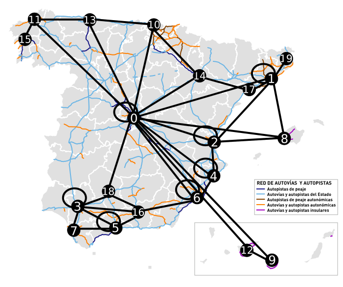
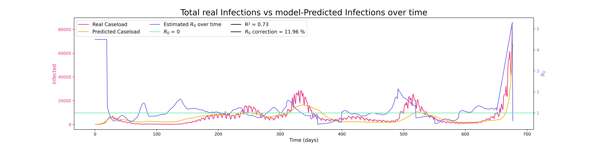
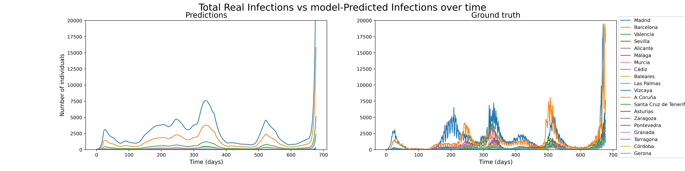
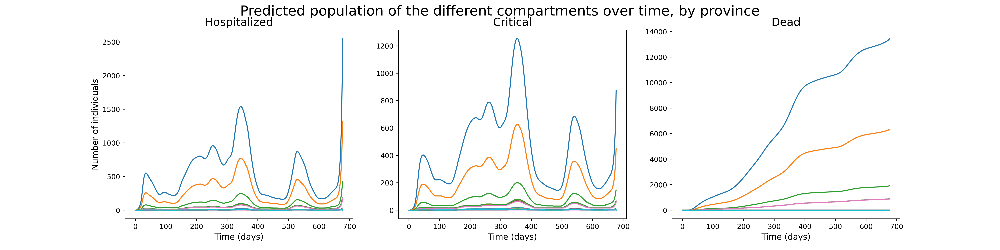

## Absctract

In *Alóndiga et al*, our team presented a modified SEIR model, which we called "SEIRHCM", to model the effect of mobility restrictions on deaths during the first wave of the CoViD-19 pandemic. In this paper, we build on that model, extending it to cover the 2 years of the pandemic so far, and trying to add other interesting features, such as waning immunity after 3 months. We have also added a spatial component to the model, representing the 20 most populated provinces in Spain by means of a graph that indicates the interconnections between them. Our model, which has a linear fit of 73% with respect to reality for the Infected compartment, can be further refined to take into account, for example, the effects of the different measures in each province or autonomous community, or the total numbers of Hospitalised and Deceased.

**Keywords: CoViD-19, Compartmental Models, Bioinformatics, Biological Systems Modelling**

## Introduction

In *Alóndiga et al*, a paper published at the [Biotechnology Student Congress 2021](https://oa.upm.es/67410/), our team used a model,[^garcia_rebollar_xiii_2021] which we called SEIRHCM, to model the evolution of the Coronavirus pandemic over the first few months of 2020, and quantify the effects of the mobility restrictions implemented by the Spanish government on the number of deaths and the overall incidence of the virus. One of the most common criticisms of this type of models, called *compartmental* because they assign the population to a series of groups through which it circulates over time, is that they do not take into account the influence of space,[^roberts_nine_2015] assigning the same chances of infection to, for example, two people from Madrid as to a person from Madrid and a person from Galicia, when we know that this is not the case.

To solve this problem, and to update a series of parameters relating to the passage of time and the formation of new waves of the pandemic, we have decided to update the model, providing it with spatial perception using a graph-based system that represents the 20 most populated provinces in Spain.

## Matherials and Methods

#### Model equations

The initial model has the following 7 compartments: **S**, Susceptible to contract the disease; **E**, Exposed who, incubate the disease but are not yet contagious; **I**, Infected, who spread the disease; **R**, Recovered, who have overcome the disease, do not spread the virus and possess immunity; **H**, infected individuals requiring hospital admission; **C**, infected individuals requiring intensive care; and **M**, COVID-19 deceased patients.

These compartments are related to each other by the following equations:

$$\frac{dS}{dt} = -\beta\:I\:\frac{S}{N} $$\
$$\frac{dE}{dt} = \beta\:I\:\frac{S}{N} - \delta E $$\
$$\frac{dI}{dt} = \delta\:E - (1-a)\:\gamma\:I - \eta\:a\:I $$\
$$\frac{dH}{dt} = \eta\:(1-a)\:I-\tau\:(1-u)\:H - u\:\sigma\:H $$\
$$\frac{dC}{dt} = u\:\sigma\:H - m\:\rho\:min(UCI, C) - max(0, C-UCI) - \omega\:(1-m)\:min(UCI,C) $$\
$$\frac{dR}{dt} = \gamma\:(1-a)\:I + \tau\:(1-u)\:H + \omega\:(1-m)\:min(UCI,C) $$\
$$\frac{dM}{dt} = m\:\rho\:min(UCI, C) + max(0, C-UCI) $$

In our improved model, we have kept these 7 compartments, but with several modifications: first, we have converted it from a SEIRHCM model to a SEIRHCMS model, which means that individuals who have successfully recovered from the virus can contract it again, under a rate of loss of immunity, $\omicron$, which is activated 180 days after the onset of the pandemic. The **R**, **C** and **M** compartments, whose values depend on the number of ICU beds, have also varied slightly, since we have modified the function describing the increase in the number of beds to generate a peak around day 200 (in July, when the worst of the first wave was over)[^instituto_de_salud_carlos_iii_evolucion_nodate], and then gradually decrease until day 300 (approximately when the last medicalised hospital was closed)[^noauthor_madrid_2021], maintaining a higher rate of ICU beds than the initial rate to take into account the public health actions; for example, the creation of the Hospital Enfermera Isabel Zendal in Madrid.[^noauthor_diaz_2020]

Additionally, the $R_{0}$ has gone from being approximated by a logistic equation, as we did in the original paper, to being estimated over time using the Python package ```epyestim```,[^noauthor_epyestim_nodate] which takes the time series of infected data to estimate $R_{0}$ at each point in time. In this way, we can take into account the appearance of new variants, with different levels of contagiousness, since $R_{0}$ is one of the most important parameters when estimating the behaviour of the virus. However, the ``epyestim`` results did not seem very accurate when modelling the pandemic, so in order to improve the model's fit to real caseload data, and to favour the appearance of the different *peaks* related to the different *waves* of the pandemic, we have modified its values at several points, resulting in a change of the average value of $R_{0}$ of 12%.

The modified equations would look like so:

$$ \frac{dS}{dt} = -\beta\:I\:\frac{S}{N} + R\:\omicron $$
$$ \frac{dR}{dt} = \gamma\:(1-a)\:I + \tau\:(1-u)\:H + \omega\:(1-m)\:min(UCI,C) - R\:\omicron $$

#### Interconnection network design
To account for the role of space, we have divided the data province-by-province, taking into account only the 20 most populated provinces, and we have represented the relationships between those 20 provinces using a graph from the Python ```networkx``` package,[^noauthor_networkx_nodate] which facilitates both weaving the connections (using an adjacency matrix generated using [graphonline.ru](https://graphonline.ru/en/)),[^noauthor_create_nodate] as well as finding neighbours. To design the graph, whose approximate representation can be seen in *Figure 1*, we have taken into account the main train lines,[^noauthor_mapas_nodate] motorways and roads in Spain (in the background of the figure),[^noauthor_datos_nodate] as well as the busiest air routes.[^noauthor_principales_nodate]



Once the interconnections between nodes have been established, we have taken into account a mobility factor of 10%; in this way, at the beginning of each day, we consider that 10% of the population of each node is distributed among its neighbours in a manner weighted by its population, receiving from them, also in a weighted manner, equivalent population to make up for this loss.

For our analysis, we chose the time period between 20 February 2020 and 28 December 2021, the time periods in which ``epyestim`` estimates values are central enough to make predictions about $R_{0}$.

## Results

The model we have created fits real data acceptably well, with an R² of 0.73 with respect to the cumulative data produced between provinces, as can be seen in *Table 1*. Moreover, one of the results we expected to find is confirmed, namely that the presence of a mobility factor between the different provinces increases the number of total cases from 3,878,189 to 4,001,762; this makes sense, since we know from graph theory that more connected nodes tend to pay a higher price in terms of infections in the event of pandemics. However, it seems that this increase in cases does not correspond to reality, since the other scenario, which has no mobility, has a slightly higher R² of 0.731; this scenario would be equivalent to analysing the same SEIRHCMS model without provinces all together, since what we would be doing in this case is running 20 separate simulations and summing the total cases. However, the change in R² is, in any case, small, and, moreover, can be explained, among other things, because we have kept the same average $R_{0}$ among all the provinces, instead of calculating it for each one. This, which greatly simplifies the workload of this assignment-overloaded student, is not the best way to proceed, and we could possibly obtain a better fit to the data if we performed the 20 simulations in a more individualised way. In any case, the relatively high R², of > 0.7, makes us think that this model does not differ greatly from reality and is therefore valid.

|                      | Total Infections |   R²  |
|:--------------------:|:----------------:|:-----:|
|   Mobility Scenario  |     4.003.445    | 0.730 |
| No Mobility Scenario |     3.880.528    | 0.731 |

Table 1: Statistical descriptors for model-predicted infections

To better understand the distribution of predicted and confirmed cases, we have produced *Figure 2*. As expected, we see that the three data series represented (Real Caseload, Predicted Caseload, and Estimated $R_{0}$ over time) are clearly visually related, indicating that the model is well-fitted and sufficiently predictive of reality. One noteworthy reflection is that, due to the way the Government of Spain reports data, the time series of actual cases presents a series of "peaks" at regular intervals: this represent weekends, when fewer cases are reported than normal due to lower activity in hospitals and the system in general. This, logically, makes it difficult to fit the data linearly, since, although it is a variation whose shape is constant over time, it slightly "messes up" the shape of the series; therefore, we believe it is possible that the R² of our model is even larger than predicted.



We can delve a little deeper into the complexity of this model by showing the results broken down by province, as shown in *Figure 3*. We can see how, as expected, the most populated provinces, Madrid and Barcelona, are always the ones that take the most cases, thus paying the price for their high centrality and interconnectivity in the system. Moreover, we can see that the pandemic evolves in reality somewhat differently from how it does in the model: for example, the second wave is almost exclusively led by Madrid, while the third and fifth waves have more cases in Barcelona, a less populated province. This is where an estimate of the $R_{0}$ province-by-province would have been more useful, as it would have allowed us to discern the effectiveness and usefulness of the different containment measures at the regional level, as was done in the original paper for the whole of Spain. However, this work is too complex and difficult, and is therefore beyond the scope of this study, which only seeks to present the model.



Finally, we can represent the three compartments that, I believe, are of most interest: Hospitalized, Critical and Deceased. The first two, at least at first glance, yield values that seem fairly close to reality, although further statistical analysis would have to be carried out to decide whether or not they do; unfortunately, I have not had time for that either. In the last compartment, however, the model fails much more: it predicts about 30,000 deaths by the end of 2021, when, in reality, the number exceeds 80,000. This may be due to several factors, including the fact that it only seems to predict deaths in the 4 most populated provinces, and that dealing with so many provinces, and thus dividing the total number of inhabitants, makes it more difficult for them to cross the compartments I \rightarrow H \rightarrow C \rightarrow M. It is possible that an adjustment of the parameters defining these compartments, using real-world data, could improve the model's outcomes on this front.
\newpage



## Conclussions

Building on the work of *Alóndiga et al.*, a previous paper by our team, we have been able to develop an updated model to represent the CoViD-19 pandemic on a province-by-province basis. This model has a good fit with reality (R² = 0.73), a high level of granularity, and takes into account various phenomena such as waning immunity and interprovincial mobility, which gives the model a spatial sensitivity that most SIR-type models lack, which is often criticised of them. However, some limitations remain (mainly due to lack of time): the deaths predicted by the model do not fully match reality, and the emergence of a new wave, *omicron*, with unprecedented levels of contagiousness, could not be included in the analysis due to it emerging too closely to the time of the analysis. Another caveat is that the loss-of-inmunity parameter is based on current levels of Recovered individuals, instead on the ones recovered 180 days ago; again, this should be fixed when more time is devoted into such a model.

Now, it is up to future researchers to use existing data series (on Hospitalizations, Critical patients and Deaths, for example) to adjust the parameters of this model even better, hopefully obtaining a new one with higher degrees of predictability and affinity with reality that not only allows us to extrapolate what the pandemic could look like in the short term, but also to analyse the effects of the restrictions on mobility adopted by the different governments on the evolution of the virus, allowing us to determine whether these were effective or not.

## References

[^garcia_rebollar_xiii_2021]: García Rebollar P. XIII Congreso de Estudiantes de Ciencia, Tecnología e Ingeniería Agronómica [Internet]. Madrid. España: E.T.S. de Ingeniería Agronómica, Alimentaria y de Biosistemas (UPM); 2021 [cited 2022 Jan 14]. Available from: https://oa.upm.es/67410/
[^roberts_nine_2015]: Roberts M, Andreasen V, Lloyd A, Pellis L. Nine challenges for deterministic epidemic models. Epidemics [Internet] 2015 [cited 2022 Jan 15];10:49–53. Available from: https://www.ncbi.nlm.nih.gov/pmc/articles/PMC4996659/
[^instituto_de_salud_carlos_iii_evolucion_nodate]: Instituto de Salud Carlos III. Evolución de la Pandemia por CoViD 19 en España [Internet]. [cited 2022 Jan 14];Available from: https://cnecovid.isciii.es/covid19/#documentaci%C3%B3n-y-datos
[^noauthor_madrid_2021]: Madrid cierra el último hotel medicalizado para pacientes con coronavirus [Internet]. ElDiario.es2021 [cited 2022 Jan 14];Available from: https://www.eldiario.es/sociedad/madrid-cierra-ultimo-hotel-medicalizado-
pacientes-coronavirus_1_8003046.html
[^noauthor_diaz_2020]: Díaz ayuso inaugura el hospital enfermera isabel zendal [Internet]. Comunidad de Madrid2020 [cited 2022 Jan 14];Available from: https://www.comunidad.madrid/noticias/2020/12/01/diaz-ayuso-inaugura-hospital-enfermera-isabel-zendal
[^noauthor_epyestim_nodate]: Epyestim - A python package to estimate the time-varying effective reproduction number of an epidemic from reported case numbers [Internet]. [cited 2022 Jan 14];Available from: https://github.com/lo-hfk/epyestim
[^noauthor_networkx_nodate]: NetworkX — NetworkX documentation [Internet]. [cited 2022 Jan 15];Available from: https://networkx.org/
[^noauthor_create_nodate]: Create Graph online and find shortest path or use other algorithm [Internet]. [cited 2022 Jan 14];Available from: https://graphonline.ru/en/
[^noauthor_mapas_nodate]: Mapas de líneas de Renfe [Internet]. [cited 2022 Jan 15];Available from: https://www.renfe.com/es/es/viajar/informacion-util/mapas-y-lineas/ave-y-larga-distancia
[^noauthor_datos_nodate]:. Datos mensuales de tráfico ministerio de transportes, movilidad y agenda urbana [Internet]. [cited 2022 Jan 15];Available from: https://www.mitma.es/carreteras/trafico-velocidades-y-accidentes-mapa-estimacion-y-evolucion/datos-mensuales-de-trafico/datos-mensuales-de-trafico-en-la-rce
[^noauthor_principales_nodate]: Principales rutas desde aeropuertos españoles Ministerio de Transportes, Movilidad y Agenda Urbana [Internet]. [cited 2022 Jan 15]; Available from: [https://www.mitma.gob.es](https://www.mitma.gob.es/areas-de-actividad/aviacion-civil/estudios-y-publicaciones/estadisticas-del-sector/principales-datos-del-transporte-aereo-en-espan%CC%83a-2012/principalesrutas-desde-aeropuertos-espan%CC%83oles)

This document, and the accompanying code, is availaible under the [CC  By SA 4.0](https://creativecommons.org/licenses/by-sa/4.0/) License, and was generated using [pandoc](https://pandoc.org/)


<!-----

This document can easily be converted to PDF format using pandoc:

``` pandoc --pdf-engine=xelatex --biblio Bibliography.bib "Report.md" -o "ProBio-2021-22-Essay - Pablo Marcos - Space-sensitive modelling of CoViD-19.pdf" ```-->
