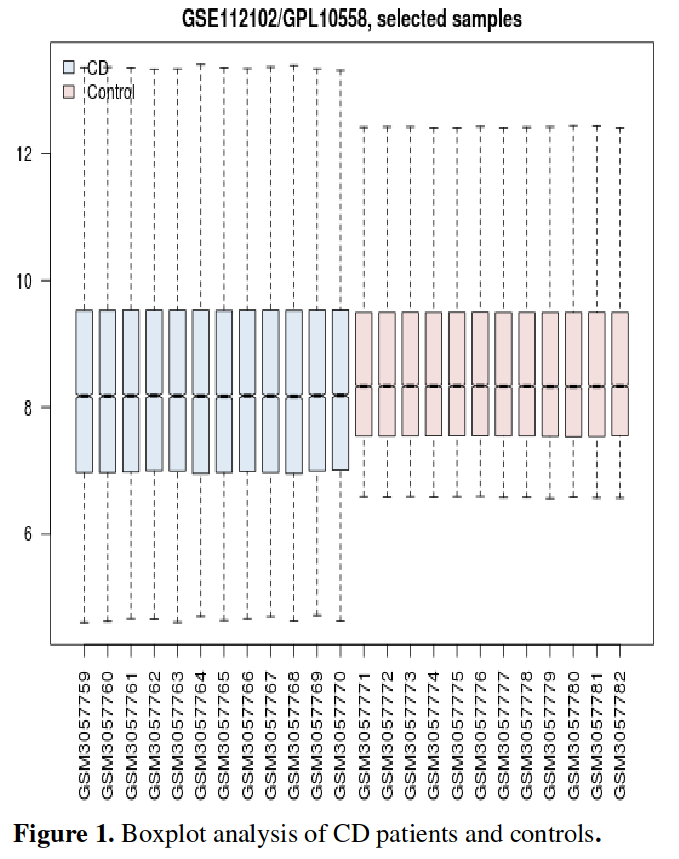
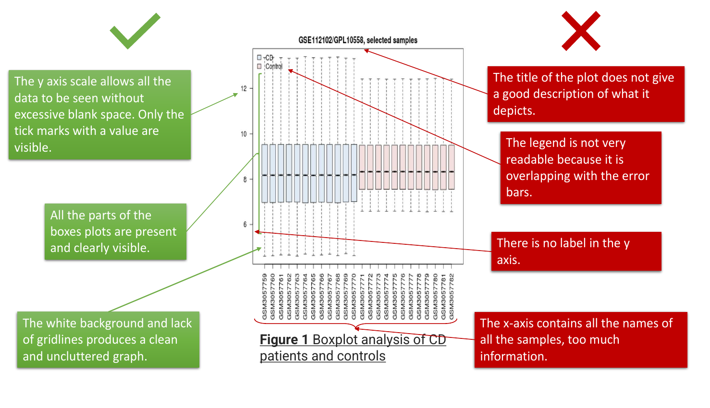
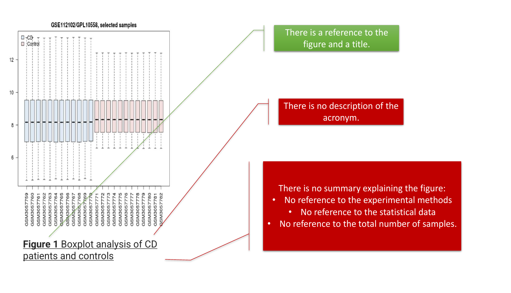
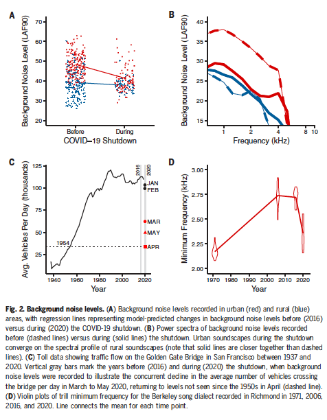

by Yaiza ARNAIZ ALCACER, Pablo MARCOS LOPEZ, Lexane LOUIS and Alexandre VERGNAUD.

## Figure 1 : Simple statistics

### Context

The plot we have chosen comes from the field of Medical Sciences. In a paper by [^rezaei-tavirani_highlighted_2019] from 2019, the authors analyze the evolution of gene expression changes of intestine tissue in celiac patients, with the aim of deciphering the complex molecular bases behind this complex disease, which affects 0.71 % [^rubio-tapia_prevalence_2012] of the inhabitants of the United States and the European Union.

### Presentation of the figure

Celiac disease is an autoimmune disease, in which susceptible patients attack their own tissues after eating gluten, damaging their small intestine and making it unable to take in nutrients. To analyze its underlying mechanisms, the authors picked gene expression profiles for experiment **GSE112102** [^noauthor_geo_nodate] under analysis platform **GPL10558** from the \"Gene Expression Omnibus\" database (this is also terribly explained in the paper). The GSE112102 experiment found that [^acharya_first_2018] some genes have enhanced differential expression in patients of Celiac Disease, compared to those who dont suffer from it. They then proceeded to show this differential expression of those genes (also without telling us about which one(s)) in the box plot we are presenting in Figure 1

    

### Analysis of the figure

Here, we can see a plot of 24 box plots, each representing one of the patients of the experiment **GSE112102**, and the differential expression of some protein(s) or gene(s) which name(s) we are not being told.

#### Mistakes and successes of the figure

We have divided the analysis of the figure in two parts. First, regarding the graph itself, we have found the following errors, as presented in Figure 2:

* The **title** does not serve as a good description of what is depicted inside : we just get to see the name of the experiment and
\"selected samples\", but with no clues about what was the selection criteria. Looking at the original paper, it seems that they selected
all of the patients.

* The **legend** is not readable, since it overlaps with the box plots. This appears like a major error, since most plot generation libraries, such as python's matplotlib, already place the legend in the most appropriate place automatically.

* The **y-axis** is not labeled at all : what do those numbers mean ?

* The **x-axis**, meanwhile, is overcluttered, with a label for each of the patients. We believe this is too much information, and that the authors would have been more professional if they had simply merged all patients in each of the groups into a single box plot per case (one for celiac patients and one for non-celiac patients).

* Regarding the previous point, a **significancy test** or score is lacking. How can we know if these results are conclusive or not ?

    

On the other hand, we also found the following things to be pretty well
managed :

* The **y-axis** allows for easy data visualization, since it is neither too big nor too small : it fits the data just right. Only some ticks are shown, which reduces visual clutter.

* All the parts of the **box plots** are visible, and none is cut.

* The white background and lack of grid lines make the graph **simple** and refreshing.

#### Mistakes and successes of the caption

With regards to the figure's caption, we have found the following (summarized in Figure 3):

* There is no **description** of what the CD acronym means. We know thanks to the context that this is \"celiac disease\", but this should have been better explained.

* There is no **summary** commenting the figure, just a title line (although at least that is present)

    

### Improvements

In order to finish our study of the figure, we should make suggestions about improvements. We would say that a better plotting type to compare numerous items (the 24 samples in the figure) would be a bar chart.

Another option could be to use the data of all the control samples and all the patients to create two box plots, representing the two groups; showing the comparisons between the two groups would have been easier with this approach. Furthermore, a statistic test to show if the results are significant or not would be a great improvement to bring strength in the study.

In general, we cannot see how this article improves the original article it was derived from ; it seems like a chaotic attempt at data description, which failed miserably.

## Figure 2 : Composite figure

### Context

The composite plot we have chosen comes from a scientific article called Singing in a silent spring : Birds respond to a half-century soundscape reversion during the COVID-19 shutdown published on September 24, 2020. This article [^Derryberry2020] attempts to provide an explanation to an unprecedented phenomenon that occurred between April and June 2020 when the COVID-19 health crisis forced nearly half of humanity to remain confined. The slowdown in human activities brought noise pollution to a level never reached in half a century, offering a silent spring to the population. During this period, many city-dwellers had the sensation of hearing the birds singing again.

The authors decided to observe a common songbird in San Francisco Bay, the White-crowned Sparrow, to see if there is a correlation between this new sound environment and the communication between these birds.

### Presentation of the figure

    

Throughout the study, which took place during the shutdowns, the authors made numerous observations and recordings to compare them with old records or data and then, be able to understand the behaviour of the White-crowned Sparrows facing this silent spring.

The composite figure we chose shows different plots of background noise level, an essential point of the study. The unit of the figures is LAF90 : a weighted, sound level just exceeded for 90 % of the measurement period and calculated by statistical analysis. Generally, these figures show that the background noise level was much higher before the shutdown, especially in urban areas. Indeed, the noise of rural areas, characterized by natural background noise such as the wind or the ocean, has been less affected. It also shows that the number of vehicles crossing the Golden Gate Bridge between April and May 2020 has returned to levels never reached since 1954. And finally, it shows the evolution of the trill (number of notes per second) minimum frequency of the Berkeley song dialect (used by birds in urban areas) over the years.

### Analysis of the figure

Unlike in the first study, we chose to divide this study into two parts
which are the mistakes and the successes of the entire representation (=
figure + caption). We have found more successes and less failures in
this figure than in the past one.

#### Mistakes of the representation

* The **caption** is very long and dense. In fact it is not easy to read. Maybe too precise for a visually effective representation.

* An explanation of the **unit** LAF90 is missing. Considering this, for non-expert people, it is difficult to understand the meaning of the representation.

#### Successes of the representation

* We have a good homogeneity of the **colors** and not a big amount of them. Actually we have only two colors : the red and the blue in order to represent respectively the urban and the rural areas.

* The **representations** are clear and clean. They are not overloaded but the important things are there.

* The **units** are present everywhere and the axes's **titles** are clear.

* The **caption** offers clear explanations of the study in order to not overload the figures.

* We have an entire **view** of the study in one composite figure effectively represented with multiple computations and statistics linked to each other.

* The **format** of four graphs is of a good size. Certainly there are not too many figures compared to the big amount of data being
presented.

### Improvements

In order to give ideas about how to manage the failures of the composite figure, we can propose some improvements. Perhaps it would be better to add some legends on the figures than to put all in the caption (as red=urban and blue=rural) for A and B. The major point is too unload the caption.

## Bibliography

[^noauthor_geo_nodate]: GEO Accession viewer.
[^acharya_first_2018]: P. Acharya, R. Kutum, R. Pandey, A. Mishra, R. Saha, A. Munjal, V. Ahuja, M. Mukerji, and
G. K. Makharia. First Degree Relatives of Patients with Celiac Disease Harbour an Intestinal
Transcriptomic Signature that Might Protect them from Enterocyte Damage. Clinical and
Translational Gastroenterology, 9(10) :195, Oct. 2018.
[^Derryberry2020]: E. P. Derryberry, J. N. Phillips, G. E. Derryberry, M. J. Blum, and D. Luther. Singing in
a silent spring : Birds respond to a half-century soundscape reversion during the COVID-19
shutdown. Science, 2020.
[^rezaei-tavirani_highlighted_2019]: S. Rezaei-Tavirani, M. Rostami-Nejad, and F. Montazar. Highlighted role of VEGFA in follow
up of celiac disease. Gastroenterology and Hepatology From Bed to Bench, 12(3) :254–259, 2019.
[^rubio-tapia_prevalence_2012]: A. Rubio-Tapia, J. F. Ludvigsson, T. L. Brantner, J. A. Murray, and J. E. Everhart. The
prevalence of celiac disease in the United States. The American Journal of Gastroenterology,
107(10) :1538–1544 ; quiz 1537, 1545, Oct. 2012.

This document is availaible under the [CC By SA 4.0](https://creativecommons.org/licenses/by-sa/4.0/) License
