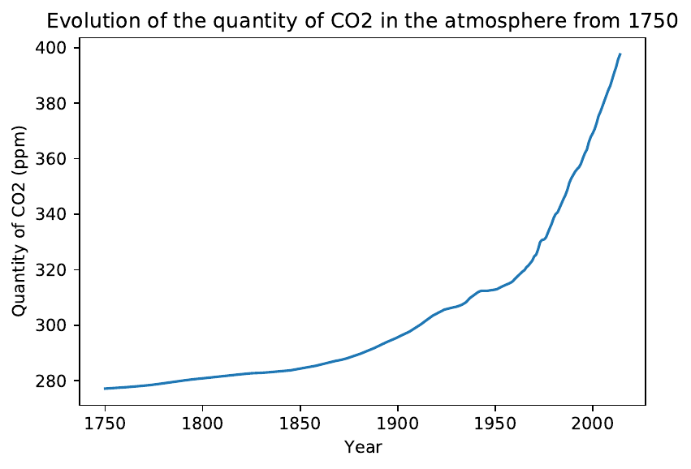

*by Yaiza ARNÁIZ ALCACER (251), Pablo MARCOS LOPEZ (269), Alexandre VERGNAUD (178) and Lexane LOUIS (179)*

    

  

## Introduction

Climate change is a term that refers to a lasting change in the statistical parameters of the Earth's global climate or its various
regional climates. These changes may be due to processes intrinsic to the Earth, to external influences or, more recently, to human activities. The Industrial Revolution has led to a change in the composition of the Earth's atmosphere as a result of greenhouse gas emissions from human activities (and in which natural variations can also play a role). The climate emergency is the defining issue of our time and we are at a tipping point: from changes in weather conditions affecting agricultural and food production to rising sea levels increasing the risk of flooding, the consequences of climate change are global in impact and scale. Without immediate action, it will be much more difficult and costly to adapt to the future consequences of these changes. [^abou_chakra_immediate_2018]

However, despite the existence of a clear scientific consensus that the planet is warming due to human action, [^noauthor_scientific_nodate] [^noauthor_examining_nodate] many continue to doubt the existence of a human connection, or of global warming itself. In an attempt to clarify the doubts that may exist on the subject, and to demonstrate conclusively the existence of warming and its association with the concentration of CO$_{2}$ in the atmosphere, we have decided to perform this study.

Additionally, to confirm that these changes are mainly due to human activities, we have decided to investigate the correlation of these two variables with a historical series of estimated GDP data. The correlation between them and with GDP may serve as indirect evidence of industrial activity and thus of human culpability in global warming. Finally, to analyze the changes that await our planet in the future, we analyzed sea level rise data from 1850 to the present, since the changes in sea levels are precisely one of the best known and most dangerous consequences of climate change. Our hypothesis is that all of this variables will be connected, showing that climate change is an urgent threat of which we must take care. This could be expressed also as an exploratory question, such as:

> Are CO$_{2}$ concentration and human activities linked to global warming ? Is the rise of the sea level a consequence of the aforementioned factors ?

## The datasets

In order to proceed with this analysis, we have chosen four datasets :

-   To investigate and analyze temperature variation over time, we downloaded a dataset from a *Kaggle competition*,[^noauthor_climate_nodate] that includes data from the Berkeley Earth Surface Temperature Survey. This source combines 1.6 billion temperature reports from 16 pre-existing archives and accounts for both the mean temperature over land (including data since 1750) and the mean temperature over the sea (since 1850). These data have been processed and normalized following the criteria provided by Berkeley Earth, to take into account various factors such as the different types of thermometers used (mercury thermometers are more inaccurate), the displacement of the location of measuring stations or the use of new measurement techniques. It contains several sub-datasets:
    -   Global Land and Ocean-and-Land Temperatures (*GlobalTemperatures.csv* )
    -   Global Average Land Temperature by Country (*GlobalLandTemperaturesByCountry.csv* )
    -   Global Average Land Temperature by State (*GlobalLandTemperaturesByState.csv* )
    -   Global Land Temperatures By Major City (*GlobalLandTemperaturesByMajorCity.csv* )
    -   Global Land Temperatures By City (*GlobalLandTemperaturesByCity.csv* )

-   To understand the growth in atmospheric CO$_{2}$ concentration, and how it correlates with the previous dataset, we used a database from the *Institute for Atmospheric and Climate Science* in Zurich (Switzerland)    [^institute_for_atmospheric_and_climate_science_atmospheric_nodate], which includes data from year 0 to the present. In order to perform a correlation analysis, we have trimmed the data to include only those values after 1750.

-   As an indirect measure of human activity, one of the variables whose correlation with the previous variables we wish to measure, we have used a database compiled by the *Madison Project of the Potsdam Institute for Climate Impact Research* [^geiger_continuous_2017] which compiles estimated GDP data from 1850 to 1944 (when the GDP metric itself was introduced by the Bretton-Woods conference) and self-reported, country-by-country data from then to 2010.

-   To see whether sea levels are rising, and how this rise correlates with other variables, we used a database from the *United States'Environmental Protection Agency* [^us_epa_climate_2016], including data collected from 1880 to 2014 using a combination of long-term tide gauge measurements and more recent satellite measurements, such as those made using NASA's Jason-3. This data contains cumulative changes in sea level for the world's oceans , showing average absolute sea level change (the height of the ocean surface), regardless of whether nearby land is rising or falling. The data was corrected to account for sea floow sinkage since the last Ice Age peak 20,000 years ago.

With the use of these datasets, we will try to understand whether or not the increase of CO$_{2}$ in the atmosphere and the rise in sea levels and GDP are related to climate change. After pre-processing the data, and after having made a series of graphs that allow us to intuitively understand the relationship between the variables, we carried out *student-t* and *linear* tests of correlation, which allowed us to observe that, indeed, all four datasets are highly correlated, that climate change is a real risk and that, if we don't do something about it soon, the earth's most prosperous cities, which are, almost all, close to the sea, are at clear danger [^rise].

## Data Preparation and Description
To understand the content of our selection of data sets, we must first analyze and briefly represent each of them, preparing them for subsequent correlation analyses. Thus, we have eliminated null values,normalized the format of dates and trimmed the time periods to be studied from the following sets:

### Temperature Data
The first dataset concerns the measurement of temperature over time and across the Earth. It consists of 5 files, one of which shows global mean temperatures and the remaining 4 show aggregated data by country,region, major cities and cities. To prepare the data, we have removed the null values, noting that there are no values for measurements that include the sea before 1850. Using the describe function, we can see that the uncertainty of the set is very low (0.938); and, to visualize the data set, we have decided to use the dispersion matrix in Figure[\[dispersion\_matrix\]" src="#dispersion_matrix){reference-type="ref"reference="dispersion_matrix"}

    
 

In this representation, we see that the distributions of the variables related to uncertainty are close to the left of the histograms. This means that the uncertainty is low for most of the values. On another hand, the uncertainty related to \"Land and Ocean Average Temperature\"is higher than the others and it seems not relevant to study this feature. Regarding the correlation between variables, we cannot conclude anything great except that the minimum and maximum land temperature are correlated : when one increase, the other increase also.

For the other files of this dataset, we decided to represent the distribution of temperature in cities and countries of the world in all years, from 1743 to 2013. Figure[\[distribution\_temp\]" src="#distribution_temp){reference-type="ref"reference="distribution_temp"} shows us that the average temperature over time is between 20 and 30 degrees.

Finally, we decided to show the global distribution of the temperature in the entire world in a country-by-country basis, generating an interactive graph available [on google colab](https://colab.research.google.com/drive/1Jl2zsjLQ4CO7u2S2V0ETWSok4ptR3dT_?usp=sharing).The resulting image, Figure[\[map\_temp\]" src="#map_temp){reference-type="ref" reference="map_temp"},shows that, globally, Africa, South America and Oceania are the hottest continents and that the countries near the northern poles are the coldest, as was to be expected.

### CO2 Data

The CO$_{2}$ dataset is composed of one file which includes a monthly measurement of the quantity of CO$_{2}$ (in ppm) in the atmosphere from year 0 to the present. The first step is to filter out all the dates and times that came before 1750, since none of our datasets extends so far,far away in time. To process this dataset, we selected the columns of interest and visualized the data by representing the evolution of the amount of CO$_{2}$ in the atmosphere over time in Figure[\[dist\_co2\]" src="#dist_co2){reference-type="ref" reference="dist_co2"}.

    
 

We can see that the PPM concentration of CO$_{2}$ increases the years and that, since 1950, the increase is on an exponential slope.Today we are probably at double the first recorded levels, in 1750.

### GDP Data

The GDP dataset is composed of one file which includes the GDP of 164 countries from 1850 to 2010. As always, this dataset contains missing values, which we removed, eliminating those countries with missing values, since their existence, especially in the 2000s, distorted the data tremendously, making it look like there was a global GDP collapse in 2007 that brought us back to 1850 levels (we know there was a drop in GDP, but it was not that big). We summed up the country-by-country data to obtain a global time series, and we saved thproperly formatted database for the next steps. To check that the data makes sense, we plot it. If we are right, we should get an almost exponential growth curve in Figure [\[dist\_GDP\]" src="#dist_GDP){reference-type="ref"reference="dist_GDP"}.

    
 

We can in fact observe that global GDP grows over the years and that, since 1950, the increase is on an exponential slope. It is curious how,in such a simple graph, so many things can be seen: around 1970, we finda first bump, probably related to the oil crisis[^warlouzet_governing_2017] that reached its peak in those years; and,around 1990, we find another bump, which, according to our team theorizes, could be related to the fall of the USSR.[^wang_what_2019]

### Sea level Data

The Sea levels dataset is composed of one file which includes data from to 2014 as explained before. We decided to visualize the data by representing the evolution of the sea levels over time. In Figure[\[dist\_Sea\]" src="#dist_Sea){reference-type="ref" reference="dist_Sea"},we see that the sea level increases over the years and that since 2000,the slope gets a bit steeper.

    
 

As previously explained, our hypothesis was that climate change is real,and that all the variables would correlate easily; so, after this initial data exploration, we will try to see whether that hypothesis validates in the next segment.

## Validation of the hypothesis
### Initial exploration

To study the increase in temperatures, we plotted on interactive map by year, also available [in our Google Colab](https://colab.research.google.com/drive/1Jl2zsjLQ4CO7u2S2V0ETWSok4ptR3dT_?usp=sharing)tear. As we can see in Figure [\[temp\]" src="#temp){reference-type="ref"reference="temp"}, there is a clear, global increase in temperatures across the world.

To study whether our hypothesis is correct or not, the first thing we need to do is to group the temperature data by year, as it are currently grouped by month, an excessively granular measure for our analysis. With the CO$_{2}$ data, since it is already grouped by year only, we don't need to further slice it ; however, we can get its mean and standard deviation (Figure [1" src="#std){reference-type="ref" reference="std"}),which will be useful later on:

    
 

An intuitive way to see if there is indeed a correlation or not between thee data, is to make a couple of graphs showing, in the same figure(Figure [2" src="#CO2){reference-type="ref" reference="CO2"}), theevolution off atmospheric CO$_{2}$ and land and land and ocean temperatures,respectively, so that we can guess whether they might be correlated or not.

    
 

As we can see, there is a fairly clear correlation between the increase in temperature and the atmospheric concentration of CO$_{2}$, especially in the second case, which measures the average temperature over both land and sea. This makes sense for two reasons: the first is that the first data set, which includes only land temperature, starts much earlier, in 1750 (note how the red line in fact starts earlier than the orange one), when measurements were made by hand, at different times of the day and with inaccurate mercury thermometers, so the deviation in the data, and hence the deviation in the correlation, is much larger,despite best efforts to correct this by the data providers. On the other hand, it is quite credible that the temperature has increased more in the oceans than on land : it is known that the oceans, which are acidifying, are large reservoirs of CO$_{2}$, which absorption could increase their average temperature. Also that the effect of evaporation of water, one of the most potent greenhouse gases (yes, water is really a greenhouse gas,[^deemer_greenhouse_2016] even if it does not stay long in the atmosphere and makes it less risky than methane or CO$_{2}$), is much greater there than on land, so one would expect local temperatures to be much higher. Also note that 75% of the Earth's surface is covered by oceans, so they would be expected to play an excessive role in global temperatures, determining the correlation.

On the other hand, it is interesting to note, in the land temperature data, a huge drop in temperatures between about 1810 and 1840. Although might partially be due, as mentioned above, to the poor quality of the measurements, such a sustained decline in time reminds our team that the Little Ice Age, which had its minima between 1770 and 1850, occurred around that time. [^gebbie_little_2019]

### Correlation

However, all the things done until now consist of a mere visual analysis and, to give solidity to our work, we must perform one or more tests of statistical significance. In our case, we have decided to make a linear fit and calculate the coefficient of determination of the sample, so that we can affirm with total solidity that our data is correlated, and,therefore, that climate change is real. In Figure[\[reg\_sea\_temp\]" src="#reg_sea_temp){reference-type="ref"reference="reg_sea_temp"}:

    
 

As we can see in Figure[\[reg\_CO2\_temp\]" src="#reg_CO2_temp){reference-type="ref"reference="reg_CO2_temp"}, our suspicions are confirmed, and, indeed,the combined mean temperature in the sea and ocean has a very good correlation (of 0.8, being datasets over hundreds of years with different measurement methods and variabilities) with the atmospheric concentration of CO$_{2}$, indicating that, indeed, climate change exists and is due to the increase of CO$_{2}$ on land. However, we can see that land temperature alone is barely correlated with CO$_{2}$concentration, presenting a very low coefficient of 0.51.

    
 

This, which at first might seem to be a problem as it contradicts our hypothesis, is not, for two reasons. The first is that, as we previously explained 75% of Earth's surface is occupied by ocean mass, so it is understandable that data that include the sea have a disproportionate influence on the relationship with a global variable such as the atmospheric concentration of CO$_{2}$. Second, and no less important, is that this phenomenon has already been observed in previous literature :water masses have an inordinate effect in accepting heat, acting as a buffer that has so far protected us from the worst effects of climate change, taking as a price, among others, the lives of thousands of corals off the Australian coast. [^hoegh-guldberg_climate_1999]

With these analyses, we therefore consider the following axioms to be proven : that the earth is warming, and that this warming is due to an increase in the amount of CO$_{2}$ in the atmosphere.

### The human factor
#### Country's GDP

The most skeptical, however, will still say : this is not true ! Yes, it is possible that CO$_{2}$ causes climate change ; but it is not caused by human activity, but by natural processes of the earth ! To try to address these concerns, and to evaluate, through statistics, whether climate change is caused by mankind or not, we have decided to perform the following analysis.

It has been widely proven that, at least until a few years ago, the growth in a country's GDP, which used to be associated with industrial growth, is associated with a growth in the country's greenhouse gas emissions (and therefore CO$_{2}$) [^martinez_post_2005] ; thus, if we were to see that there is an association between global GDP, the observed increase in temperature, and the amount of CO$_{2}$ in the atmosphere, we could prove that global warming exists, and that it is caused by an increase in human CO$_{2}$ emissions. Thus, we will perform the same analysis as in the previous section, a linear adjustment of the data, taking this time only the data of combined temperature between sea and land, since we have observed in the previous section that they are the most appropriate.

As we can see in the figure[\[reg\_CO2\_GDP\]" src="#reg_CO2_GDP){reference-type="ref"reference="reg_CO2_GDP"}, global temperature over time and global GDP have a correlation of 0.72, which, although weak, is not negligible:indeed, it seems that, in order to grow, humans overheat the planet, as we had indicated in our hypothesis.

    
 

What is surprising, because of its high correlation of 95%, is the link between CO$_{2}$ and global GDP : indeed, it seems that, in order togrow, humans are dependent on fossil fuels on a scale that, at least, we were not aware of until now. This very high correlation is more surprising in that these are datasets that we have downloaded from completely different sites on the internet, and that we have preprocessed as we saw fit without ever looking for prior correlation.This is a good indicator of the serious trouble we are in, a notion that is further reinforced by the connection expressed above between temperature and GDP : it seems that the three variables have a lot to do with each other.

#### Industrial revolution

Finally, we have performed a small analysis to see how statistically significant the change in temperature on land and ocean before and after the industrial revolution, a period widely recognised as one with huge spikes in both CO$_{2}$ production (through the burning of coal) and GDP(through industrial re-conversion) is. We expected the correlation between the two values to be high, since we saw that GDP is already highly correlated with temperature and CO$_{2}$ emissions.

As we can see in Figure [3" src="#industrial){reference-type="ref"reference="industrial"}, there is a very high correlation, as measured by the student t-test, between mean, minimum and maximum temperature,both in the ocean and in global terms (ocean + sea) before and after the industrial revolution. This confirms the results of the previous analysis, adding even more robustness to our conclusions and showing that the First Industrial Revolution, the period where massive fossil fuel burning began, is also the starting point for our climate-related troubles

    
 

## The future that awaits us

One of the most worrying consequences of climate change is the rise of sea level. It is well known that the most prosperous regions of the earth, the richest cities, and the majority of the population, are distributed along the shores of the sea, where trade, fishing and exchange of content is easier than in land. This presents us with a dilemma : what will happen when, due to global warming, sea level will rise ?
As we can see from the graphs below on Figure[\[sea\_temp\]" src="#sea_temp){reference-type="ref" reference="sea_temp"},there is a visually clear relationship between temperature increase and sea level rise; and since, as we can see in Figure[3" src="#industrial){reference-type="ref" reference="industrial"} above,temperature and industrial progress are highly correlated, it is a foregone conclusion that industrial growth inevitable gives rise to huge climate change problems. If, as we have predicted in the previous parts of this analysis, global temperatures are predestined to rise withGDP and industry, we can only think with concern about the future of these cities, and thus of humanity itself.

    
 

## Conclusion

Through a thorough analysis of existing data on GDP, CO$_{2}$ emissions and temperature over time, we have been able not only to understand how our datasets work, test their consistency and explore their content, but also to demonstrate their use in showing the existence of global warming and proving that it is caused by human industrial activity. While haters may point out that correlation does not imply causation (which,generally speaking, is true), the reality is that, both from the previous literature available in the References section, and from the arguments presented here, the authors of this paper believe that the case for human responsibility for global warming, with all the negative things that go with it, is proven. It is now up to us, then, to remedy the situation, avoiding dangerous consequences such as excessive sea level rise caused by the melting of the poles, which threatens the coastal regions where most of humanity lives today.[^neumann_future_2015]

## Bibliography

[^noauthor_climate_nodate]: Climate change : Earth surface temperature data.
[^noauthor_examining_nodate]: Examining the scientific consensus on climate change - doran - 2009 - eos, transactions american geophysical union - wiley online library.
[^warlouzet_governing_2017]: Governing europe in a globalizing world : Neoliberalism and its alternatives following the 1973 oil crisis.
[^abou_chakra_immediate_2018]: M. Abou Chakra, S. Bumann, H. Schenk, A. Oschlies, and A. Traulsen. Immediate action is the best strategy when facing uncertain climate change. 9(1) :2566.  Nature Publishing Group
[^rise]: B. R. Deemer, J. A. Harrison, S. Li, J. J. Beaulieu, T. DelSontro, N. Barros, J. F. Bezerra-Neto, S. M. Powers, M. A. dos Santos, and J. A. Vonk. Greenhouse gas emissions from reservoir water surfaces : A new global synthesis. 66(11) :949–964.
[^gebbie_little_2019]: G. Gebbie and P. Huybers. The little ice age and 20th-century deep pacific cooling. 363(6422) :70–74.
[^geiger_continuous_2017]: T. Geiger and K. Frieler. Continuous national gross domestic product (GDP) time series for 195 countries : past observations (1850-2005) harmonized with future projections according the shared socio-economic pathways (2006-2100). Artwork Size : 806905 Bytes, 2 Files Medium : application/x-zip-compressed,application/pdf Pages : 806905 Bytes, 2 Files Type : dataset.
[^hoegh-guldberg_climate_1999]: O. Hoegh-Guldberg. Climate change, coral bleaching and the future of the world’s coral reefs.
50(8) :839–866. Publisher : CSIRO PUBLISHING.
[^institute_for_atmospheric_and_climate_science_atmospheric_nodate]: Institute for Atmospheric and Climate Science. Atmospheric CO2 concentration database from the year 0 to the present, in PPM.
[^martinez_post_2005]: L. H. Martinez. POST INDUSTRIAL REVOLUTION HUMAN ACTIVITY AND CLIMATE CHANGE : WHY THE UNITED STATES MUST IMPLEMENT MANDATORY LIMITS ON INDUSTRIAL GREENHOUSE GAS EMMISSIONS. 20(2) :403–421. Publisher: Florida State University College of Law.
[^neumann_future_2015]: B. Neumann, A. T. Vafeidis, J. Zimmermann, and R. J. Nicholls. Future coastal population growth and exposure to sea-level rise and coastal flooding–a global assessment. 10(3) :e0118571.
[^us_epa_climate_2016]: O. US EPA. Climate change indicators : Sea level.
[^wang_what_2019]: Y. Wang, S. Hong, Y. Wang, X. Gong, C. He, Z. Lu, and F. B. Zhan. What is the difference in global research on central asia before and after the collapse of the USSR : a bibliometric analysis. 119(2) :909–930.

This document, and the accompanying code, is availaible under the [CC BySA 4.0](https://creativecommons.org/licenses/by-sa/4.0/) License
