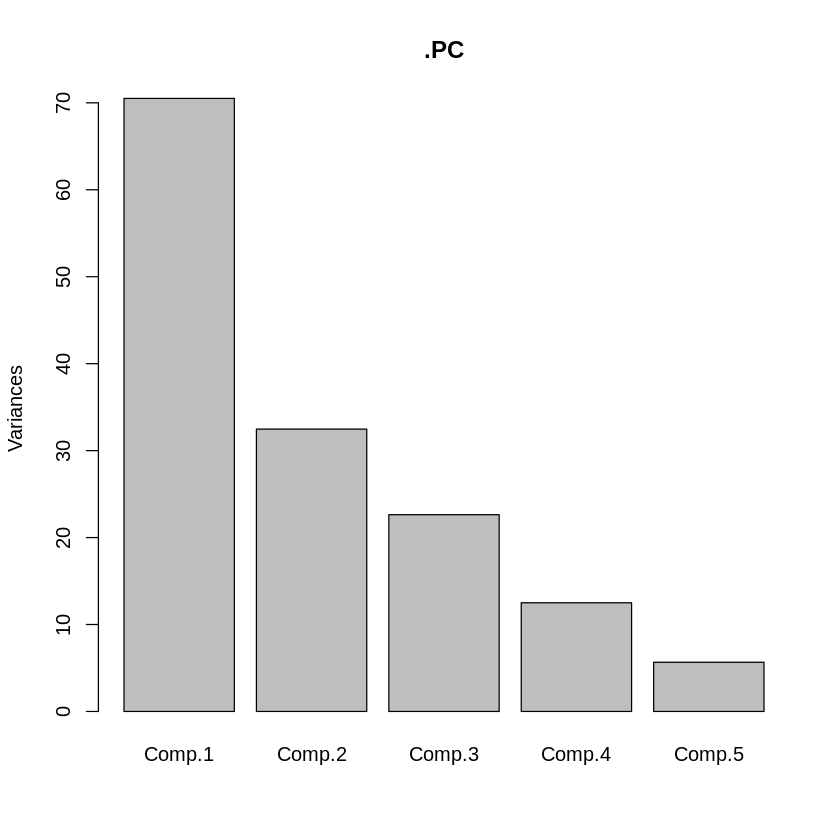
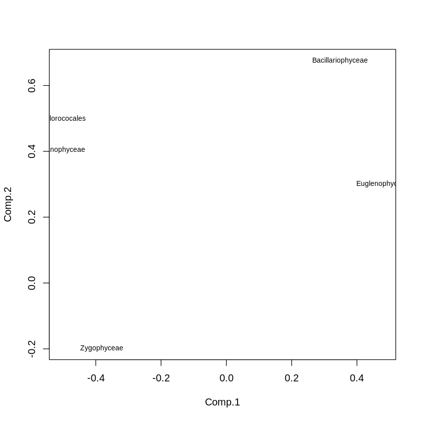
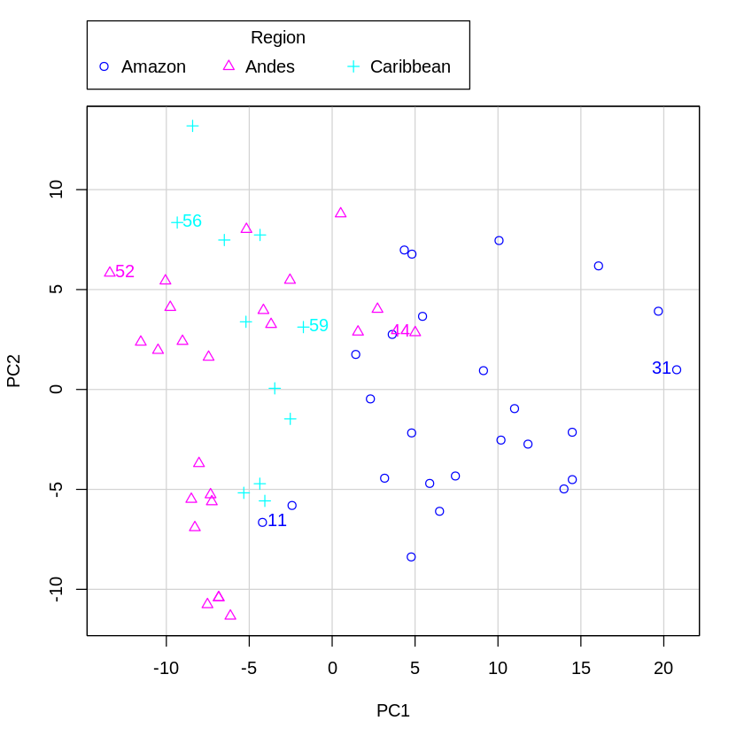
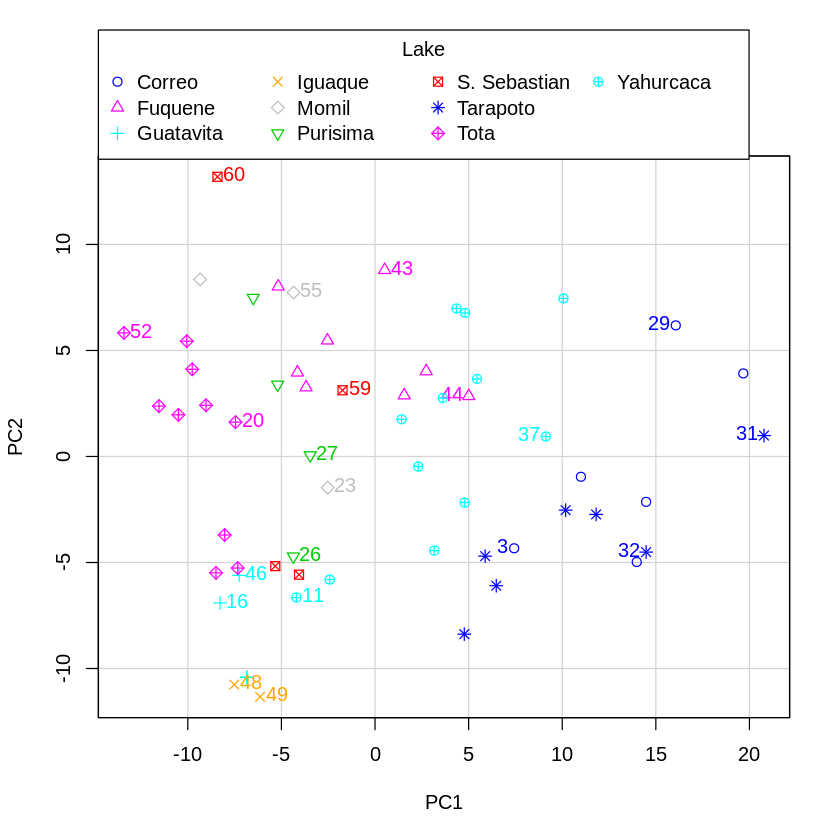
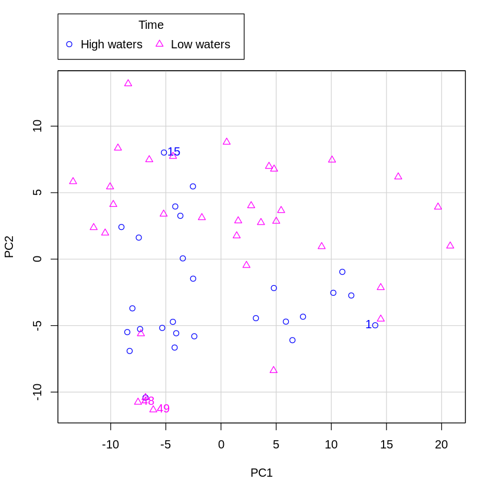
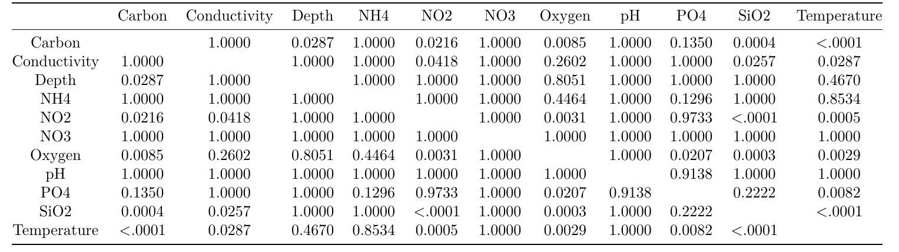
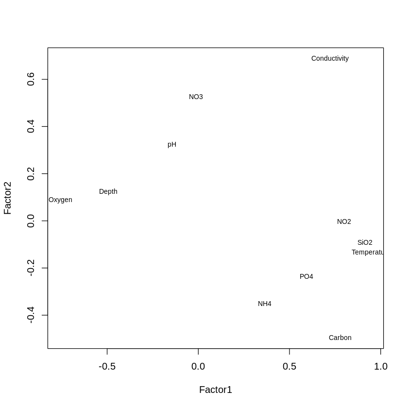
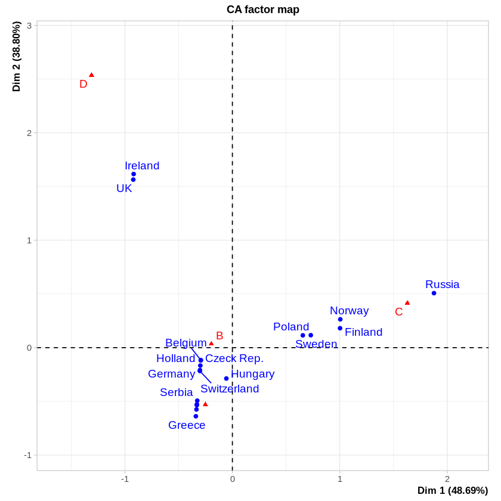

*by Yaiza ARNAIZ ALCACER (251), Pablo MARCOS LOPEZ (269), Alexandre VERGNAUD (178) and Lexane LOUIS (179)*

    

  

## Introduction

Advanced statistics, through methods such as Principal Component Analysis, Factor Analysis and Correspondence Analysis, allows us to find the most important variables in a dataset, facilitating its understanding and the making of decisions and conclusions. Throughout the following 3 exercises, we will demonstrate the use of these three methods in different fields, showing their usefulness and applications.

## Exercise 1

In this first exercise, our aim is to analyze the different species of phytoplankton algae present in lakes of different regions at two different times each year. Using PCA and descriptive statistics, we want to find out if the different parameters present in our data are good predictors species type distribution over time, and, if possible, to determine which of these components are the most important in this distribution.

To do this, the first step is to detect whether the different species are correlated; and, if so, to see how significant said correlation is. To do this, we created Table 1, which shows the correlation matrix between the different species using the p-value of for the pearson correlation quotient adjusted by the Holm-Bonferroni method, which corrects the family-wise error rate (the probability of finding false positives) in multiple hypothesis tests; helping us discern only trully correlated variables. Estimating an acceptable p-value of \< 0.05, as is usual in statistics, we obtain a correlation, in decreasing order of significance, between the following species: Cianophyceae and Chlorocococales, Zygophyceae and Chlorococales, Euglenophyceae and Cianophyceae; and Euglenophyceae and Bacillariophyceae.

|                   | Bacillariophyceae | Chlorococales | Cianophyceae | Euglenophyceae | Zygophyceae |
|:-----------------:|:-----------------:|:-------------:|:------------:|:--------------:|:-----------:|
| Bacillariophyceae |                   |     1.0000    |    1.0000    |     0.0049     |    0.0853   |
|   Chlorococales   |       1.0000      |               |    \<.0001   |     0.7839     |    0.0269   |
|    Cianophyceae   |       1.0000      |     <.0001    |              |     0.0343     |    1.0000   |
|   Euglenophyceae  |       0.0049      |     0.7839    |    0.0343    |                |    1.0000   |
|    Zygophyceae    |       0.0853      |     0.0269    |    1.0000    |     1.0000     |             |

 Matrix of Pearson correlations showing the pairwise two-sided p-values adjusted by Holm's method. As it is shown, the correlation is significant for the following pairs: Euglenophyceae and Bacillariophyceae, Euglenophyceae and Cianophyceae and Zygophyceae and Chlorococales; and highly significant for the pair Cianophyceae and Chlorococales. 

Now that we are sure about possible correlations, we would like to know about the dimensionality of our data, and, therefore, its complexity. Thus, we performed a Principal Component Analysis using the covariance matrix of our different types of bacteria. In Table 2, we can see that, indeed, 71.6% of the variability in our data can be explained by looking at just 2 components. Now, what are these 2 components? One possible theory is that they are, for example, the 2 annual periods in which we have sampled the data. Therefore, we will work only with these components, trying to clarify whether their relevance is indeed due to the fact that they represent the different periods of the year or not.

|                        | Component 1 | Component 2 | Component 3 | Component 4 | Component 5 |
|:----------------------:|:-----------:|:-----------:|:-----------:|:-----------:|:-----------:|
| Proportion of Variance |  0.4903891  |  0.2258744  |  0.1574135  |  0.08693947 |  0.03938336 |

 Proportion of Variance explainaible by each component after PCA of the data.

Another way to approach this problem is through a sedimentation plot. These figures, which represent the eigenvalues, usually show a \"bend\", a bend between the most important components and those that are not so interesting. Such a bend is, of course, a relative thing, as there is no \"set in stone\" definition;[^kristiansen_using_2010] but, in Figure 1, we would argue that it is precisely the first two components (especially the first, although the second is more subjective) that are above the curve. We therefore consider our selection validated.

    
    
Figure 1. The PCA barplot (principal component analysis) of the different components, shows how the 2 first PCs (principal components) explain the 71.6% of the variability of the data.

We can also assess which are the most interesting variables for each component using a loading plot, which interprets the values of the coefficients (loadings), so that those variables furthest away from the origin of coordinates and the centre of the graph are those that will provide more information for each component. In Figure [\[first\_second\]](#first_second){reference-type="ref" reference="first_second"}, we see that the most important variables for the first component selected are Chlorococales and Euglenophycea, while for the second, these would be Bacilloriaphyceae and Chlorocales.

    
    
Figure 1. The PCA plot of the loadings shows the variables more related to: A) The first PC: Chlorococales, Cianophyceae and Euglenophyceae; B) The second PC: Bacilloriaphyceae and Chlorocales.

Finally, we can use various scatter plots to represent the selected components across regions, lakes and time-spans. In Figure 3 a), we can see that Component 1 of the PCA explains the difference between two biomes: on the one hand, the Andean and Caribbean regions; and, on the other hand, the Amazon region. In subfigure c) we see that a clear differentiation for PC2, which allows us to separate the two time periods (high and low tides), as we had previously predicted. For subgraph b), the interpretation is more complicated: it seems that the separations between lakes Iguaque and Tota, Purisima, Momil and Fuquequeque are explained by PC2, while the difference between lakes Purisima and Tota and lake Tarapoto is explained by PC1. This, on the one hand, agrees with our initial hypothesis, since PC1 and PC2 allow us to distinguish the time of sampling; but, on the other hand, these components allow us to explain even more differences: after all, as we have explained, they account for 71% of the total variance.



---

---



## Exercise 2

For this second exercise, we would like to analyze the limnological properties of several neotropical lakes in order to find out their productivity degree and adequacy for life, which, a priori, seem like they might be related to values such as nutrient concentration, depth, pH or amount of dissolved oxygen. We therefore seek to use a multifactor analysis to check if we can find a suitable model to explain the data.
 

To do this, we will, again, see if the variables correlate with each other. Thus, we made a new table, Table 3, of the p-values of the correlation coefficients fitted by Holm's method. Although the correlations are too numerous to detail in writing in this report, the correlation values between the variables are, in general, rather poor, which is to be expected: it is unlikely, for example, that the amount of a certain gas in the lake influences the others, beyond certain isolated cases. [^jorgensen_application_1990]

    

To understand how these variables influence the productivity degree and the adequacy for life, we carried out a Factor Analysis, which works in the opposite way to PCA: instead of seeking to create \"new components\", as if it were the greatest common divisor, it seeks to find a least common multiple, a subset of factors common to all the data which are implicit, neither observable nor directly measurable. In this way, we hope to see whether the model we have devised, in which different lake concentration variables are related to fitness to support life, fits reality or not. We would expect concentration of nutrients and dissolved organic carbon to be correlated with productivity degree, with the \"chemicals\" determining if the lake is adequate for life or not.

One of the ways we can find out whether or not the system does indeed fit the two-factor model we have chosen is to use the Kaiser-Meyer-Olkin, or sample adequacy, index. In our case, this takes a value of 0.66, which means that the model, while not unacceptable, is only an approximate fit to the data.

Next, we can analyse the results of trying this model, which a priori we have seen is not very good, on our data. To do this, we have two parameters: the loadings, which are the values of the fit coefficients; and the communalities, the sum of the squares of these loadings. According to the result of our analysis, which can be consulted in detail in *Annex I - Code*, there are two variables with low uniqueness: Conductivity (0.005) and Temperature (0.084), which will therefore have high communality, and respond satisfactorily to our model. However, the other nine variables have high uniqueness, especially pH (87.6%), NH4 (74.4%), Depth (74.2%), NO3 (72.4%) and PO4 (59.4%) which means that they will not be adequately explained by the factorial model because of their low uniqueness.

About the loadings, we found that they can help us correlate Factor 1 with adequacy, and Factor 2 with productivity. However, pH doesn't seem to correlate well with Factor 1, and the carbon, NO2, P04, Si02 seem to be more linked with the Factor 2 than with the second. This does not fit our previous hypothesis, and makes the model even more messy and difficult to understand.

With regards to the percentage of variability explained by our factors, we found that, collectively, Factors 1 and 2 only account for 55.9% of our model's cumulative variability, which is too little to be acceptable. What is more, the p-value of the contrast is approximately zero (1.68e-03), which forces us to reject the hypthesis that two factors are enough, and, thus, that only the productivity degree and the habitat's adequacy for life are correlated with the provided variables.

Finally, as we did in the previous exercise, we will build and interpret the loading plot, availaible in Figure [\[second\_first\]]{#second_first label="second_first"}. There, we can see that Oxygen, Depth, PO4, Carbon, Conductivity, SiO2, NO2 and Temperature are mostly correlated to Factor 1, whereas Conductivity, Carbon, NO3 and NH4 are mostly correlated to Factor 2. These correlations do not match our pre-assumptions that concentration of nutrients and dissolved organic carbon would be mostly correlated with productivity degree, with the \"chemical compounds data\" being mostly connected with habitat adequacy for life, and instead mix together in strange ways, which suggests that the model is neither good not coherent for this kind of analysis

    
    
Figure 1. The Factor Analysis plot of the loadings shows that the variables more related to Factor 1 are Oxygen, Depth, PO4, Carbon, Conductivity, SiO2, NO2 and Temperature; whereas Factor 2 is mostly related to Conductivity, Carbon, NO3 and NH4.

In any case, and as we have seen, a more complete model would be required, perhaps with three factors or more. This conclusion is consistent with the previous observation that nine of the 11 variables are not sufficiently explained by the two factors due to their low communality.

## Exercise 3

Finally, we will use cars.xls, a database of random samples of car brands in different European countries, with the aim of discovering whether or not there is an association between the different brands and countries. For this, we will use Correspondence Analysis, a dimension reduction technique that allows users to visualize a cloud of multidimensional points in two dimensions respecting the relative positions of the points in the original point cloud.

To do so, the first step is to perform the Correspondent Analysis analysis and its factor map, which shows the points distributed in the different dimensions. Thus, in Figure [\[third\_first\]]{#third_first label="third_first"}, we can see how brands A and B seem to be clustered quite close to each other, together with most of the Central European countries; while brands C and D are the most distant from the distribution, with C appearing mostly in Scadinavia and Russia (perhaps Volvo) and D in Ireland and the UK, as might be the case for Rolls-Roice. For B, it seems to be mostly associated with Central European countries, such as Germany or Czech Republic, while A is closer to Spain and France.

    
    
Figure 1. Correspondent analysis factor map. The plot shows the associations between the brands A and B, while the huge different between the brands D and C. Regarding the countries, Portugal, Spain, Italy, Greece, Serbia and France are associated with the brand A; Holland, Germany, Switzerland, Belgium, Czech Republic and Hungary are distributed between A and B; Sweden, Norway, Poland and Finland are mainly distributed between B and C; finally, UK and Ireland are associated to brand D.

The next step, to understand whether the model is valid or not, is to analyse the variances of the axes, the absolute and relative contributions, and the inertia:

-   **Variances of the axes**: As seen on the graph, we have close coordinates between Portugal, Spain, Italy, Greece, Serbia and France especially along the dimension 1, which might mean that their auto industries are closely intertwined together. UK and Ireland, two island nations partially decoupled from the EU's single market and Schengen Area, are far from the others.
-   **Absolute contributions**: Dimension 1 is most closely related to Finland, Norway, Uk, Ireland and Russia. Dimension 2 explains UK and Ireland, and Dimension 3 works for mostly Greece, the Czeck Republic, Holland and Belgium.
-   **Relative contributions**: Dimension 1 is good at explaining variations in car buying in Finland, Sweden, Norway, Russia and Poland with a relative value of more than 90%. This increases for Dimension 2, which explains Hungary with a 95% value, although this only reached 70% for the UK and Ireland. Dimension 3 is good at explaining variance in Holland and Belgium: around 80%.
-   **Inertia**: The most important countries in the CA analysis are Russia (20,6%), UK (17,6%) and Ireland (18,4%).  Overall, these values make a lot of sense, and are consistent with what was obtained in Figure [\

Brands A and B are thus much more closely related to each other and to Dimension 3, with Dimension 2 mostly related to Brand D and Dimension 1 related to Brand C. Moreover, the relative correlation values are very high, always above 50% (see *Annex I - Code*). Moreover, Dimensions 1 and 2 seem to explain up to 87,5% percent of the variance on our data (see Table 4), being the most important ones, with Dimension 3 only explaining 12,5% of the variance. This makes sense: automotive industries are generally highly correlated with the countries of origin of their parent groups, especially in Europe, one of the world's largest automotive production regions. [^radosevic_foreign_2005]

|             |     Eigenvalue    |  \% of Variance  | Cumulative % of Variance |
|:-----------:|:-----------------:|:----------------:|:------------------------:|
| Dimension 1 | 0.493421000637901 | 48.6932328057494 | 48.6932328057494         |
| Dimension 2 | 0.393197841420016 | 38.802714124917  | 87.4959469306664         |
| Dimension 3 | 0.126706772625117 | 12.5040530693336 | 100                      |

Eigenvalues and variance of each dimension. As shown in the table, the dimension 1 and 2 explain the 87,5% percent of the variance while the dimension 3 only explain the 12,5%.

## Conclusions

Using Principal Component Analysis, Factor Analysis and Correspondence Analysis, we have been able to solve a number of statistical problems in fields as far apart as automobiles, biology and the emergence of life in lakes. Although it has not always produced perfect results, we believe that the use of these models has, in general, been very useful, and has allowed us to solve the problems we faced in a creative and satisfactory way.

## Bibliography

[^kristiansen_using_2010]: S. E. Jørgensen. Application of models in limnological research. SIL Proceedings, 1922-2010, 24(1) :61–67, Dec. 1990.
[^jorgensen_application_1990]: L. C. Kristiansen, S. Jacobsen, F. Jessen, and B. M. Jørgensen. Using a cross-model loadings plot to identify protein spots causing 2-DE gels to become outliers in PCA. PROTEOMICS, 10(8) :1721–1723, 2010.
[^radosevic_foreign_2005]: S. Radosevic and A. Rozeik. Foreign Direct Investment and Restructuring in the Automotive Industry in Central and East Europe, Mar. 2005.

This document, and the accompanying code, is availaible under the [CC By SA 4.0](https://creativecommons.org/licenses/by-sa/4.0/) License
