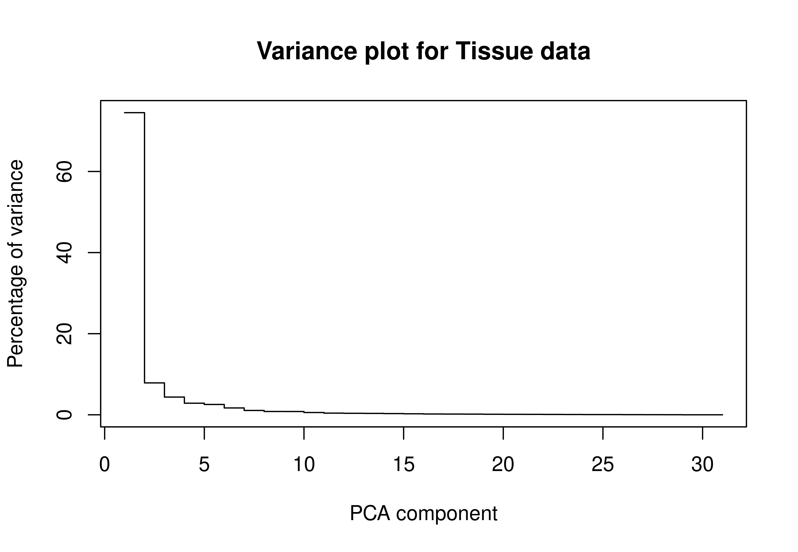
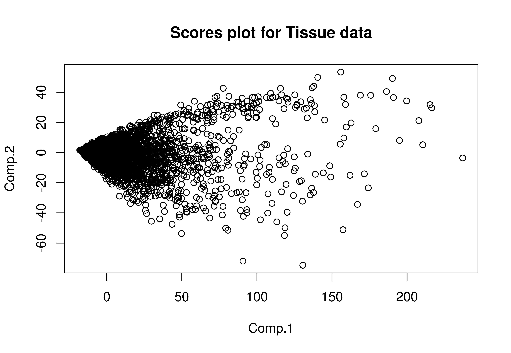
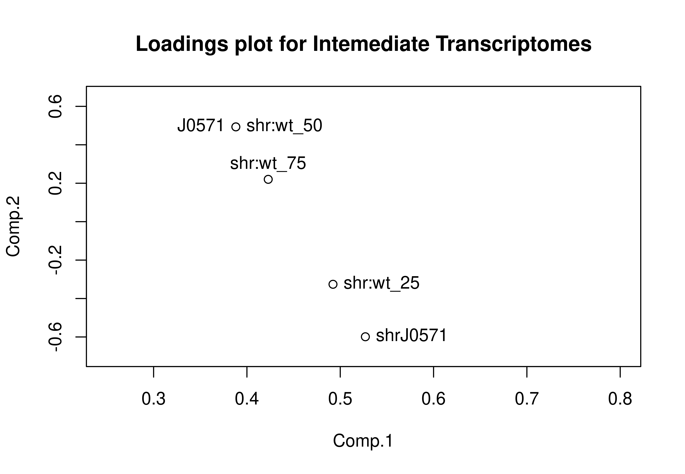
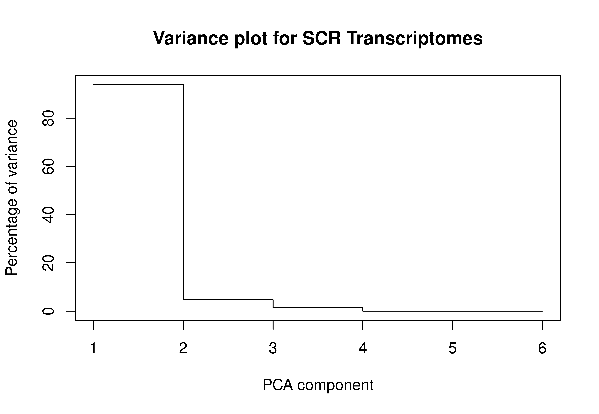
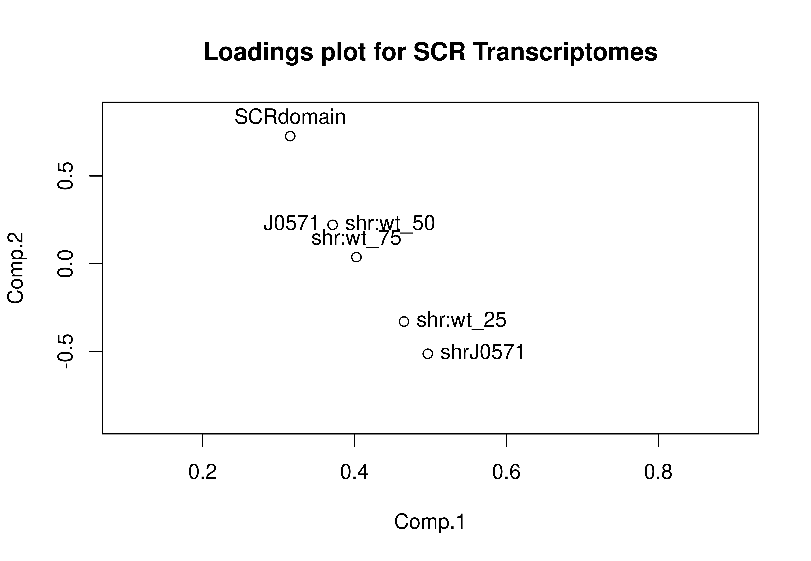
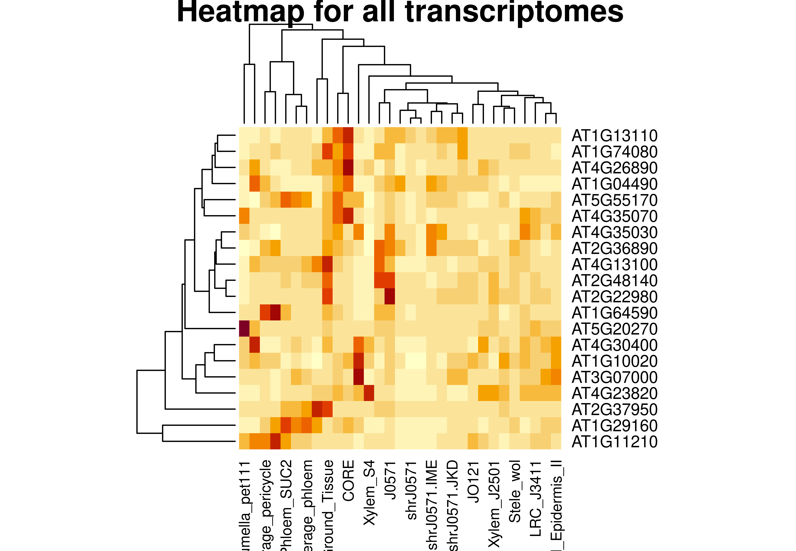
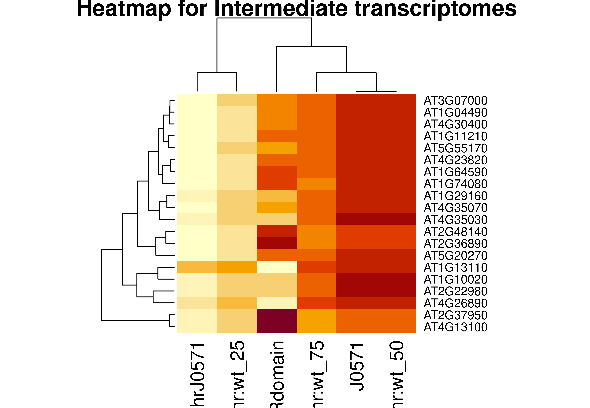

In the file 'table.csv' rest a series of samples for gene expression assays in tissues shr, wt and complemented lines with factors BLUEJAY (BLJ), JACKDAW (JKD), MAGPIE (MGP), NUTCRACKER(NUC), IMPERIAL EAGEL (IME) and SCARECROW (SCR). We want to perform a PCA on this data to see how the data is structured and to try and make some educated guesses.

```{r setup-chunk, include=FALSE}
# Set up images
knitr::opts_chunk$set(dev = "png", dpi = 1000, echo = FALSE, 
                      cache = TRUE, out.width = "450px")
```

## Principal Component Analysis

For this, we will be using princomp, a function from baseline R. We will use cor=FALSE as an option, since the correlation matrix can only be used if there are no constant variables, and process the output to plot loadings, scores and components.

```{r, echo=FALSE, results='hide',fig.keep='all'}
my_table <-read.csv("./table.csv", header=TRUE, row.names = 1)
# Remove empty columns
my_table <- my_table[,apply(my_table, 2, function(x) { sum(!is.na(x)) > 0 })]

# Calculate the initial PCA
PCA<-princomp(na.omit(my_table),scores=TRUE)
variance<-((PCA$sdev^2/sum(PCA$sdev^2))*100)

# We can now plot the different parameters
png(file="ex1_pca1_plots.jpeg",res=300, width = 5200, height = 5200, units = "px")
par(mfrow=c(3,1))
plot(variance, type="s", main="Variance plot for Tissue data", cex.main = 3,
     ylab="Percentage of variance", xlab="PCA component", cex.lab = 2)
plot(PCA$loadings, main="Loadings plot for Tissue data", cex.main = 3, cex.lab = 2)
plot(PCA$scores, main="Scores plot for Tissue data", cex.main = 3, cex.lab = 2)

# Text labels could be added, but there are so many that they make it ilegible
#text(PCA$scores,labels=row.names(PCA$scores),pos=c(4,4,4,2,2,4))
dev.off()
```



---

---




* For the Variance plot, we can see that only 2 components seem to explain more than 80% of the variance of the data. That is great! It means our PCA is really great at simplifying the understanding of the data.
* For the Scores plot, we see that there are two main directions for the data, too, and that there are lots of genes relatively separated from the 0 mark. This is good, too! Since the principal components could be defined as a new coordinate system on which to plot our data, high scores indicate that it is easier to relate these scores to a particular PC. 
* For the loadings plot, we also find relatively high values, which probably correlate with the first plot and are forcing the scores to the left.

## Intermediate transcriptomes

We can then create a series of intermediate transcriptomes, in order to see how these relate to the PCA loadings set, and whether these make it easier to recover expression in each one or not. Thus:

```{r, echo=FALSE, results='hide',fig.keep='all'}
# First, we create the intermediate transcriptomes
intermediate <- my_table[,c("J0571", "shrJ0571")]
intermediate[,"shr:wt_25"] <- 0.75*my_table[,"shrJ0571"] + 0.25*my_table[,"J0571"]
intermediate[,"shr:wt_50"] <- 0.50*my_table[,"J0571"] + 0.50*my_table[,"J0571"]
intermediate[,"shr:wt_75"] <- 0.25*my_table[,"shrJ0571"] + 0.75*my_table[,"J0571"]

# And we do the PCA
PCA_intermediate<-princomp(na.omit(intermediate),scores=TRUE)
variance_intermediate<-((PCA_intermediate$sdev^2/sum(PCA_intermediate$sdev^2))*100)

# We can now plot the different parameters
png(file="ex1_pca2_plots.jpeg",res=300, width = 5400, height = 5200, units = "px")
par(mfrow=c(2,1))
plot(variance_intermediate, type="s", main="Variance plot for Intemediate Transcriptomes",
     ylab="Percentage of variance", xlab="PCA component", , cex.main = 3, cex.lab = 2)
plot(PCA_intermediate$loadings, xlim = c(0.25,0.8), ylim = c(-0.7,0.65),
     main="Loadings plot for Intemediate Transcriptomes", cex.main = 3, cex.lab = 2)
text(PCA_intermediate$loadings,
     labels=row.names(PCA_intermediate$loadings),
     pos=c(2,4,4,4,3,3,3,4))
dev.off()
```



---




Here, as in the previous case, we can see that only 2 PCs explain more than 90% of the variance, and that, when plotting these two components, we can see that, indeed, there is a clear regression along component 1, where we can see that, as their values go down, we pass from the transcriptome at 25%, to the one with 50% and, finally, to the one at 75%. In component 2, however, this is not the case, and the 75% transcriptome appears before the 25% transcriptome.

## Adding another transcriptome: SCR

We add the SCR domain and re-do the PCA:

```{r, echo=FALSE, results='hide',fig.keep='all'}
intermediate[,"SCRdomain"] <- my_table[,"SCRdomain"]
PCA_scr <-princomp(na.omit(intermediate),scores=TRUE)
variance_scr<-((PCA_scr$sdev^2/sum(PCA_scr$sdev^2))*100)

png(file="ex1_pca3_plots.jpeg",res=300, width = 5400, height = 5200, units = "px")
par(mfrow=c(2,1))
plot(variance_scr, type="s", main="Variance plot for SCR Transcriptomes",
     ylab="Percentage of variance", xlab="PCA component", cex.main = 3, cex.lab = 2)
plot(PCA_scr$loadings, xlim = c(0.1,0.9), ylim = c(-0.9,0.85),
     main="Loadings plot for SCR Transcriptomes", cex.main = 3, cex.lab = 2);
text(PCA_scr$loadings,
     labels=row.names(PCA_scr$loadings),
     pos=c(2,4,4,4,3,3,3,4))
dev.off()
```



---



As we can see, things dont chnage much, and SCRdomain appears as a bit of an outlier in our otherwise straight line.

## Most important genes

Finally, we will find the most important genes in the whole population. For this, we will choose the 25 highest-scoring genes in the "PCA_scr" PCA:

```{r, echo=FALSE, results='hide',fig.keep='all'}
Variable_genes =  head(sort(PCA_scr$scores[, 1]), 20)
png(file="ex1_heatmap1.jpeg",res=300, width = 5400, height = 5200, units = "px")
heatmap(as.matrix(my_table[rownames(as.matrix(Variable_genes)), ]),
        main="Heatmap for all transcriptomes", cex.main = 3, cex.lab = 2)
dev.off()
png(file="ex1_heatmap2.jpeg",res=300, width = 5400, height = 5200, units = "px")
heatmap(as.matrix(intermediate[rownames(as.matrix(Variable_genes)), ]),
        main="Heatmap for Intermediate transcriptomes", cex.main = 3, cex.lab = 2)
dev.off()
```



---



We can see that AT2G22980 shows highly differential expression in gene J0517, and is almost unexpressed elsewere; however, for the mutant shrJ0571, we see no expression anywhere, which might give us a cue: this mutation must be a loss of function mutation, which, if we look at our "Heatmap for Intermediate transcriptomes", gets restored when we get a part of the initial transcriptome in.
