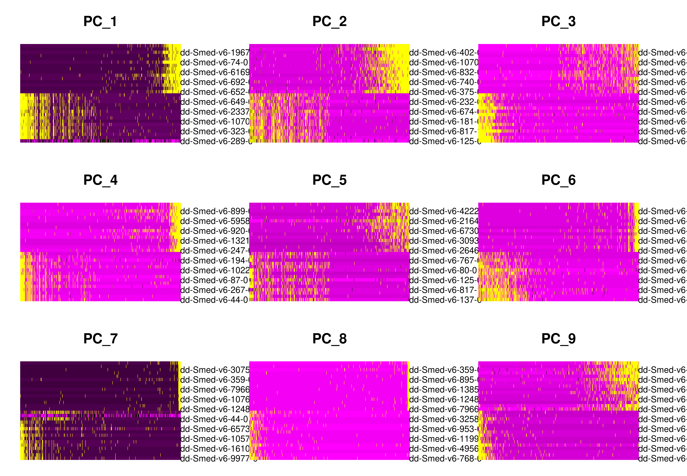
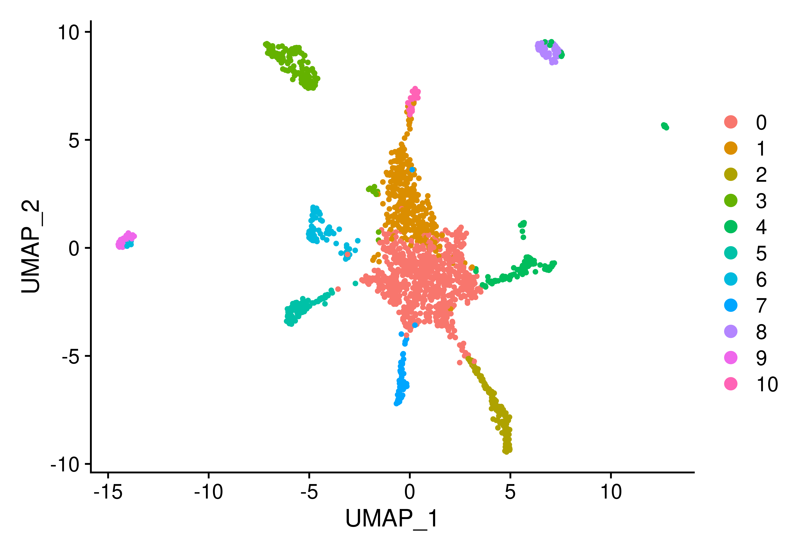
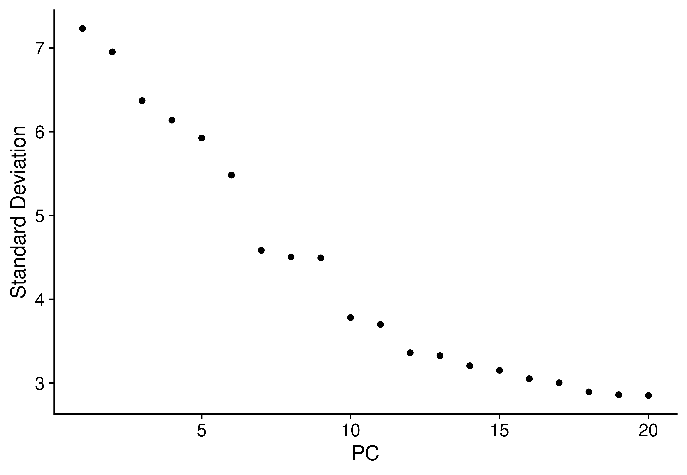
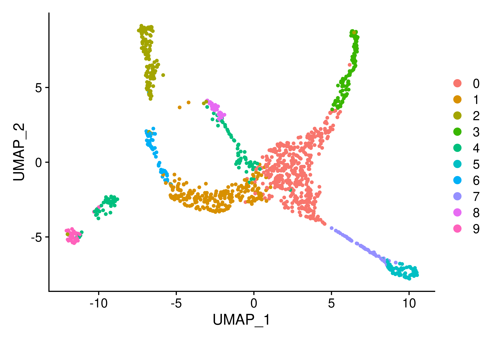
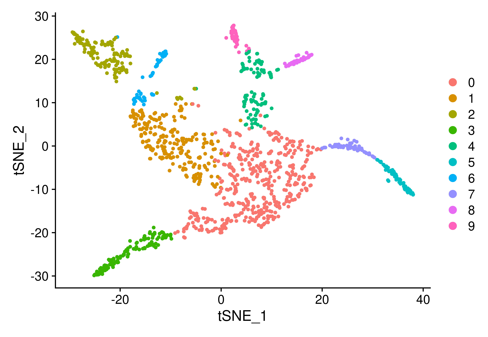
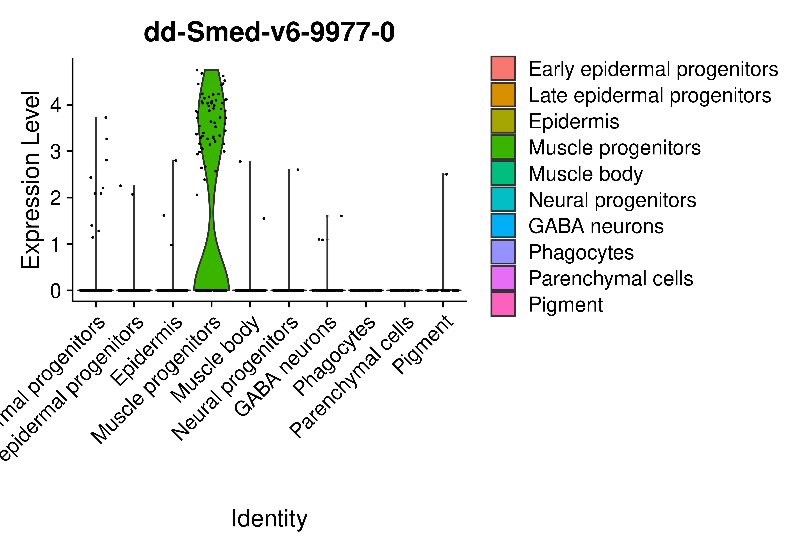
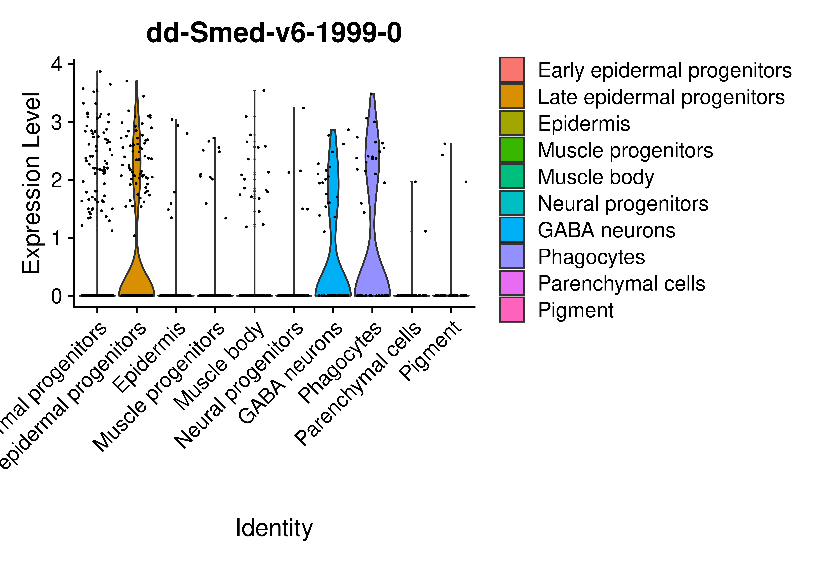
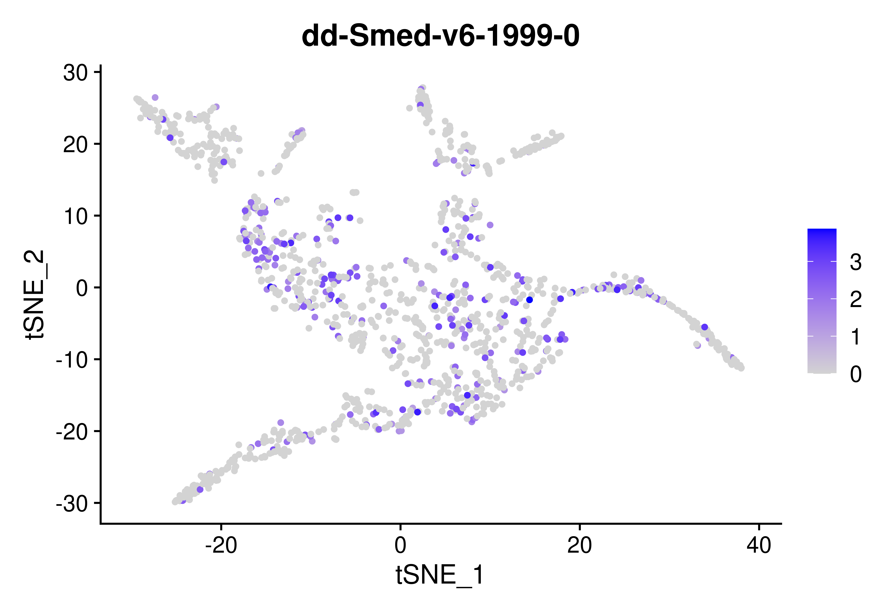

Seurat is an R package designed for QC, analysis, and exploration of single-cell RNA-seq data. Seurat aims to enable users to identify and interpret sources of heterogeneity from single-cell transcriptomic measurements, and to integrate diverse types of single-cell data. In this exercise, we will learn to use it!

```{r setup-chunk, include=FALSE}
## Set up images
knitr::opts_chunk$set(dev = "png", dpi = 1000, echo = FALSE, cache = TRUE)
```

Using the raw data in file “SCOplanaria.txt” we will:

```{r, echo=FALSE, results='hide',fig.keep='all'}
## First, we will import the necessary packages
packages <- c("Matrix", "dplyr", "Seurat")
##for (x in packages) {install.packages(x)}
lapply(packages, require, character.only = TRUE)
```

## Initialize a Seurat object

The steps can be consulted below:

```{r, echo=FALSE, results='hide',fig.keep='all'}

## First, we read the data from the .txt file:
table <- read.table("./SCOplanaria.txt", row.names = 1, header = FALSE)

## To save memory, and since the current dataset has lots of 0's, we convert
## the table -> sparse matrix
table <- as.matrix(table, sparse=TRUE)

## And, we create the Seurat object
SCOplanaria <- CreateSeuratObject(counts = table, project = "SCOPlanaria")

## We have created an RNA assay with 24883 features for 1871 cells.
## We do not want to filter, but, rather, to use all the available data
## We can inspect both the data propper
SCOplanaria[["RNA"]]@counts[1:5,1:5] 
```
```{r, echo=FALSE, results='hide',fig.keep='all'}
## And the meta-data
SCOplanaria@meta.data [1:5,] 
## Here, we can see the read counts per cell (nCount_RNA) and the total
## number of expressed genes per cell (nFeature_RNA)
```
## Pre-process the data

### Perform quality control

For the QC, we would like to select only those samples that are acceptable in quality. For this, we can do a number of data visualizations: for example, we can show the meta.data matrix using a violin plot like this:

```{r, echo=FALSE, results='hide',fig.keep='all'}
# Violin plot and scatter plots are for data discovery only
png(file="ex3_violin_pre.png",res=300, width = 5400, height = 5200, units = "px")
VlnPlot(object = SCOplanaria, features= c("nFeature_RNA", "nCount_RNA"), ncol = 2)
dev.off()
```



In this plot, each point represents an individual read, with the red area being the rotated kernel density plot for the values. As one can read in the title, the left plot represents the number of genes expressed per cell, with the one in the one on the right showing the number of reads per cell. At first sight, there seems to be more counts than features; this is because each gene can have one or more reads.

Now, we can visualize the metadata with the GenePlot function, to try and see if there are any outliers which we should remove.

```{r, echo=FALSE, results='hide',fig.keep='all'}
png(file="ex3_scatter_pre.png",res=300, width = 5400, height = 5200, units = "px")
FeatureScatter(SCOplanaria, feature1 = "nFeature_RNA", feature2 = "nCount_RNA")
dev.off()
```



This function generates an scatter plot for our data, in which we can see that there is a 95% positive correlation, which is pretty high and actually statistically significant. We can try to improve this by removing the values with a nFeature_RNA over 1800, and those with a nCount_RNA < 4500.

```{r, echo=FALSE, results='hide',fig.keep='all'}
# Quality control
png(file="ex3_scatter_post.png",res=300, width = 5400, height = 5200, units = "px")
SCOplanaria <- subset(SCOplanaria, subset = nFeature_RNA < 1500 & nCount_RNA < 4000)
FeatureScatter(SCOplanaria, feature1 = "nFeature_RNA", feature2 = "nCount_RNA")
dev.off()

# Normalization
png(file="ex3_violin_post.png",res=300, width = 5400, height = 5200, units = "px")
SCOplanaria <- NormalizeData(SCOplanaria, normalization.method = "LogNormalize")
normaldata <- colSums(SCOplanaria[["RNA"]]@data)
SCOplanaria <- AddMetaData (SCOplanaria, normaldata, col.name="Normalized_Data")
VlnPlot(object = SCOplanaria, features= c("nCount_RNA", "Normalized_Data"), ncol = 2)
dev.off()
```



Here, we see that, while the correlation does not get any better, it also does not get worse, and there are in fact way less outliers, which is always desirable.

### Normalization

We can normalize the gene expression for all cells by multiplying each cell's baseline expression by a scale factor of 10,000, and log-transforming the result. The new values will be stored in [["RNA"]]@data (as Seurat forces us to use an existing slot for the data), and can be visualized, using its equivalent violin plot(s), as follows:

```{r, echo=FALSE, results='hide',fig.keep='all'}
SCOplanaria <- NormalizeData(SCOplanaria, normalization.method = "LogNormalize")
normaldata <- colSums(SCOplanaria[["RNA"]]@data)
SCOplanaria <- AddMetaData (SCOplanaria, normaldata, col.name="Normalized_Data")
VlnPlot(object = SCOplanaria, features= c("nCount_RNA", "Normalized_Data"), ncol = 2)
```



As we can see, due to the normalization, the data is much more evenly split over the values.

### Feature selecion

We would also like to separate highly variable genes (those that show differential expression across tissues, for example), focusing on them for downstream analysis; seurat does this by modelling the mean-variance relationship od single-cell data, returning 2000 of the most important features. Using this, we will identify the top10 most important genes, and plot them to better understand which they are:

```{r, echo=FALSE, results='hide',fig.keep='all'}
png(file="ex3_feature_selection.png",res=300, width = 2000, height = 2000, units = "px")
SCOplanaria <- FindVariableFeatures(SCOplanaria, selection.method = "vst")
best_hits <- head(VariableFeatures(SCOplanaria), 10)
VariableFeaturePlot(SCOplanaria)
# One can also add the labels using the following code; NoLegend because it was ugly
LabelPoints(plot = VariableFeaturePlot(SCOplanaria), points = best_hits, repel = TRUE
            ) + NoLegend()
dev.off()
```



### Scaling of the data

Finally, we can center and scale the data into a linear model, assuring that the mean expression across cells is 0 and the variance is 1 and savung the results in SCOplanaria[["RNA"]]@scale.data. This gives equal weight to all cells, ensuring there is no over-domination by highly-expressed cells.

```{r, echo=FALSE, results='hide',fig.keep='all'}
SCOplanaria <- ScaleData(SCOplanaria, features = rownames(SCOplanaria))
```

## PCA Analysis

After pre-processing the data, we can finally run the PCA analysis! To understand the results, first, we will group the genes based on behaviour and plot a heatmap with the 15 most variable genes. We can also plot the cells based on which component they belong to, and show the scores for each variant and component, with the following code:

```{r, echo=FALSE, results='hide',fig.keep='all'}
# Run the PCA itself
SCOplanaria <- RunPCA(SCOplanaria, features = VariableFeatures(object = SCOplanaria))
# Some graphs we dont care much about
DimHeatmap(SCOplanaria, dims = 1:9, cells = 500, balanced = TRUE)
VizDimLoadings(SCOplanaria, dims = 1, reduction = "pca")
DimPlot(SCOplanaria, reduction = "pca")
```


---

---



Seurat may also plot the cells by their PCA scores, which would help us group genes by common characteristics (for example, gene families). To determine the number of components, seurat automatically calculates significancy values for N components and reruns the analysis until there isa good distribution of gene scores, in a method that was inspired by the JackStraw algorithm. There, significant components would be those with a strong enrichment of low p-values, represented as dots over a curved line.

```{r, echo=FALSE, results='hide',fig.keep='all'}
SCOplanaria <- JackStraw(SCOplanaria, num.replicate = 100)
SCOplanaria <- ScoreJackStraw(SCOplanaria, dims = 1:20)
# Draw JackStraw and ElbowPlot
png(file="ex3_jackstraw_1.png",res=300, width = 2000, height = 2000, units = "px")
JackStrawPlot(SCOplanaria, dims = 1:15)
dev.off()
png(file="ex3_elbowplot_1.png",res=300, width = 1300, height = 2000, units = "px")
ElbowPlot(SCOplanaria)
dev.off()
```


---



We may also plot a traditional elbow plot, in which we show the standard deviation against the number of Principal Components. As it turns out, a sharp drop in SD occurs after PC 19, which means that, at said point of inflexion, adding an additional PC does not add much to the data; thus, we can keep 10 as our number of PCs.

## Cell clustering

Now that we have defined an adecuate number of Principal Components, we can run a clustering to see if, in fact, we can generate real groups of families of genes. This clusters can be visualized through non-linear dimensional reduction, and then plotted, like so:

```{r, echo=FALSE, results='hide',fig.keep='all'}
SCOplanaria <- FindNeighbors(SCOplanaria, dims = 1:10)
SCOplanaria <- FindClusters(SCOplanaria, resolution = 0.5)
SCOplanaria <- RunUMAP(SCOplanaria, dims = 1:10)
DimPlot(SCOplanaria, reduction = "umap")
SCOplanaria <- RunTSNE(SCOplanaria, dims = 1:10)

png(file="ex3_dimpolot_10PCs_2.png",res=300, width = 1300, height = 2000, units = "px")
DimPlot(SCOplanaria, reduction = "tsne")
dev.off()
```



---



## New Parameters

To validate our results, we will reproduce the analysis by keeping only genes expressed in at least 3 cells and cells with at least 200 and at most 2500 genes, lognormalizing with a scale of 10000 and selecting the 3000 most variable features. We will also regress out any variability, and use PCs 1-5 with a resolution of 0.6

```{r, echo=FALSE, results='hide',fig.keep='all'}
New_plan <- CreateSeuratObject(counts = table, project = "Planaria", 
                               min.cells = 3, min.features = 200)
New_plan <- subset(New_plan, subset = nFeature_RNA < 2500 & nFeature_RNA > 200)
New_plan <- NormalizeData(New_plan, normalization.method = "LogNormalize", 
                          scale.factor = 10000)
New_plan <- AddMetaData(New_plan,colSums(New_plan[["RNA"]]@data),col.name="Norma Data")
New_plan <- FindVariableFeatures(New_plan, selection.method = "vst", nfeatures = 3000)
New_plan <- ScaleData(New_plan, features = rownames(New_plan))
New_plan <- RunPCA(New_plan, features = VariableFeatures(object = New_plan))

png(file="ex3_elbowplot_2.png",res=300, width = 1300, height = 2000, units = "px")
ElbowPlot(New_plan)
dev.off()

New_plan <- FindNeighbors(New_plan, dims = 1:5)
New_plan <- FindClusters(New_plan, resolution = 0.6)
New_plan <- RunUMAP(New_plan, dims = 1:5)
DimPlot(New_plan, reduction = "umap")
New_plan <- RunTSNE(New_plan, dims = 1:5)
DimPlot(New_plan, reduction = "tsne")
```



---

---



As we can see in the elbow plot, there is not much of a difference when we account for the small changes introduced now; in both cases, there are two possible elbows, at 5 and 10 clusters, respectively. This is good! It means our results are robust, and do not depend so much in discretionary parameters which could be misinterpreted. If we look at the graph itself, we will see that its shape is quite different, but mostly in the group shapes, since their size is quite similar. The two options, however, seem good enough, which reinforces the idea that our results are robust independently of the number of PCs chosen.

## Finding Biomarkers through Differential Gene Expression

For each of the gene expression clusters that we have previously defined, we would like to find a series of associated biomarkers, to try and see whether they relate to a specific cellular function or not. For this, Seurat has a built-in function that analyzes each cluster with regards to all others, analyzing whether some biomarkers show a disproportionate expression in each cluster or not. Since, as we have already discussed in the previous section, 5 PCs seem to show better adjustment to the data than 10 PCs, we will use the data from our repetition for this analysis.

```{r, echo=FALSE, results='hide',fig.keep='all'}
## Calculate biomarkers
New_plan.biomarkers <- FindAllMarkers(New_plan, only.pos = TRUE,
                                      min.pct = 0.25, logfc.threshold = 0.25)

## Select the best hits (we chose 5)
best_hit_biomarkers <- (New_plan.biomarkers %>% group_by(cluster) 
                        %>% slice_max(n = 5, order_by = avg_log2FC))

## And show them as a heatmap
# And show them as a heatmap
png(file="ex3_heatmap.png",res=300, width = 2000, height = 1500, units = "px")
DoHeatmap(New_plan, features = best_hit_biomarkers$gene) + NoLegend()
dev.off()
```



The results seem promising: for each gene cluster, from 0 to 9, we find that each one has a series of clearly differentiated markers (in yellow) and that, except in clusters 4-8-9 and 5-7, there are no duplicities, as they are marked on the diagonal. This indicates that we will surely be able to differentiate the gene clusters by their markers, and, therefore, that they probably have a differentiated biological function.

## Showing the expression distribution of these markers

Finally, we can directly show the distribution of the expression of these markers between the different clusters, by means of both violin plots and feature plots. For them, we can choose between t-SNE and uMap as methods; since t-SNE very good at creating a single map that reveals structure at many different scales, we decided to use that algorithm for our dimensionality reduction.

```{r, echo=FALSE, results='hide',fig.keep='all'}
## First, we set the col names. Since R does not let us create a dictionary,
## we must declare two vectors:
gene_names = c('dd-Smed-v6-61-0', 'dd-Smed-v6-2178-0', 'dd-Smed-v6-298-0',
               'dd-Smed-v6-1410-0', 'dd-Smed-v6-702-0', 'dd-Smed-v6-2548-0',
               'dd-Smed-v6-9977-0', 'dd-Smed-v6-48-0', 'dd-Smed-v6-175-0',
               'dd-Smed-v6-1161-1')

cell_identities = c('Early epidermal progenitors', 'Late epidermal progenitors',
                    'Epidermis', 'Muscle progenitors', 'Muscle body',
                    'Neural progenitors', 'GABA neurons', 'Phagocytes',
                    'Parenchymal cells', 'Pigment')

# The full plots. Not of much use, but, if I dont save them
# R just makes them hyper mega o sea super-super ugly
# (gosh I hate R)
png(file="ex3_full_violinplots.png", res=300, width = 5000, height = 4000, units = "px")
VlnPlot(New_plan, features = gene_names)
dev.off()
png(file="ex3_full_featureplots.png", res=300, width = 5000, height = 4000, units = "px")
FeaturePlot(New_plan,  features = gene_names, reduction = "tsne")
dev.off()
```

<!-- --> <!-- -->

We can also show our renamed clusters based on the information we now know; since all of the data-processing steps are already done, this is just a visualization step, in which we get to see how our analysis went:

```{r, echo=FALSE, results='hide',fig.keep='all'}

## Rename the columns
names(cell_identities) <- levels(New_plan)
New_plan <- RenameIdents(New_plan, cell_identities)

## Or the feature/violin plot for some of the elements
VlnPlot(New_plan, features = 'dd-Smed-v6-9977-0')
FeaturePlot(New_plan, features = 'dd-Smed-v6-9977-0', reduction = "tsne")

VlnPlot(New_plan, features = 'dd-Smed-v6-1999-0')
FeaturePlot(New_plan, features = 'dd-Smed-v6-1999-0', reduction = "tsne")
```



---




---



As we can see, it seems that the biomarker *dd-Smed-v6-9977-0*, related to cluster 4, is clearly related to muscle progenitors, its expression being highly localised in the lower left side of the image, as can be seen in the individual feature plot. However, for *dd-Smed-v6-1999-0*, mainly related to epidermal, phagocyte and GABA neuron progenitors, it seems that its expression is much more diffuse, which may be due both to the fact that it is a poorer quality cluster and that, as it contains so many features, it is easier to find dispersion.

This analysis could be done individually for each of the clusters, but for the purpose of the exercise at hand, I believe that this short description serves to show how to proceed in the clusters.

```{r, echo=FALSE, results='hide',fig.keep='all'}
# We can show the labeled dimplot
names(cell_identities) <- levels(New_plan)
New_plan <- RenameIdents(New_plan, cell_identities)
png(file="ex3_labeled_dimplot.png", res=300, width = 3000, height = 2000, units = "px")
DimPlot(New_plan, reduction = "tsne")
dev.off()
```


