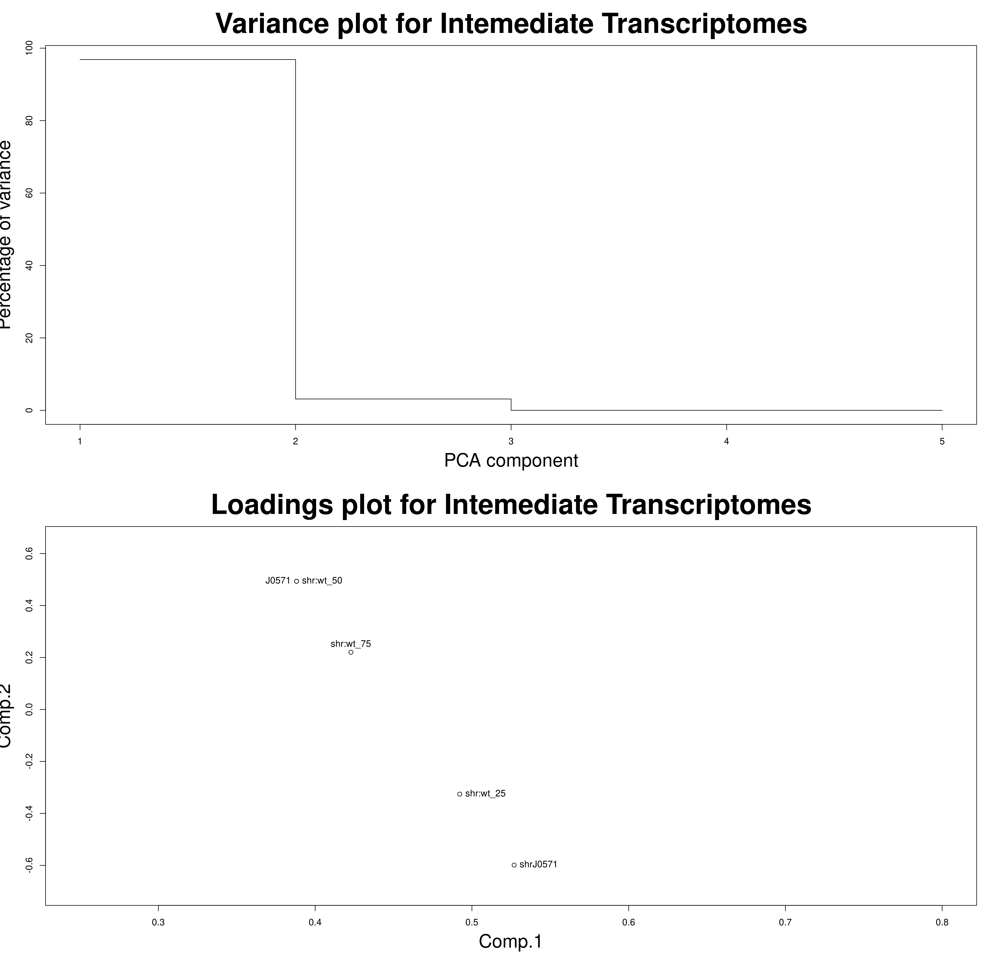
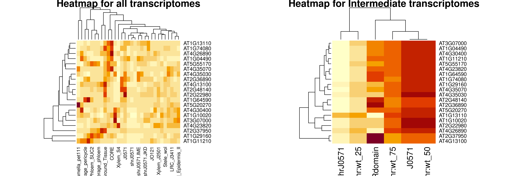
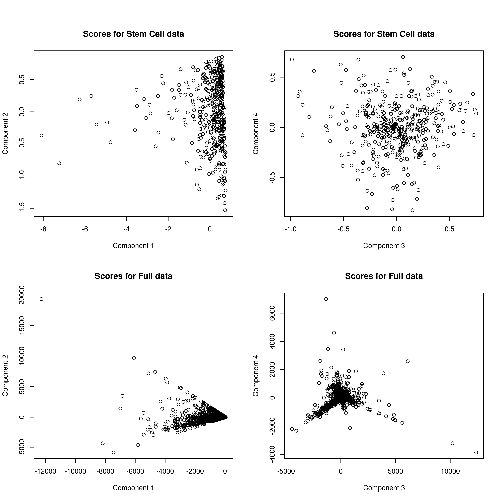
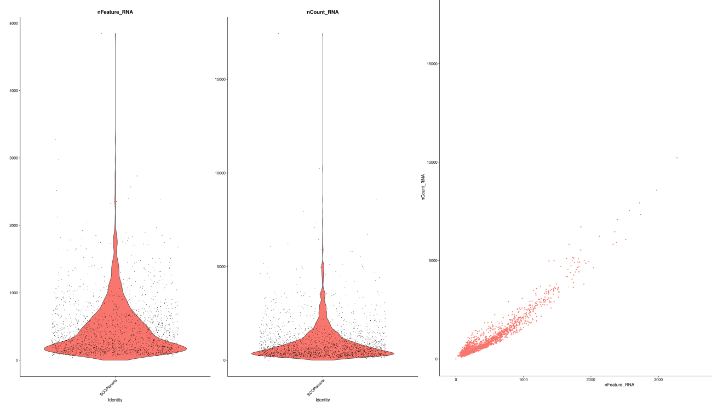
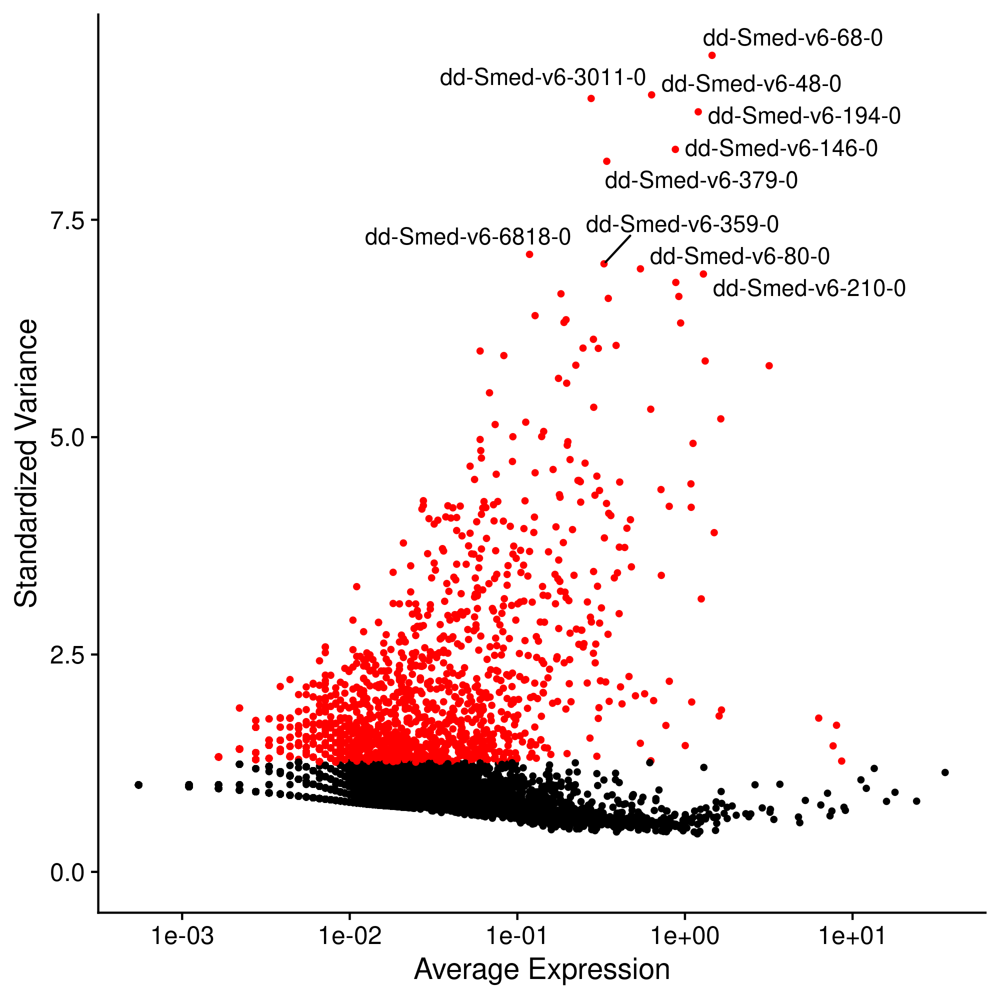
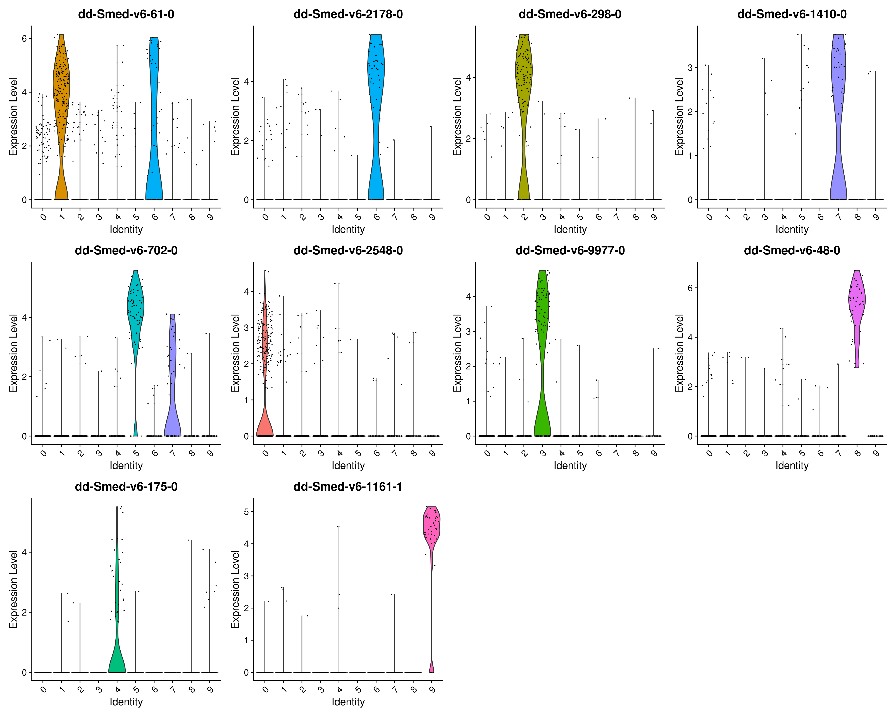

## Introduction

Single-cell omics technologies are a series of scientific methods that allow us to investigate the variations that exist, at the individual level, in the expression of the different cells that make up a whole, whether this is a tissue, a colony of bacteria, or even a human being.[@paolillo_single-cell_2019] Through these ultra-detailed analyses, we can identify exactly which molecular characteristics correspond to certain clinical outcomes, and therefore allow us to go beyond the "macro" paradigm in which we have been working until now. Thus, since the publication of the first single-cell RNA-sequencing study in 2009,[@paolillo_single-cell_2019] the number of publications related to this field has skyrocketed, multiplying by more than 10 times between now and 2021.[@noauthor_search_nodate] In this work, our aim is to delve deeper into the molecular characteristics that correspond to certain clinical outcomes.

In this report, we aim to delve deeper into the use of this kind of analysis to better understand how it works and the kind of insigts it can provide us with, using advanced statistical analysis methods such as Principal Component Analysis, relying on the ``` R ``` programming language and packages such as ```matlib``` and ```Seurat```.

## Matherials and Methods

### Exercise 1: Undertanding Mutagenesis Processes

As part of this exercise, we have received a data file, ``table.csv``, containing the results of a series of gene expression assays in plants. Thus, we have both wild type organisms (i.e. whose genome is the predominant one in nature)[@noauthor_heredity_nodate] and shr mutants, which have a loss-of-function mutation in the SHORT ROOT protein,[@koizumi_short-root_2012] and whose presence causes, precisely, reduced apical root growth due to deficiencies in the formation of separate endodermal and cortical cell layers. To study the effect of this mutation in detail, both cell lines have been supplemented with factors *BlueJay*, (BLJ), *JackDaw* (JKD), *MagPie* (MGP), *NutCracker* (NUC), *Imperial Eagle* (IME) and *ScareCrow* (SCR).

Thus, our aim is to understand how loss of function works, and what ways different factors affect it, for which we will use PCA type analysis. For this first exercise, we will use princomp, a function that comes pre-included in R-base, and show the initial PCA result. Then, to understand how the loss of function due to the shr mutant works, we will create a series of wt-shr "intermediate transcriptomes", in which we will be able to see how the loss of function is reversed. Finally, we will add SCR to our intermediate transcriptomes, and see what happens to the 25 genes that contribute the most to the expression of the shr protein, in order to understand if, for example, it belongs to a family of genes and transcription factors, or simply to see what other parts of the organism it affects.

### Exercise 2: Finding Stem Cell Biomarkers

The aim of this second exercise will be to demonstrate the potential of PCA to make sense of a large set of data, the intention being, in this assignment, to find biomarkers that allow us to differentiate the presence of Stem Cells from a new set of assays on gene expression with multiple samples.

First, we will perform a preliminary visualisation of the data using box plots, to try to determine which genes have extraordinary expression values and, therefore, which are more likely to influence the result of the PCA and end up finding good molecular markers. In the following, we will analyse the differences in the transcriptomes using PCA, indicating which are the most important components and elucidating whether these are related to the box plot results or not.

Having discovered the most important genes and components, and knowing that one of our genes, **WOX5**, is only expressed in stem cells, we can proceed to subtype only those markers that differentially express WOX5, performing a new PCA with these genes and analysing the result in detail in terms of components, loadings and scores.

Comparing the first PCA with the second, we will try to find out what is the significance of the Principal Components, see if we can discover the presence of biomarkers through their scores and speculate about which cell types are likely to present better markers.

In this case, and in order to fully understand how PCA works, we will perform the analysis completely manually, diagonalising the matrices and calculating their eigenvectors by hand, instead of using an integrated module as we did in the previous part. For this, we used R's ```nmatlib``` package.

### Exercise 3: Differential Expression Clustering Using Seurat

```Seurat``` is an R package designed for QC, analysis, and exploration of single-cell RNA-seq data, which aims to enable users to identify and interpret sources of heterogeneity from single-cell transcriptomic measurements, and to integrate diverse types of single-cell data.[@hao_integrated_2021] In this exercise, we will learn to use it through a practical example, in which we will analyse a database of Peripheral Blood Mononuclear Cells (PBMC) recovered from a healthy donor and sequenced on Illumina NovaSeq with approximately 43k read pairs per cell.[@10xgenomics_10k_nodate] This database is available for free, and under Creative Commons license, on the 10xGenomics website.[@10xgenomics_10k_nodate]

Once this data has been downloaded, we will perform a Quality Control, removing any entries with more than 1800 expressed genes per cell or less than 4500 read counts per cell, and Normalize the data using the ```LogNormalize``` method with a factor of 1000. Having removed this "incorrect" outliers, we would like to separate highly variable genes (those that show differential expression across tissues, for example), focusing on them for downstream analysis; seurat does this by modelling the mean-variance relationship od single-cell data, returning 2000 of the most important features. Using this, we will identify the top10 most important genes, centering and scaling them onto a linear model, assuring that the mean expression across cells is 0 and the variance is 1. This gives equal weight to all cells, ensuring there is no over-domination of the whole data-set by this highly-expressed cells.

After pre-processing the data, we can perform a PCA analysis. To understand the results, first, we will group the genes based on behaviour and plot a heatmap with the 15 most variable genes. We can also plot the cells based on which component they belong to, and show the scores for each variant and component. Seurat may also plot the cells by their PCA scores, which would help us group genes by common characteristics (for example, gene families). To determine the number of components, seurat automatically calculates significancy values for N components and reruns the analysis until there isa good distribution of gene scores, in a method that was inspired by the JackStraw algorithm. There, significant components would be those with a strong enrichment of low p-values, represented as dots over a curved line. We may also plot a traditional elbow plot, in which we show the standard deviation against the number of Principal Components, to see if the result from the JackStraw graph is OK.

After defining an adecuate number of Principal Components, we will run a clustering to see if, in fact, we can generate real groups of families of genes. This clusters can be visualized through non-linear dimensional reduction, and then plotted; to validate our results, we will reproduce the analysis by keeping only genes expressed in at least 3 cells and cells with at least 200 and at most 2500 genes, lognormalizing with a scale of 10000 and selecting the 3000 most variable features. We will also regress out any variability, and use PCs 1-5 with a resolution of 0.6

For each of the gene expression clusters that we will have just defined, we would like to find a series of associated biomarkers, to try and see whether they relate to a specific cellular function or not. For this, Seurat has a built-in function that analyzes each cluster with regards to all others, analyzing whether some biomarkers show a disproportionate expression in each cluster or not; we will visualize this genes in a heatmap, to see whether they are differentially expressed or not.

Finally, we can directly show the distribution of the expression of these markers between the different clusters, by means of both violin plots and feature plots. For them, we can choose between t-SNE and uMap as methods; since t-SNE very good at creating a single map that reveals structure at many different scales, we decided to use that algorithm for our dimensionality reduction. We will also show our renamed clusters based on the information we will then know; since all of the data-processing steps will already be done, this will just be a visualization step, in which we get to see how our analysis went.

## Results

### Exercise 1

#### Principal Component Analysis

After running the related code in the Annex, we get the following **Figure 1**:

<div style="text-align: center">
    
 </div>

* For the Variance plot, we can see that only 2 components seem to explain more than 80% of the variance of the data. That is great! It means our PCA is really great at simplifying the understanding of the data.
* For the Scores plot, we see that there are two main directions for the data, too, and that there are lots of genes relatively separated from the 0 mark. This is good, too! Since the principal components could be defined as a new coordinate system on which to plot our data, high scores indicate that it is easier to relate these scores to a particular PC.
* For the loadings plot, we also find relatively high values, which probably correlate with the first plot and are forcing the scores to the left.

#### Intermediate transcriptomes

In **Figure 2**, as in the previous case, we can see that only 2 PCs explain more than 90% of the variance, and that, when plotting these two components, we can see that, indeed, there is a clear regression along component 1, where we can see that, as their values go down, we pass from the transcriptome at 25%, to the one with 50% and, finally, to the one at 75%. In component 2, however, this is not the case, and the 75% transcriptome appears before the 25% transcriptome.

<div style="text-align: center">
    
 </div>

#### Adding another transcriptome: SCR

As we can see in **Figure 3**, things dont chnage much, and SCRdomain appears as a bit of an outlier in our otherwise straight line.

<div style="text-align: center">
    
 </div>

#### Most important genes

For this section, our intention is to collect the 25 most differentially expressed genes from our entire list, attempting to elucidate how these are affected by the shortroot mutation through a Heatmap. However, after several hours of trying and much frustration, the author of this report has discovered that, apparently, R-base's ```heatmap``` function is **simply incapable** of doing such a thing.[@noauthor_display_nodate] Leaving aside how incredible it seems that one of the most widely used programming languages in the world is incapable of doing something so simple in a natively simple way, the author has decided to go the lame way and capture them side by side. The result can be seen in **Figure 4**, just below:

<div style="text-align: center">
    
 </div>

We can see that AT2G22980 shows highly differential expression in gene J0517, and is almost unexpressed elsewere; however, for the mutant shrJ0571, we see no expression anywhere, which might give us a cue: this mutation must be a loss of function mutation, which, if we look at our "Heatmap for Intermediate transcriptomes", gets restored when we get a part of the initial transcriptome in.

### Exercise 2

#### Data Visualization

The first idea is to do a simple data visualization, to see which genes among our data have more variable expression profiles, and thus are more likely to influence the number of PCs and the quality of our analysis. We can use the ```boxplot()``` function for that:

<div style="text-align: center">
    
 </div>

As **Figure 5** shows, most of the genes have a very similar basal level of expression, and very low, close to 0, which is the reason why the boxes in our box plots (representing the values between Q1 and Q3) look so small and stuck to the bottom of the image. In addition, we can see that most of the genes have a large number of outliers, represented by circles that stack up to look like columns, and that, in almost all cases, do not exceed the 5000 barrier. However, for both **E30** and **S18**, we observe a large number of outliers, which is precisely what we wanted to find with this representation: these are the genes that will be of most interest to us, as they are the ones that most modify the response of the system.

#### Analyzing transcriptome differences for all cell types

In **Figure 6** below, components 1-3 seem to explain most of the variance on our dataset. with the percentage of variance dropping significantly after PC4. This is equivalent to the more traditional "elbow plot", in which we find an elbow after which adding additional PCs has little to no effect on variance. Seen the resultsof the above plot, we will keep 4 PCs for our analysis. With regards to the loadings plot, what we find is that, once again, there seem to be two clear outliers (maybe related to **E30** and **S18**?), with two semi outliers which might actually be PC3 and PC4. The loadings seem to correlate with the scores, which is good; in both graphs, there is a cluster of uninteresting genes close to 0, with some outliers to the left bringing the scores to the left too, and adding variance that may be of interest.

<div style="text-align: center">
    
 </div>

#### Finding biomarkers for Stem Cells

Having decided on the number of Principal Components for our PCA analysis, we can proceed with the analysis itself. Since we want to find biomarkers that occur specifically in Stem Cells, and we know the genes that are differentially expressed there present the **WOX5** domain, we will select for the PCA analysis only those rows that surpass a treshold of 1 for said gene, and that dont surpass it for any of the other genes.

<div style="text-align: center">
    
 </div>

As shown by **Figure 7**, the markers we have selected are, in fact, hightly selective towards **WOX5** (and thus stem cells), ignoring most of the rest of the tissues.

#### PCA of stem-cell markers

After re-doing the PCA only for these WOX5-selective markers, we get **Figure 8**:

<div style="text-align: center">
    
 </div>

Unlike what happened before, we can see that 2 PCs suffice to explain most of the variance of the data. This makes sense: we only have ~450 rows, down from ~63000 before! With regards to the loadings, we see much fewer outliers, to the left of the graph, and, while some do exist, forcing the scores a bit in their direction, the real spread occurs along the vertical axis, especially for scores: that is, Component 2 records a much wider diversity than Component 1. That a single component explains so much variance makes a lot of sense: on the one hand, because it is inherent to PCA processes to reduce as much as possible the dimensions we work with; and, on the other hand, because we ourselves have manually reduced those dimensions by selecting a variable of special interest, the overexpression of WOX5. It is therefore possible that PC1 is telling us just that, the inordinate importance of variance in WOX5 expression in understanding our data.

#### Comparing the graphs and identifying biomarkers

We can compare the results obtained for stem cells and for normal cells and see what happens. For instance, we can check PC1 vs PC2, and PC3 vs PC4, and see how they correlate in **Figures 9 and 10**.

<div style="text-align: center">
    
 </div>

<div style="text-align: center">
    
 </div>

To interpret these graphs, we have to know that, to differentiate biomarkers, the key is the points that are separated from the rest, "marking" a differential expression. For example, in the PC1 vs PC2 loadings, we find that WOX5 is very clearly separated from the rest of the loadings in the Stem cell data graph, being located at the top left; as this does not happen in the full data, we can see that it is indeed a biomarker of this expression. We can also see that S18 and E30 tend to be located separately from the others in most loadings: this makes sense, as they are the genes with the highest differential expression, and therefore those for which it would be easiest to find biomarkers. To do this, we go to the Scores graph, where, if we see a point that corresponds to the loadings in terms of its separation from the rest, we can conclude that the marker it represents is specific to that gene (although we cannot know exactly which one because we have omitted the labels to avoid further blurring the image). This happens, apart from WOX5, for S18 and E30, which are the ones for which we can find biomarkers; not surprisingly, it was precisely S18 and E30 which were overexpressed in our original data, which is, indeed, why we can find biomarkers for them.

### Exercise 3

#### Quality Control and Normalization

The coding processes can be consulted in the joint script; essentially, for the quality control, the first step would be to draw some plots that show the internal distribution of our data and allow us to identify some outliers. Once again, since R clearly does not stand for "Really smart", we found out that there is no easy, out-of the box way of merging the kind of figures Seurat draws into one canvas, so we had to use an internet resource;[@] the result can be seen in **Figure 11**

<div style="text-align: center">
    
 </div>

In each of the violin plots, each point represents an individual read, with the red area being the rotated kernel density plot for the values. The left plot represents the number of genes expressed per cell, with the one in the one on the right showing the number of reads per cell. At first sight, there seems to be more counts than features; this is because each gene can have one or more reads. When plotted against each other, a good correlation of 0.95 is found; however, some outliers are found with the distribution being really narrow because of that. Thus, outlier removal is advisable: the results are in **Figure 12**.

<div style="text-align: center">
    
 </div>

Here, we see that, while the correlation does not get any better, it also does not get worse, and there are in fact way less outliers, which is always desirable.

#### Feature Selection

As explained in Matherials and Methods, Seurat aut-selects the 2000 most variable genes; they can be seen, labeled, on **Figure 13**:

<div style="text-align: center">
    
 </div>

#### PCA Analysis and Clustering

To decide the number of Principal Components in our PCA, Seurat uses a JackStraw-like algorithm shown in **Figure 14(b)**. We can see that, between PC9 and 10 there is a large gap, which indicates that 10 is the adequate number of PCs to select. Using a t-SNE algorithm, we will cluster the data resulting from this PCA into 10 groups, a number obtained from the Elbow plot available in **Figure 14(a)**, which shows a large drop in Standard Deviation between components 9 and 10, such that, from PC10 onwards, adding an additional component does not improve the SD explained by the system.

<div style="text-align: center">
    
 </div>

Then, a clustering using t-SNE for dimensionality reduction was performed, and its results were compared, in **Figure 15**, to another clustering using PCs 1-5 with a resolution of 0.6, for which 10 clusters were selected as well according to the corresponding elbow plot (**Figure 14(c)**), which is not very different to the one in **Figure 14(a)**; in both cases, there are two possible elbows, at 5 and 10 clusters, respectively. This is good! It means our results are robust, and do not depend so much in discretionary parameters which could be misinterpreted. If we look at the dim plots themselves, we will see that their shapes are quite different, but mostly in the group shapes, since their size is quite similar. However, the groups generated with 5 PCs seem to be, at first glance, more cohesive and close thogether than either those that existed or those created with 5 10 PCs. The two options, however, seem good enough, which reinforces the idea that our results are robust independently of the number of PCs chosen.

<div style="text-align: center">
    
 </div>

#### Finding Biomarkers through Differential Gene Expression

Since, as we have already discussed in the previous section, 5 PCs seem to show better adjustment to the data than 10 PCs, we will use the data from our 5-PC repetition for this analysis. The results in **Figure 16** seem promising: for each gene cluster, from 0 to 9, we find that each one has a series of clearly differentiated markers (in yellow) and that, except in clusters 4-8-9 and 5-7, there are no duplicities, as they are marked on the diagonal. This indicates that we will surely be able to differentiate the gene clusters by their markers, and, therefore, that they probably have a differentiated biological function.

<div style="text-align: center">
    
 </div>

#### Showing the expression distribution of these markers

Once the PCA and differential gene expression analysis has been performed, we can show the FeaturePlots (**Figure 19**) and ViolinPlots (**Figure 18**) of the differential expression of the different markers in the different clusters, showing these labelled in order to associate them to specific functions (**Figure 17**). As we can see, it seems, for instance, that the biomarker *dd-Smed-v6-9977-0*, related to cluster 4, is clearly related to muscle progenitors, its expression being highly localised in the lower left side of the image, as can be seen in the individual feature plot. However, for *dd-Smed-v6-1999-0*, mainly related to epidermal, phagocyte and GABA neuron progenitors, it seems that its expression is much more diffuse, which may be due both to the fact that it is a poorer quality cluster and that, as it contains so many features, it is easier to find dispersion.

This analysis could be done individually for each of the clusters, but for the purpose of the exercise at hand, I believe that this short description serves to show how to proceed in the clusters.

<div style="text-align: center">
    
 </div>

<div style="text-align: center">
    
 </div>

<div style="text-align: center">
    
 </div>

## Conclussions

Throughout these three exercises, and thanks to packages such as Seurat and Matlib, we have learned how to use R packages to deal with Single Cell Genomics data in an efficient, effective, useful way, and in only 15 pages, which was the minimum required! Thanks to this complete text, as well as the accompanying code scripts, it has been proven that we know how to use PCA for the analysis of massive SCG data, demonstrating, we hope, a thorough knowledge of the subject.

## References

<div id="refs"></div>

This document, and the accompanying code, is availaible under the [CC  By SA 4.0](https://creativecommons.org/licenses/by-sa/4.0/) License, and was generated using [pandoc](https://pandoc.org/)


<!-----

This document can easily be converted to PDF format using pandoc:

``` pandoc --pdf-engine=xelatex --highlight-style tango --biblio Bibliography.bib "Report.md" -o "MarcosLópez_PabloIgnacio.pdf" ```-->

