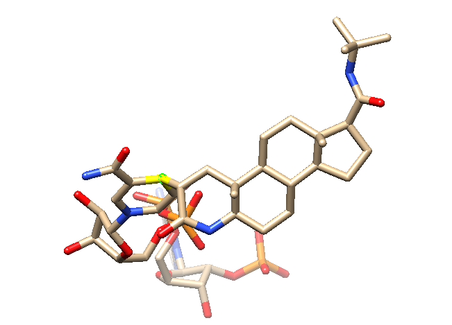

    

  

In the previous assignment, we managed, using l**igand Based Virtual Screening**, to obtain a list of those molecules that we considered to have \"high affinity\" with finasteride, a selective inhibitor of 5α-reductase type II, the enzyme that converts testosterone into dihydrotestosterone in the scalp and, therefore, that causes baldness. The idea was thus to find a molecule similar to finasteride and with the same properties, but even more selective and with greater affinity, in order to improve its therapeutic properties.

In this assignment, the idea is to perform a **pharmacophore-based virtual screening**. In our case, the pharmacophore we design will already be selective, as it is based on the properties of finasteride; therefore, what we are looking for is to improve as much as possible the **affinity**, which we described in the initial assignment through its IC~50~ of 16 nM.

To do this, the first step is to enter PDB and search for structures of our target protein (5α-reductase) associated with the selective inhibitor we have previously chosen (finasteride). In this case, we have only managed to find **only one result**,[^1] which is coupled with NADPH as a reaction intermediary.

    
    
Figure 1. The Finasteride-coupled-to-NADPH complex I found in PDB. In yellow, with the joining Carbon atom highlighted in green, the bond between FNS (right, front) and NADPH (back). Nottice some  SO4-2 ions on the back: I believe they act as coadyuvants.

This complex structure has raised several serious issues for me. Is it appropriate to cut the NADPH bond, and recreate the double bond in order to have a \"guide molecule\" that has at least the right structure to bind to the 5-aR? Or, on the contrary, is this a bad idea since, although the structure of the complex may be adequate to interact with the enzyme, it may not be, for example, adequate to access the active center? Does it make sense to cut the molecule in this way, when surely the binding of NADPH itself modifies its spatial conformation?

It is because of all these doubts that I have decided to dispense with this molecule. I am aware that, in doing so, I give up the possibility of having a guide molecule with the appropriate conformational structure to bind to the enzyme in question, but, in exchange, I make sure that I am not touching parameters that I do not fully understand and that may end up messing up the pharmacophore even more. In addition, PDB as a format does not support the double bonds[^2] that Finasteride presents, and, as much as I have tried with Chimera, I have not found a way to simulate them.

Therefore, to make up for this lack of valid crystallographic structures, I will take the 4 best hits from the file \'SimilarityAnalysisFinasteride.csv\', measured by Dice (MACCS), which recall that in the previous assignment we had defined as the best similarity measurement method. Excluding *CHEMBL710* (which has an score of 1.0, since it is our initial drug, finasteride), we get the following list:

 <strong> CHEMBL2282655   CHEMBL2282779     CHEMBL2282654   CHEMBL2282782 </strong> 

These four compounds all come from the same paper,[^3] have the same mechanism as Finasteride (competitive inhibition) and use the same "bolsillo protéico", which means they will be quite similar, and thus good at predicting a pharmacophore.[^3]

Once we have added the three compounds + the Finasteride to Chimera, we add Hydrogens, add Charges and minimize the structure five times, in order to provide as accurate a result as possible, and save as mol2.

    
    
Figure 2. Molecule’s structure before (L) and after (R) minimization. Notice how the minimized structure is much more “loose”, letting molecules have their way.

For the next step, we would like to create a pharmacophore out of these molecules. For this, we merge the 4 individual mol2 files into one, and we upload it to PharmaGist.[^4] To account for its hight lipophilicity, the "Hydrophobic" advanced option could have been upped a bit, but, since I didn't know by how much, I prefered to leave the default values. Once we get the results, we select the target with the best score from the alignments that include the 4 molecules, and download the JMOL file, which includes **our pharmacophore**.

Now that we have created our pharmacophore, we can proceed with the part of interest in our analysis: the **pharmacophore based virtual screening**. For this, we will use Pharmit: first, we create a new database from the compounds discovered in Assignment 1 (SimilarityAnalysisFinasteride.csv), which we convert to .msi format by removing all columns except for SMILES and CHEMBLID and concatenating both of them with an space in between. Once we are sure the database has been correctly created (in our case, **Finasteride-Similar 5ARIs KQMJ9Y**, with 2,832 conformers and192 compounds), we can proceed with the scanning: we enter pharmit search, search for our database from the "contributed libraries" panel and add our pharmacores under the "Load features..." button.

Unfortunately, there are no hits for our chosen pharmacophore: this most likely means its structure is too restrictive, and thus that pharmit has problems finding matches. No problem! We can continue searching for matches using PharmaGist's list of suitable pharmacophores, descending one-by-one in order of Score: for \#6, we found 6 matches, and 9 matches for \#13; still a bit too little for our analysis. However, when we go for \#10, ¡bingo! 65 matches are found, which reduce to 25 when we select 1 hit per configuration and per molecule. After ordering the matches in order of decreasing RMSD, we can save the .sdf results file.

And, just like this, ¡we have some drug candidates! Now, to make sure this drugs are good enough for clinical use, we would like to try and predict some of their ADME properties. The term ADME, which stands for Absorption, Distribution, Metabolism, and Excretion, describes how the drug interacts with the target organism, since the levels and kinetics of drug exposure to different tissues influence the degradation and processing of the drug, and thus its activity and efficiency. For this, we will use the accompanying Jupyter Notebook, which was kindly provided to us by the teacher.

This notebook takes the .sdf file and transforms it to CSV, which is more manageable, and evaluates whether the compounds fulfill Lipinski's rule of five. That rule, developed at Pfizer in 1997, evaluates how likely a drug candidate is to be an effective oral drug in humans, based on the idea that most orally-active compounds are small, lipofillic molecules.[^5] It thus demands that the mollecular weight is \< 500, that there are no more than 10 Hydrogen Bond acceptors and no more than 5 HB donors, and that its *n*-octanol-water partition coefficient (a measure of the relationship between lipophilicity and hydrophilicity) does not exceed 5 (high lipophilicity, but not too high).

If all 5 rules (or 4, since Lipinski originally merged the HB rules in one) are met, and if the Topological Polar Surface Area is less than 140 (since polar mollecules are bad at permeating cell membranes), the data is saved into a new file, 'MolDB\_Ro5.csv', which you can find attached. We could also have allowed a rule to be broken without exclusion.; however, I found that too permissive, as it left out only 2 molecules (full rule-following left 13 in and 12 out, a \~50/50 split).

To better understand the statistical distribution of our drugs, we made the following graphs:
- A radar plot of the values of our selected "drug candidates": here, we can see that none exceed the "blue area" of accepted values under the rule of five, although the more "dangerous" values (i.e. those that risk causing an exclusion the most) are molecular weight and *n*-octanol-water partition coefficient (here specified as LogP in log scale)

    
    
Figure 3. Radar plot of the Ro5 (and therefore ADME) classification of those drugs that previously met the Rule of Five.Note how the characteristics with the highest deviation are molecular weight and logP

- Some histograms of the Ro5 properties of our drugs. Since we only found 13, it is a bit more difficult to extract conclussions from a histogram, but we can still see that the parameters with the greatest variance are in the number of hidrogen bond donors and acceptors, which can also be seen in the previous graphs. Molecular weight is actually pretty similar, which must mean that those molecules with more HBD/A are smaller, since hidrogen-bond formating atoms (usually N and O) are bigger than Carbon

    
    
Figure 4. Histogram of the Ro5 properties of our compounds. As can be seen, the greatest variance is in the number of hydrogen bond acceptors and donors, which indicates, together with the low variance in molecular mass, that the molecules must vary in size.

And, ¡that would be it! With the rule-of-five acting as a proxi for ADME properties acting as a proxy to ensure compliance with ADMET properties, these would be possible drugs to study as a substitute for finasteride. It remains for future researchers both to analyze the in vivo inhibitory capacity, side effects and viability of the drug, and to find more crystallographic structures for finasteride itself, which currently, to my surprise, is not as extensively studied as one would expect for one of the most important enzymes in the human (or at least in the male) body.

## References

[^1]: Bank, RCSB Protein Data. RCSB PDB - 7BW1: Crystal Structure of Steroid 5-Alpha-Reductase 2 in Complex with Finasteride. <https://www.rcsb.org/structure/7BW1>. Accessed 12 december 2021.

[^2]: «PDB File Format and Double Bonds». Avogadro Discussion, 19 de febrero de 2016, <https://discuss.avogadro.cc/t/pdb-file-format-and-double-bonds/2293>.

[^3]: Kumar, Rajnish, y Manoj Kumar. «3D-QSAR CoMFA and CoMSIA Studies for Design of Potent Human Steroid 5α-Reductase Inhibitors». Medicinal Chemistry Research, vol. 22, n.o 1, enero de 2013, pp. 105-14. Springer Link, <https://doi.org/10.1007/s00044-012-0006-1>.

[^4]: Schneidman-Duhovny, D., et al. «PharmaGist: A Webserver for Ligand-Based Pharmacophore Detection». Nucleic Acids Research, vol. 36, n.o Web Server, mayo de 2008, pp. W223-28. DOI.org (Crossref), <https://doi.org/10.1093/nar/gkn187>.

[^5]: Lipinski, Christopher A., et al. «Experimental and Computational Approaches to Estimate Solubility and Permeability in Drug Discovery and Development Settings1PII of Original Article: S0169-409X(96)00423-1. The Article Was Originally Published in Advanced Drug Delivery Reviews 23 (1997) 3--25.1». Advanced Drug Delivery Reviews, vol. 46, n.o 1, marzo de 2001, pp. 3-26. ScienceDirect, <https://doi.org/10.1016/S0169-409X(00)00129-0>.
