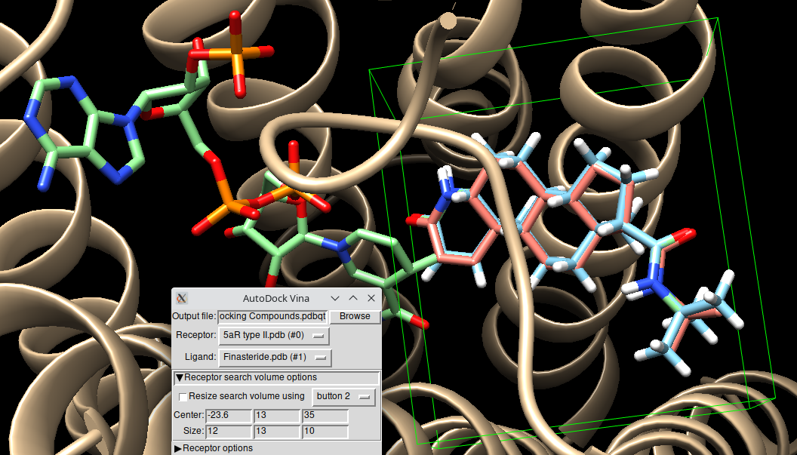

## Abstract

Androgenetic alopecia is a genetic variation that causes hair loss on the scalp due to hypersensitivity of hair follicles to didydrotestosterone (DHT). Using only computational methods, we were able to find a drug candidate to replace the most commonly used drug, Finasteride (FNS), which acts by blocking the generation of DHT in the scalp by type II 5-α-reductase, the most active isoform there. Not only did we improve Ki (from 26 nM in FNS to 21 nM), but our candidate remains 63% more selective to type II than to type I, which we hope will allow it to avoid FNS’s side effects.

**Keywords: Male Pattern Hair Loss, Alopecia, Finasteride, Drug discovery**

## Introduction

Male pattern Hair Loss, baldness or, more technically, androgenetic alopecia, is a genetic variation present in about 40% of Spanish men 1 that causes hair loss in the scalp due to hypersensitivity of hair follicles to didydrotestosterone (DHT), a potent androgen derived from testosterone. 2

With the exception of hair transplants, which treat the condition by repositioning testosterone-insensitive follicles from the sides and back of the head to the DHT-sensitive area on top, there are only two drugs approved for the treatment of androgenetic alopecia: minoxidil and finasteride. Unlike minoxidil, which works by increasing the blood supply to the area, nourishing the hair follicles and temporarily increasing their resistance to DHT, finasteride treats the root of the problem. It competitively and non-suicidally 3 inhibits 5α-reductase type II, the enzyme that converts testosterone to DHT in the scalp, and has been shown to slow hair loss in up to 60% of patients, and to increase hair density in 35% of them. 4 Moreover, due to its selectivity (it acts mainly against 5αR type II, which is mainly expressed in the scalp, and only slightly against 5αR type I, which is expressed in the liver and the rest of the skin), 3 it has fewer side effects than comparable drugs such as dutasteride, even though these may be slightly more effective.

Both drugs were discovered accidentally, when it was found that patients being treated for benign prostatic hyperplasia (in the case of FNS) and hypertension (in the case of minoxidil) presented excessive hair growth. 2 In this work, we aim to find a drug with greater efficacy (measured by its Ki) than FNS, with comparable side effects and which maintains selecitvity against 5αR type II (so that DHT does not disappear completely from the body, limiting its generation to the area not affected by alopecia). We hope that, in this way, side effects (such as decreased libido and sperm levels, erectile dysfunction and depression in FNS) will remain limited, without sacrificing efficacy.

## Materials and Methods

### Initial Analysis and Ligand Based Virtual Screning

To start with the drug search process we entered CHEMBL and searched for type II 5α-Reductase, sorting the interacting molecules by increasing order of Ki (idecreasing order of inhibitory activity). CHEMBL296415, the best hit, presents an Ki of 7.6 nM, which will be used for comparison as a maximum target value at the end of the study. However, as we are looking for a molecule selective only against type II 5αR, and, as we know that this one is not, we will rather use finasteride, which is already characterized, as a base molecule on which to improve its Ki of ~ 26 nM. 5

Thus, obtained its SMILES from CHEMBL, we uploaded it to SwissSimilarity, selecting "Combined - ChEMBL (activity<10µM)" to obtain molecules with a high degree of similarity to FNS. We processed that list of molecules to find the most similar ones using both MACCS and Morgan Fingerprints and Tanimoto and Dice indexes (see Annex I - Code for more details on processing), selecting those with a combined Dice-MACCS value greater than 0.75. This metric was selected because it yielded the smallest values among the four MACCS/Morgan and Tanimoto/Dice combinations, although all values were quite small due to method selection (Combined - ChEMBL uses electroshape and fingerprint indexing, which are different and make the conditions stringent).

### Pharmacophore Based Virtual Screning

Having obtained the results of the LBVS, we will now analyze the pharmacophoric properties of our molecules, to find out how and which parts of the molecule carry  biological activity

To do this, we first built a pharmacophoric model:

* As a guide molecule, we used Finasteride itself, downloading the crystallographic structure of the FNS-5aR type II complex from the Protein Data Bank 6 and separating the ligand both from the protein and from the NADPH that acts as a cofactor. To get the original mollecule, we recreated the double bond that was destroyed when the NADPH joined it. This helps our pharmacophore account for the biological conformation of the ligand in vivo.

* To improve diversity and make the structure less force, and in the absence of more crystallographic structures in PDB, we used 4 additional molecules, the 4 best hits by Dice - MACCS of the Ligand Based Virtual Screening, to generate the pharmacophore. These are, CHEMBL2282655, CHEMBL2282779, CHEMBL2282654 and CHEMBL2282782, all come from the same original paper, 7 and have the same mechanism of action and target the same protein pocket as finasteride, so we can be sure that their position with respect to the enzyme will be similar, and, therefore, that they will be valid to form the pharmacophore.

Once we have added the four compounds and the cleaved Finasteride to Chimera, we added Hydrogens and Charge and minimized the structure five times, with 500 steepest descent steps and 50 conjugate gradient steps each, and saved as five different mol2 files, which we merged into one. Then, we uploaded that file to PharmaGist, a webserver for ligand-based pharmacophore detection which works via multiple flexible alignment of drug-like molecules. 8 To account for finasteride’s high lipophilicity, we changed the “Hydrophobic” value from 0.3 to 0.5.

From PharmaGist, we downloaded the best match, and screened it against a Pharmit 9 database made out of our  Dice-MACCS filtered compounds. To make the screen less stringent, we deactivated some of the less important features, as shown in Figure 1.

    
    
Figure 1. Selected and discarded features for our pharmacophoric model. In green, kept hydrophobic features generated by PharmaGist; in blue, discarded ones. A Hydrogren Bond donor and an aceptor, in white and orange respectively and on the down left, where also kept in the final model.

### ADMET Properties analysis

The term ADME, which stands for Absorption, Distribution, Metabolism, and Excretion, describes how a given drug interacts with a target organism, since the levels and kinetics of drug exposure to different tissues influence drug’s degradation and processing, and, thus, activity and efficiency. 10

Using the code present in Annex I, we  evaluated whether our selected molecules follow Lipinski’s rule of five. The rule, developed at Pfizer in 1997, evaluates how likely a drug candidate is to be an effective oral drug in humans, based on the idea that most orally-active compounds are small, lipofillic molecules, and can be used as a proxy for ADMET properties. 11 It demands that the mollecular weight is < 500 daltons, that there are no more than 10 hydrogen bond acceptors and  5 donors, and that its n-octanol-water partition coefficient (a measure of the relationship between lipophilicity and hydrophilicity) does not exceed 5 (high lipophilicity, but not too high). 11

If all 5 rules are met, and if the Topological Polar Surface Area is less than 140 (since polar mollecules are bad at permeating cell membranes), the molecules are considered valid.

### Docking using Dock Thor

Finally, having selected some drug candidates with good pharmacophoric and chemical properties, we performed a virtual molecular docking, to try and predict the Ki of our compounds and see if they are indeed more effective and selective than approved compounds.

Since the docking process is very intensive in both time and computational resources, we have used Dock Thor, an online docking service provided by the Laboratório Nacional de Computação Científica do Brazil and powered by the SDumont Supercomputer. 12 With its help, we performed two dockings: one against 5aR type II, and the other against type I, both using as cofactor the NADPH cleaved from the PDB structure obtained in Section 2; and, as a list of potential ligands, a series of 30 compounds obtained in the previous section and converted to SDF using the code in Annex I. To define a suitable docking box, we have performed a reference docking, comparing Finasteride’s 3D structure from PDB with the results of a virtual docking in Chimera using Autodock Vina, 13 obtaining an RMSD of just 0.453 Å for a docking box with the values in Figure 2.

    
    
Figure 2. Docking box size and coordinates using USCF Chimera. In green, the NADPH-coupled finasteride, with the NADPH part left out of the docking box as much as possible. In blue, the docking-ready finasteride, together with 5aR typeII, in beige. In red, the docking result, with an RMSD of 0.453 Å to the original, blue finasteride.

Given that 5aR type I’s structure was not availaible in PDB, we kept the same box when docking it, expecting it to be similar to that of  5aR type II. Its structure was obtained from alphafold, which predicts its most likely conformation based on the aminoacidic chain.

## Results

Over the successive rounds of selection detailed in the “Materials and Methods” page, we were able to select only those compounds with better similarity, affinity and ADMET properties than finasteride, our original molecule. Figure 3 explains the process in a more detailed way: of the 400 SwissSimilarity results, 200 dissappeared when we applied a further Dice-MACCS combined simmilarity treshold of 0.621, representing Q2; of those, only 51 presented good pharmacophoric properties (as presented in Figure 1), which was reduced to just 30 Rule-of-Five following compounds, with good enough ADMET properties to be sure that they will work in the human body.

The results for the docking of those 30 molecules are shown in Table 1, which filters only those with 15% more affinity towards 5aR type II and 15% less towards 5aR type I than FNS, making for suitable drug candidates. As one can see, the estimated Ki values for FNS (CHEMBL710) are 26.713525 for type II and 30.861358, pretty close to literature values of 17–29 nM for type II, 5 though not much for type I, which has a real Ki of 330 nM. 14 This might be because, in vivo, type 2  has higher affinity for testosterone than type 1, 15 and because its structure here was predicted by alphafold, but, given selectivity was overall preserved, we may consider the docking valid.

    
    
Figure 3. Flowchart for compound selection

As we can see, the results are not impressive, and most compounds have only a small variation in  Ki, never getting close to the 7.6 nM value for which we set off at the start. This, however, is to be expected: the molecule that presented it, CHEMBL336532, was itself an outlier on its table, and may not have good ADMET, similarity or docking qualities. With regards to the compounds that we ended up with, all of them might be good drug candidates, although CHEMBL1668930 seems to be the best: its Ki for 5aR type I might not be as high as for, for example, CHEMBL76192, but it makes up for that with a much lower Ki for 5aR type I, meaning that, overall, it is the most selective of the 3. Furthermore, given that Finasteride is already approved and found to have minimal side effects, we would suggest choosing the one with the lowest Ki for 5αR type II as a proposed drug, since what seems to matter most is efficacy, not side effects, which would in any case already be reduced given the higher Ki for 5αR type I in all our molecules.

|   Chembl ID   | Ki for 5αR type II | Ki for 5αR type I | Selectivity Ratio |
|:-------------:|:------------------:|:-----------------:|:-----------------:|
|   CHEMBL710   |       26.7135      |      30.8614      |       15.53       |
| CHEMBL2282652 |       24.8536      |      36.2249      |       45.75       |
|  CHEMBL76192  |       24.6041      |      39.9923      |       62.54       |
| CHEMBL1668930 |       21.7651      |      35.5565      |       63.36       |

**Figure 4.** Table of proposed compounds. In blue, Finasteride, the original drug, and its predicted Kis. In lime, CHEMBL1668930, our proposed drug, with its predicted Kis. Selectivity ratio is 100*(Ki for type I-Ki for type II)\Ki for type II

## Conclussions

Using   computational methods only, we were able to determine a good candidate for the treatment of Androgenetic Alopecia in CHEMBL1668930. Its high selectivity towards 5αR type II, its better affinity than already approved drugs and its fulfillment of Lipinski’s Rule of Five, makes us believe that this drug holds potential in improving the state of the art with regards to the treatment of both AA and, potentially, Benign Prostate Hyperplasia, which is caused by the same molecular mechanisms. It remains for future scientists to build on our discovery, analyzing the in vivo activity of our molecule and understanding whether this drug is, indeed, body safe, useful and effective.

## References
 1	A. Goren et al., “A preliminary observation: Male pattern hair loss among hospitalized COVID-19 patients in Spain – A potential clue to the role of androgens in COVID-19 severity,” Journal of Cosmetic Dermatology, vol. 19, no. 7, pp. 1545–1547, 2020, doi: 10.1111/jocd.13443.

 2	V. A. Randall, “Molecular Basis of Androgenetic Alopecia,” in Aging Hair, R. M. Trüeb and D. J. Tobin, Eds. Berlin, Heidelberg: Springer, 2010, pp. 9–24. doi: 10.1007/978-3-642-02636-2_2.

 3	S. L. Hulin-Curtis, D. Petit, W. D. Figg, A. W. Hsing, and J. K. Reichardt, “Finasteride metabolism and pharmacogenetics: new approaches to personalized prevention of prostate cancer,” Future Oncol, vol. 6, no. 12, pp. 1897–1913, Dec. 2010, doi: 10.2217/fon.10.149.

 4	J. Leyden et al., “Finasteride in the treatment of men with frontal male pattern hair loss,” Journal of the American Academy of Dermatology, vol. 40, no. 6, pp. 930–937, Jun. 1999, doi: 10.1016/S0190-9622(99)70081-2.

 5	“Pharmacogenetic analysis of human steroid 5α reductase type II: comparison of finasteride and dutasteride in: Journal of Molecular Endocrinology Volume 34 Issue 3 (2005).” https://jme.bioscientifica.com/view/
journals/jme/34/3/0340617.xml (accessed Jan. 10, 2022).

 6	R. P. D. Bank, “RCSB PDB - 7BW1: Crystal structure of Steroid 5-alpha-reductase 2 in complex with Finasteride.” https://www.rcsb.org/structure/7BW1 (accessed Jan. 10, 2022).

 7	“3D-QSAR CoMFA and CoMSIA studies for design of potent human steroid 5α-reductase inhibitors | SpringerLink.” https://link.springer.com/article/10.1007%2Fs00044-012-0006-1 (accessed Dec. 12, 2021).

 8	D. Schneidman-Duhovny, O. Dror, Y. Inbar, R. Nussinov, and H. J. Wolfson, “PharmaGist: a webserver for ligand-based pharmacophore detection,” Nucleic Acids Research, vol. 36, no. suppl_2, pp. W223–W228, Jul. 2008, doi: 10.1093/nar/gkn187.

 9	J. Sunseri and D. R. Koes, “Pharmit: interactive exploration of chemical space,” Nucleic Acids Research, vol. 44, no. W1, pp. W442–W448, Jul. 2016, doi: 10.1093/nar/gkw287.

 10	L. L. G. Ferreira and A. D. Andricopulo, “ADMET modeling approaches in drug discovery,” Drug Discov Today, vol. 24, no. 5, pp. 1157–1165, May 2019, doi: 10.1016/j.drudis.2019.03.015.

 11	C. A. Lipinski, “Lead- and drug-like compounds: the rule-of-five revolution,” Drug Discovery Today: Technologies, vol. 1, no. 4, pp. 337–341, Diciembre 2004, doi: 10.1016/j.ddtec.2004.11.007.

 12	I. A. Guedes et al., “New machine learning and physics-based scoring functions for drug discovery,” Sci Rep, vol. 11, no. 1, p. 3198, Feb. 2021, doi: 10.1038/s41598-021-82410-1.

 13	O. Trott and A. J. Olson, “AutoDock Vina: Improving the speed and accuracy of docking with a new scoring function, efficient optimization, and multithreading,” Journal of Computational Chemistry, vol. 31, no. 2, pp. 455–461, 2010, doi: 10.1002/jcc.21334.

 14	S. Délos, C. Iehlé, P.-M. Martin, and J.-P. Raynaud, “Inhibition of the activity of ‘basic’ 5α-reductase (type 1) detected in DU 145 cells and expressed in insect cells,” The Journal of Steroid Biochemistry and Molecular Biology, vol. 48, no. 4, pp. 347–352, Mar. 1994, doi: 10.1016/0960-0760(94)90074-4.

 15	C. Iehlé, S. Délos, O. Guirou, R. Tate, J. P. Raynaud, and P. M. Martin, “Human prostatic steroid 5 alpha-reductase isoforms--a comparative study of selective inhibitors,” J Steroid Biochem Mol Biol, vol. 54, no. 5–6, pp. 273–279, Sep. 1995, doi: 10.1016/0960-0760(95)00134-l.

## Code and Acknowledgements

Source code for the assignment can be found  here(./Annex_I_Code.ipynb)

This document, and the accompanying code, is availaible under the  CC-By SA 4.0 License(https://creativecommons.org/licenses/by-sa/4.0/).
