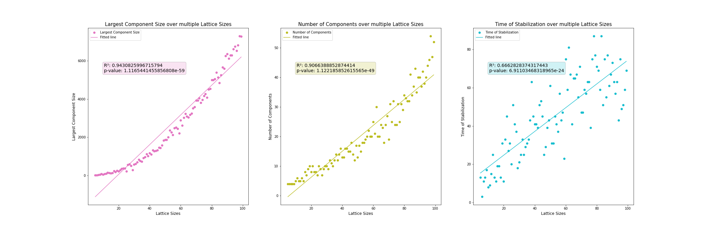
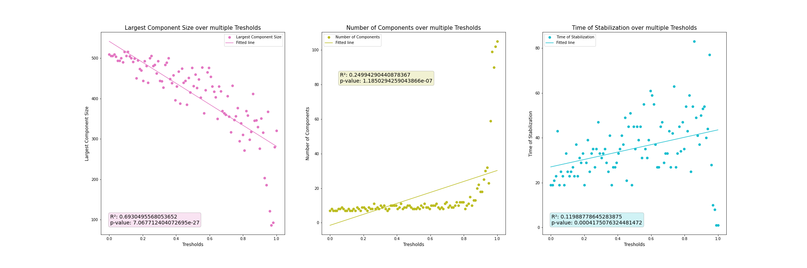
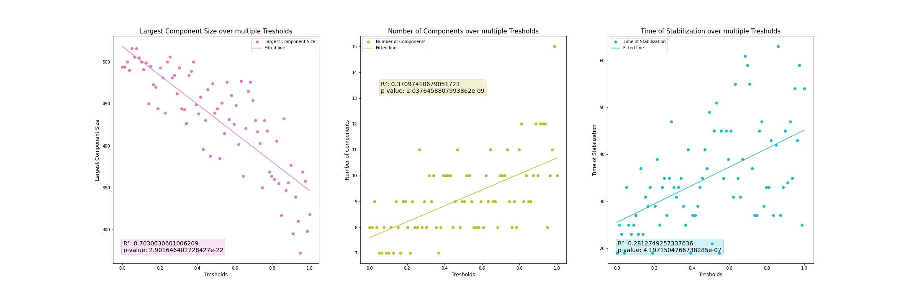
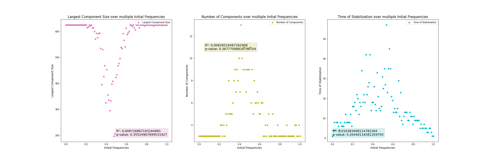

<div style="text-align: center">
    <a href="./Annex I - Code.ipynb" target="_parent"></a>
</div> </br>

# Abstract

The synchronisation of bioluminescence in *Photinus carolinus*, the rocky mountain firefly, has intrigued researchers and visitors alike for years, making it one of the most studied phenomena of its kind. Using parameters defined in previous literature, we have created a cellular automaton capable of representing, in a simple way, the complex synchronisation mechanisms behind this coleopteran species. Using descriptive statistical methods, we concluded that the most important parameter for defining the system is the size of the network, much more so than the initial proportion of each class of individual or the ratio of influenceability by neighbours, and we were able to test the robustness of our results using Machine Learning, a completely different method that nevertheless supports the same conclusions. Although the predictive power of the parameters studied remains low, it is up to future researchers to characterise other parameters, such as boundary conditions, which could allow us to define the system and predict its results even more accurately.

# Introduction

*Lampyridae* are a family of polyphagous coleopterans that includes the insects known as fireflies, characterized by their ability to emit light through bioluminescence. This phenomenon, which greatly exposes the insects to the presence of predators in the dark of night, has a lot of functions, mostly related to reproduction: by performing a flash of light, a male firefly can attract the attention of a female mating partner, although a female of an opposing species can also use this mechanism to attract a male and eat him.

Special mention should be made of *Photinus carolinus*, whose synchronized bioluminescence displays have intrigued *Rocky Mountain National Park* visitors over the years. Due to its originality, this event has been the subject of many studies, which show that it presents a reproductive advantage: by synchronizing their flashes of light, males facilitate location recognition by females, which, in turn, increases their chances of transmitting their genes and improves the collective reproductive prowess of the species.

During the breeding season in June, hundreds and even thousands of these synchronous fireflies emit between five to eight flashes of light all at once before allowing eight to 10 seconds of darkness. This light pattern can continue for hours, usually starting by the evening and ending around midnight. Previous literature suggests that these mechanisms are governed by a biological pacemaker, which has a waiting time in which it is not usually activated again once it has been previously activated, and an activation treshold at which bioluminescence appears. In this way, the fireflies avoid flashing too close together in time, as well as remaining in a permanent ON/OFF state. This pacemaker is usually reset every 1000 milliseconds, although this can vary depending on a series of external stimuli, which can be either an artificial light (in the case of researchers) or the luminescent signal from neighbors, causing synchronization to exist.

To better understand the functioning of this complex system, we have designed a cellular automaton that mimics the synchronization behavior of fireflies, taking into account the waiting and treshold periods described above, and we have studied its behavior to understand the importance of different factors, such as lattice size, initial frequency of each type of individuals and influenceability by the neighbors' consensus.

# Materials and Methods

Our simulator consists of three main functions:

* ```time_step``` takes a python matrix, in the form of a np.ndarray, and recursively updates it over time by using our specified treshold parameter, which defaults to 0.25. This works only one step at a time, and a similar ndarray matrix is return with the results of a cycle of lights-turning.

* ```keep_track``` tracks a series of *values* of study that, together with our *parameters* of interest, let us define the system and understand how it is behaving. We have decided this values to be **time to stabilization**, **number of components** and **size of the largest component** at a given time. ```keep_track``` itself only manages the **time to stabilization** part, by defining "stabilization" as no change in the **size of the largest component** (the parameter we thought would be most prone to change of the three, as it works as the "background" of sorts of the binary image) over three generations (or six ON/OFF cycles), and invokes ```count_elements``` to do the actual calculations.

* ```count_elements``` uses ```ndimage```, a SciPy package, to label and classify the number of islands in each binary image (our lattice), processing its size and returning largest component size, number of components, and average size at equilibrium.

With the main pieces of code defined, we can start our investigations:

## Lattice Size

Based on previous knowledge from [Assignment 4](https://www.pablomarcos.me/es/posts/modelizaci%C3%B3n-de-sistemas-biol%C3%B3gicos/celular-automata/) (the cellular automata), we would expect the complexity of our system to be highly correlated with the size of the network, since complex systems can only start to appear once the framework for them is large enough. This can be understood simply by *reductio ad absurdum*: if we have a grid of only 1 or 2 pixels, synchronisation will be almost immediate, making the system uninteresting to study; whereas, with a grid of 100 pixels, there may be local phenomena of interest, which is why we have chosen to study only grids of between 5 x 5 and 100 x 100 pixels (since bigger grids were deemed too computationally intensive).

With respect to the parameters, the direct consequences of this assumptions would be to expect the **number of components** to be directly correlated with the size of the lattice, since, as the lattice size increases, the chances of local phenomena of interest also increase. For the **size of the largest component**, something similar should happen: the larger the grid, the larger it will be, although it is possible that the appearance of local phenomena will make the correlation less intense than in the previous case. Finally, the **time to stabilization** should also correlate nicely with this parameter, since in smaller lattices, this is trivial, while, in larger lattices, "lazy fireflies" that take longer to synchronise may appear.

For the data visualization part, we have fitted the data to a linear model using SciPy's ```linregress``` package, extracting the R² and the p-value parameters to mathematically see how well this correlate. To show the results, we defined the ```plot_graph``` function, which simply makes it easier to automate making subplots of linearly-fitted data.

## Influenceability by the neighbors' consensus

For this parameter, our basic ```time_step``` function has a qualifier, ```treshold```, which represents the chance that, given a set of neighbours with equal values, a given ```firefly X``` with the opposite value and neighbouring them will reset to match the ON/OFF state of its neighbours. This value is defined as a threshold between 0 and 1, so that the higher the threshold, the more difficult it is for this to occur, and therefore the lower the influenceability, from which it follows that, the lower the threshold, the higher the influenceability. Influenceability can thus be expressed, in percentage terms, by the following formula:

$$ influenceability\_percentage = (1-threshold) \cdot 100 \qquad \%$$

In principle, we would expect the **size of the largest component** to be highly influenced by the neighbor's consensus, since, if fireflies tend to more easily respond to each other syncronizations, the should more easily become syncronized, forming larger groups; although, and this is important, the **number of components** might not be as influenced, since local pockets that surged after 100 generations mostly stayed that way because they were insensible to the default (and already quite high) treshold of 25%. **Time to stabilization**, might, however, be more correlated, since we have defined stabilization as "no changes in the largest component over three generations", and a low influenceability treshold might cause an increase in the number of "lazy fireflies", which are, in a biological sense, more autonomous; and, in a mathematical sense, more prone to remember the effects of the initial distribution (which is in this case, random but common to all simulations in this section).

For our analysis, we chose 100 linearly spaced treshold values between 0 and 1, covering all probability ranges, and drew the same linearly-fit graphs as in the previous section; more creative plots could have been provided for, but it is difficult to match the descriptive power of a good scatterplot with an R² inside. For the simulations, we chose a 25 x 25 grid, which is enough to be computationally affordable while allowing some interesting complexity to appear.

## Initial Frequency of each type of individuals

The initial frequency of each type of individual (i.e., ON/OFF, 1/0) can be defined through a value $p$, which is equal to the proportion over 1 of initially ON individuals; whereas $1-p$ would represent the initial proportion of OFF individuals. Taking into account this probability, initial values were assigned at random through a series of 100, 25 x 25 grids, using the data to plot some more linear correlation graphs using the ```plot_graph``` function. Although common sense would suggest that, as happened in the previous section, extreme values (those closer to $p=0$ or $p=1$) should be excluded from our analysis (they represent extreme values that are difficult to find in nature), we have decided to include them and maybe cut them later on, so as to check if taking them out has the desired effect.

In general, I would expect all the values here to be weakly correlated (R² of around 0.5), specially parameters such as **largest component size**, because, although having a larger population of one type will obviously lead to a bigger group of individuals of that same type in the end, this should no big deal: initial conditions usually dont matter that much. I would expect **time to stabilization** to be less related, specially since, first of all, the time values already tend to be pretty low, so making it easier by modifying proportions shouldn't make much of an impact; and since "lazy fireflies", depending on the treshold, may make the process difficult to stabilize in any case. Finally, with regards to the **number of components**, I expect to see a low correlation, because I expect the data to be two-tailed: with low values of $p$, almost all will be OFF at the beginning, so they would be mostly synched; the reverse would happen for high $p$ values. However, for intermediate values, we might see lots of components appearing, since there are more posibilities to choose from. In this case, of course, the R² metric would be useless, but we will calculate it nonetheless.

## The final question

By now, we should have already characterized the system based on our designed parameters, concluding that, by importance, **lattice size >> influenceability, with initial freq.'s influence being more difficult to determine**. Nowing how the model works, we should be qualified to answer the following questions:

> What determines how quickly the system reaches equilibrium? \
What does the average cluster size at equilibrium depend mostly on?

For this section, we will build on the knowledge acquired in the "Big data" subject, doing something quite different from the traditional statistical analysis we have been using until now. Using a decision tree machine-learning algorithm, we will try to train out machine to predict the 'Average cluster size' and 'Time to Equilibrium' parameters, using the 'largest component size', 'time to stabilization' and 'number of components' values that we have studied. The interesting part here is that SPARK (the software we want to use), as part of its Machine Learning algorithms, presents a method, ```.featuresImportance```, which shows us precisely what determines the different parameters and in what proportion, which is our subject of study!

Thus, if our analysis is correct, we should find that lattice size is much more important than influenceability, and that influenceability is somewhat more important than intial frequency.

To perform this analysis, we have run 8000 different experiments, in which we have played with the following parameters:

* The lattice size, between 10 and 30: this way, we avoided very small sizes, with artefacts such as perfect synchronisations at the beginning, and very large ones, which would increase computing time.
* The proportions of initial values, with probabilities between 0.1 and 0.9, up to 20 values: this way, we avoid extreme 0/1 values, which we are not likely to find in nature.
* Tresholds between 0.1 and 0.9, up to 20 values, once again to get more "nature-like" values.
* The number of generations has been kept at a maximum of 80 ON/OFF cycles in all cases, since we have seen, by analysing the graphs of the previous simulations, that this number is almost never exceeded, even for lattices larger than 30x30, which we will not be using here.


# Results

## Lattice Size

As we can see in *Figure 1*, with respect to the **number of components**, represented in in olive colour, we can see that, indeed, they seem to be highly correlated with the size of the lattice, with an R² of 0.90, especially between 0 and 80 pixels. However, from 90x90 pixels onwards we see that a cluster of elements appears that deviates greatly from the trend line, probably due, as we have mentioned, to the fact that, at such large sizes, rare local phenomena appear.



Regarding the **size of the largest component**, in pink, we see that it presents an even higher R² of 0. 0.94, although with a trend that seems exponential (although it is not, as we have made the calculations and ressembles more clearly a linear extrapolation), with an inflection point around 50x50 pixels; below this, the size of the largest component does not quite take off, especially between 0 and 40, where almost all the larger sizes are very small due to the ease with which they all synchronise; however, from 50 onwards a new trend appears, in the form of an almost straight line with a much greater slope.

Where our predictions seem to have been less accurate is with respect to **time to stabilization**, in cyan, which has a low R² of only 0.66, with a large dispersion of values around a diffuse increasing trend. This may be due, as mentioned above, to the occurrence of "lazy fireflies", which disrupt systems, making the total time to synchronisation less predictable. It is noteworthy, however, how curious it is that, despite this large variability in the time to stabilisation, the rest of the parameters show such high correlation parameters.

## Influenceability by the neighbors' consensus

As we can see in *Figure 2*, the correlation between variables is pretty bad, with lots of outliers appearing when the treshold gets close to 1; this makes sense, since a treshold of 1 means that the fireflies are completely insensible to their neighbors, and, thus, that they will never syncronize, keeping lots of small-sized components. This was at first surprising to me, and I didnt understood it quite well until I used the ```animate_firefly``` function (see below) to evaluate the system graphically.



To make sense of the remaining, non-outlier data, we can slice it to keep them out and re-make the graphs:



In *Figure 3*, correlations dont get much better than in *Figure 2* for the **number of components**, and increase moderately, to ~0.3, for **time to stabilization**. For **largest component size**, however, R² skyrockets to 0.70: still not super high, but way, way better than before. This actually makes sense from an evolutionary perspective: if fireflies are able to eventually sync, with not much of a delay independently of how bad they are at that (measured by ```treshold```), that means that we can have really "messy", biological, and real-life scenarios in which fireflies will, eventually, sync, no matter how bad the visibility conditions are, for example. In a system so important to reproduction, an essential function of any living being, it is precisely the **robustness** shown here that it is the most important; if good coupling would have been limited to just a few treshold values, that would have made finding suitable mates much more difficult.

Of course, in such a system, treshold values close to 0 or 1 dont make much sense: a treshold of 1 would imply *almost-blind fireflies* which would have trouble reproducing; and a treshold of 0 would see *hyper-aware fireflies*, so bent on their surroundings and on keeping everything as-is, that no sync would take place.

## Initial Frequency of each type of individuals

In *Figure 4*, we can see that, in fact, our prediction for **number of components** was right! There *seems* to be a two-tailed distribution, although, after trying different parameters, we couldn't fit it neither to a $\chi²$, nor to a normal or a polynomial distribution, so, being quite unsure what how this data are fitted exactly, we removed the trend lines (the poor R² can still be seen). With regards to **largest component size** and **time to stabilization**, however, we were less in the right: they too seem to follow a "triangular" distribution, although opposite to what was previously theorized. As we explained in the "Materials and Methods" section, this makes sense! It is difficult to find complexity if the initial conditions are all 0s or 1s.



Respecting the biological interpretation of the data, this means that, at our default treshold of 0.25, fireflies would already be quite good at synching, forming homogeneous groups unless the proportions are ~50/50. This makes sense, since a ~50/50 distribution is the most likely to appear in nature, but if this is good or bad could only be said through further studies of nature: it could very well be that a homogeneous, big group is better at attracting females, or maybe the existance of "spots" is what makes the light shows attractive to mates and different to sunlight, which would make sense given that they are most likely to appear in nature.

## The final question

In *Table 1*, we can see that our predictions were, in fact, more or less correct! For 'Average Cluster Size', the first component, Lattice Size, has an outsized influence of 60.49%, with initial frequency assigned an influence of 27.02%, and the influenceability by neighbors’ consensus assigned 12.47%. That we find an R² of 0.791 (quite high when considered that we only studied three values, and that probability has a role in our system) only reinforces our previous ideas: the system has, in fact, good predictive power, which means it is well characterized and useful for our purpouses. This also solves the question of initial frequency influence: although not linearly fittable, it seems like, for determining 'Average Cluster Size', it is actually better than a poorly fitted influenceability.

With regards to ' Time to Equilibrium', however, we find that the component with the most influence, with 47.35%, is actually influenceability. This makes sense both theoretically, where our "lazy firefly" theory would mean that, the less influenceable the fireflies are, the more they take to sync; and graphically: time to equilibrium, though never the one with the best descriptive R², seems way more "structured" than any other parameter in Figure 4, which precisely studies this interaction, and may skew the worse R² found in Figures 1-3. In any case, this feature has a way worse R², which means that our predictive power is way smaller than in the last case; this, as we said, makes sense, since we are only studying 3 values and trying to predict a whole system from that, so we in any case consider 0.472 to be high enough to consider our results significant and, therefore, to settle the issue in question as successfully resolved.

|                      |  RMSE |   R²  | Features Importance    |
|:--------------------:|:-----:|:-----:|------------------------|
| Average Cluster Size | 28.82 | 0.791 | [0.6049,0.2702,0.1247] |
|  Time to Equilibrium | 11.12 | 0.472 | [0.2102,0.3162,0.4735] |

**Table 1:** Results of our Machine Learning Analysis

## Conclussions

Using descriptive statistical methods, we have been able to effectively describe our model as a function of parameters such as lattice size, initial frequency of each type of individuals and influenceability by the neighbours' consensus, showing that, of these, only the former appears to be more statistically significant. To analyse and validate these results, we have evaluated the effects of these parameters on the average cluster size at equilibrium and how quickly the system reaches equilibrium itself, finding that, indeed, the size of the lattice is the most important parameter. That we reached similar conclussions using both Machine Learning algorithms (in our case, a decision tree) and traditional statistics endows our analysis with even greater robustness, cementing the basis of our results.

The fact that, in the case of Machine Learning, our predictive ability is low may be due to many things: among them, the low number of simulations with which the algorithm has been trained (only 70% of 8000, which is not as high as it seems in Machine Learning); it remains for future researchers with more powerful computers than ours to repeat this analysis taking more variations of data. Another possible factor to study could be the boundary conditions, which, honestly, I did not know how to modify in the code I worked with, but which could greatly change the result: for example, in a "sphere world", there are many more contacts than in the flat 2D world we have proposed, although the one we studied seems more representative of reality. Another possibility would be to introduce 3D matrices, although this seemed too complicated to me.

With regards to the code itself, some possible changes would be making the ```plot_graph``` function more moddable, adding the posibility of polynomial fitting for *Figure 4*. We could also create a function/modify the form in which we run the simulations, since now they often overwrite each other, meaning that, to get Figure n, you have to re-run all the code if you have already run Figure n+1

In general, however, I believe to be proven that we have a robust and useful code and analysis system that models reality well (because of its agreement with previous literature) and that can be of great interest: it is curious to see how the simplest cellular automata can model biological processes as complex as these.

## References

Using the knowledge from Task 6, here is a nice animation function that will allow you to visualise the evolution of the fireflies depending on the initial conditions you choose. An equivalent mp4 video has been sent along with the answer in case you don't feel like running the code yourself.

- Faust, L. F. (2004). Fireflies as a catalyst for science education. Integrative and Comparative Biology, 44(3), 264-265. https://doi.org/10.1093/icb/44.3.264

- Faust, L. F., & Weston, P. A. (2009). Degree-day prediction of adult emergence of Photinus carolinus (Coleoptera: Lampyridae). Environmental Entomology, 38(5), 1505-1512. https://doi.org/10.1603/022.038.0519

- Ramírez-Ávila, G. M., Kurths, J., & Deneubourg, J. L. (2018). Fireflies: A paradigm in synchronization. En M. Edelman, E. E. N. Macau, & M. A. F. Sanjuan (Eds.), Chaotic, Fractional, and Complex Dynamics: New Insights and Perspectives (pp. 35-64). Springer International Publishing. https://doi.org/10.1007/978-3-319-68109-2_3

- Sarfati, R., Hayes, J. C., & Peleg, O. (2021). Self-organization in natural swarms of Photinus carolinus synchronous fireflies. Science Advances. https://doi.org/10.1126/sciadv.abg9259

This document, and the accompanying code, is availaible under the [CC  By SA 4.0](https://creativecommons.org/licenses/by-sa/4.0/) License

Header image by [Evan Leith](https://unsplash.com/@jevanleith) on [Unsplash](https://unsplash.com/photos/TjMYP49juCg)

<!-----

This document can easily be converted to PDF format using pandoc:

``` pandoc --pdf-engine=xelatex Marcos_MSB_opt.md -o Marcos_MSB_opt.pdf ```-->

## Example Simulations



---


