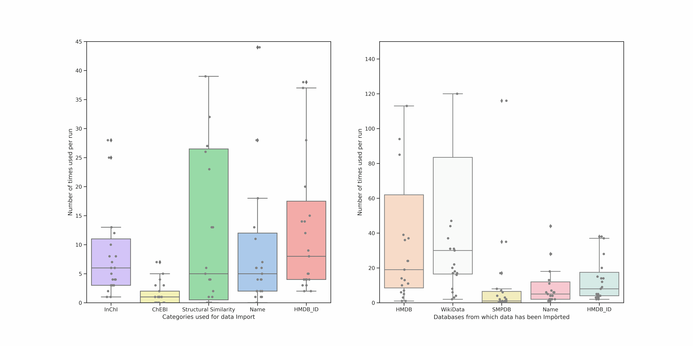



  

# CanGraph

##### a python utility to study and analyse cancer-associated metabolites using knowledge graphs

~ by [Pablo Ignacio Marcos López](https://www.pablomarcos.me/)

  

  

    
  

  

    <small style="vertical-align: middle">July 11, 2022</small>
  

---



<h3 style="text-align:left"> Introduction</h3>

* Cancer is one of the leading causes of death, with 19 M diagnoses and 10 M deaths each year

* A modest part of this work is carried out at IARC, where we try to identify cancer-related metabolites to include them in IARC's reputed **Monographs**; but this is costly and complicated

* To solve this, **metabolomics**, the global analysis of small molecule metabolites, is being increasingly used

---



<h3 style="text-align:left"> Objectives </h3>

 Given the need to automate interaction with bast metabolomics data, and harnessing the power of machines, we want to: 

* Create a python program that extracts Knowledge sub-Graphs from a series of existing DataBases (*like google*, but for metabolomics!)

* Automate the analysis of the resulting graphs

* Eventually, offer the program as SaaS using the Agency's HPC system and a web-interface

---

{}


To do this, we will use

## Five DataBases and Five Search Parameters...

---



## Five DataBases

  
  
  
  
  

---



##### which complement each other...

---



## and Five Search Parameters...

  

  

    HMDB ID
  

  

    CHEBI ID
  

 

  

    Name
  

  

    InChI and InChIKey
  

{}

---



that are related thanks to:

## The Database Management System

---

{}


and unified under

## a common schema

---



* To arrive to this, we merged the five schemas of the five databases we use by **carefully investigating each of the node types and their properties**, removing duplicates and condensing information

* The idea is to minimize the number of fields while maximizing the information contained on each, leading to **as little information loss** as possible

---



This way, we can reduce the number of nodes from 70 to 29, and the number of relations, from 98 to 35

{}

---



The workflow would be:

---

{}


## Seeing the outputs...

---



  
<small>Schema of CanGraph’s output</small>

---



  
<small>A Publication node and some related Drugs, Metabolites and Proteins</small>

---



  
<small>All the Pathways a Metabolite is a part of</small>

---



  
<small>All the Diseases related to a Protein</small>

---



  
<small>Some Proteins and their Sequences</small>

{}

---

{}


... and understanding them

  
<small>Categories (search terms) used for data import and databases from which the data comes</small>

---



  

The most used criterion is structural similarity, which makes sense, since it doesn't require an exact match

ChEBI is the less used one due to problems with the way it was supplied

Lots of exact InChI matches

---



  

The most used database is WikiData, since its the most general

HMDB has a high relevance, since HMDB was one of the search queries

SMPDB is the least used, but also the smallest DB

{}

---



  

<h3 style="text-align:left"> Potential Improvements</h3>

* The processing time is **still too high** (60 h + per metabolite). Since the publication was written, we have reduced this to 6 h

* Neo4J's python driver is **really unstable**

* The networks need to be post-processed

 

{} Potential solution: Use the HPC system  {}

---



<h3 style="text-align:left"> Conclussions</h3>

* We were able to develop a software that acts as a *search engine* on existing databases, pulling metabolic sub-networks that will help IARC **determine potential cancer associations**.

* We would like to provide the software as SaaS, to present the graphs in a more attractive and informative way

* Running the program on IARC's HPC system **might help reduce** the main roadblocks we have encountered

---



    

# Thank you!

<small>Bibliography and additional information can be found in the [original TFM document]()</small>

[↩️](#) Back to the beggining

    

